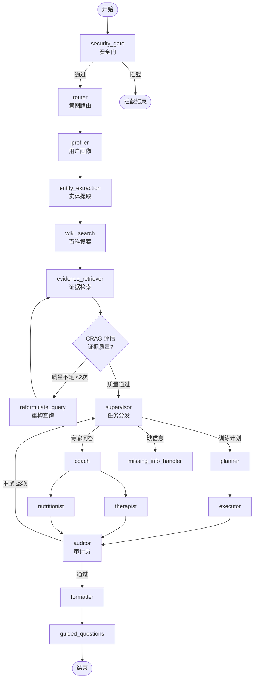
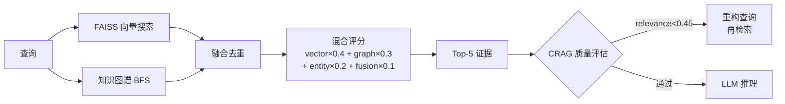

# 马拉松训练 AI 助手

> 基于 LangGraph 的多专家 RAG 训练教练——支持生成个性化训练计划、实时问答、运动记忆与 PIPL 数据权利。

[](https://www.python.org/)
[](https://fastapi.tiangolo.com/)
[](https://github.com/langchain-ai/langgraph)
[](https://astro.build/)

---

## 特性亮点

| 功能 | 说明 |
|------|------|
| **多专家 LangGraph 工作流** | 教练、营养师、心理师、审计员节点并行协作，支持 team / subagent / adaptive 三种模式 |
| **CRAG 纠正检索** | 每次检索后评估证据质量，质量不足时自动重构查询并再次检索（最多 2 轮） |
| **结构化运动记忆** | 持久化记录 profile 变更、训练反馈、生理区间，跨会话记忆（SQLite + FAISS 向量检索） |
| **PIPL 数据权利 API** | 个人数据导出、级联删除、记忆增删改查、同意版本管理（符合个人信息保护法） |
| **多页面 Astro 前端** | MUJI 风格 Journal 布局，10+ 页面（日历/当日/反馈/历史/档案） |
| **静态 Demo 集合** | 5 套 MUJI 参考 HTML，无需部署即可在浏览器直接预览 |

---

## 演示 Demo

> 在浏览器中直接打开 **`apps/web/public/demos/index.html`** 即可体验 5 套 MUJI 风格界面方案，无需启动服务器。

| Demo | 设计方向 |
|------|---------|
| 方案 A 单任务首屏 | 最保守，聚焦"生成训练计划"一个动作 |
| 方案 B 左侧导航工作区 | 最像产品，左切视图 + 右工作区 |
| 方案 C 训练日志板（ink 系列） | 多页面流转，含 calendar/day/event/profile 等页面 |
| 方案 D 编辑式安静界面 | 极简排版，文字为主 |
| 方案 E 移动优先 | 手机视口优先，卡片式布局 |

---

## 架构

### LangGraph 工作流



### 记忆系统

```mermaid
graph LR
    PF[用户档案更新] --> MP[memory_pipeline]
    FB[训练反馈] --> MP
    ZO[生理区间计算] --> MP

    MP --> MS[(session_memories\nSQLite)]
    MS --> FI[FAISS 向量索引]

    FI -->|top-5 语义检索| PN[profiler_node]
    MS -->|CRUD| DR[/user/:id/memories]
```

### RAG 证据融合



---

## 快速启动

### 环境要求

- Python 3.10+
- Node.js 18+（前端）
- [Ollama](https://ollama.com/) + `qwen2.5:latest` + `nomic-embed-text`
- 或：配置 `DS_API_KEY` 使用 DeepSeek 云端 API

### 安装

```bash
# 后端依赖
pip install -r apps/backend/requirements-dev.txt

# 前端依赖
cd apps/web && npm install
```

### 启动后端

```bash
# 在项目根目录
export PYTHONPATH="apps/backend/src"
uvicorn marathon_qa_assistant.apps.api_app:app --host 127.0.0.1 --port 8000
```

### 启动前端

```bash
cd apps/web
npm run dev
# 访问 http://localhost:4321
```

> **Windows 中文路径提示**：如启动失败，请使用 `apps/web/start_ascii.cmd`，脚本会将前端同步到 ASCII 路径后启动。

### 查看静态 Demo

无需启动任何服务，直接用浏览器打开：

```
apps/web/public/demos/index.html
```

---

## API 参考

### 核心查询

| 方法 | 路径 | 说明 |
|------|------|------|
| `POST` | `/query` | 主查询（流式 SSE）|
| `GET` | `/health` | 健康检查 |
| `GET` | `/llm-options` | 可用 LLM 列表 |

### 训练计划

| 方法 | 路径 | 说明 |
|------|------|------|
| `POST` | `/plans/generate` | 生成训练计划 |
| `GET` | `/plans/{id}` | 获取计划详情 |
| `GET` | `/training-calendar` | 获取训练日历 |

### 用户档案

| 方法 | 路径 | 说明 |
|------|------|------|
| `GET` | `/profile` | 获取档案 |
| `PUT` | `/profile` | 更新档案（触发记忆写入）|
| `GET` | `/zone-reference` | 生理区间参考值 |

### PIPL 数据权利 API

| 方法 | 路径 | 说明 |
|------|------|------|
| `GET` | `/user/{id}/data/export` | 导出全部个人数据（档案+记忆+计划+同意记录）|
| `POST` | `/user/{id}/data/delete` | 级联删除所有数据（需传 `confirmation` 字段）|
| `GET` | `/user/{id}/memories` | 列出记忆（支持 `category` / `active_only` 过滤）|
| `POST` | `/user/{id}/memories` | 新建记忆 |
| `PUT` | `/user/{id}/memories/{mid}` | 更新记忆内容或激活状态 |
| `DELETE` | `/user/{id}/memories/{mid}` | 删除记忆 |

**数据导出示例：**
```bash
curl http://localhost:8000/user/default_user/data/export | python -m json.tool
```

**删除全部数据：**
```bash
curl -X POST http://localhost:8000/user/default_user/data/delete \
  -H "Content-Type: application/json" \
  -d '{"confirmation": "DELETE_ALL_MY_DATA"}'
```

### 认证（Auth）

| 方法 | 路径 | 说明 |
|------|------|------|
| `POST` | `/auth/send-code` | 发送验证码 |
| `POST` | `/auth/verify` | 验证码校验 |
| `POST` | `/auth/login` | 登录获取 Token |

---

## 记忆系统

### 记忆来源优先级

| 来源 | 优先级 | 说明 |
|------|--------|------|
| `user_stated` | 1.0 | 用户明确告知（目标配速、伤史等）|
| `system_computed` | 0.9 | 系统计算值（生理区间、Z2 HR）|
| `llm_inferred` | 0.5 | LLM 从上下文推断 |

### 记忆写入时机

- **档案更新**：目标、LTHR、周训练量、配速、伤史、目标赛期变更时自动写入
- **训练反馈**：提交 feedback 时写入疲劳/疼痛/睡眠评分及原因码
- **区间计算**：档案带 LTHR 时自动写入 Z2 心率记忆

### 向量检索

记忆使用 `nomic-embed-text`（Ollama）构建 FAISS 索引，每次推理前语义检索 top-5 相关记忆注入 profiler 上下文。若 Ollama 不可用，自动降级为最近 N 条记忆。

---

## 数据库结构

```sql
-- 核心表
users               -- 用户基础信息 + 同意版本
user_profiles       -- 序列化档案 JSON（无 FK 依赖）
session_memories    -- 结构化记忆（source / confidence / category / tags）
schema_migrations   -- 迁移版本 + 校验和（防止误改已执行迁移）

-- 训练数据
training_plans      -- 计划 + 状态
daily_workouts      -- 每日训练任务
workout_feedback    -- 反馈记录
weekly_check_in     -- 周度复盘
```

迁移文件：`apps/backend/src/marathon_qa_assistant/services/migrations/`

---

## 安全设计

- **InputGuard**：编译正则检测 prompt injection / jailbreak / API 密钥泄露 / 系统提示探测
- **OutputGuard**：扫描 LLM 输出，自动脱敏敏感信息，拦截有害内容
- **RAG 清洗**：检索上下文注入前经 `scan_and_clean_context()` 处理
- **医疗免责**：所有训练建议包含医疗免责声明，年龄门控 > 13 岁

---

## 项目结构

```
马拉松助手/
├── apps/
│   ├── backend/
│   │   └── src/marathon_qa_assistant/
│   │       ├── apps/          # FastAPI 应用 + 路由
│   │       ├── core/          # 工作流装配 + 状态模型 + 配置
│   │       ├── nodes/         # LangGraph 节点（每节点一文件）
│   │       ├── services/      # DB / 向量库 / 知识图谱 / 记忆 / Reranker
│   │       └── ui/            # 非交互式报告渲染
│   └── web/
│       ├── public/demos/      # 静态 MUJI demo（可直接在浏览器打开）
│       └── src/
│           ├── layouts/       # JournalLayout（Astro）
│           ├── pages/         # 10+ 页面（calendar/day/event/…）
│           ├── scripts/       # apiClient / journal-app / auth
│           └── styles/        # journal.css + global.css
├── docs/                      # 架构文档 / UI 改进路线 / 审计记录
├── tests/                     # pytest 测试套件
└── tools/                     # 评测脚本 / KB 构建工具
```

---

## 系统要求

### 最低配置

- CPU 4 核
- 内存 8 GB
- 存储 5 GB（模型 + 向量库）

### 推荐配置

- NVIDIA GPU 6 GB+ VRAM（运行 qwen2.5:latest 等 7B 模型）
- 或：`DS_API_KEY` 环境变量（DeepSeek 云端 API）
- 内存 16 GB

### CPU-only 环境

- 可使用 `response_mode: "skeleton"` 获取规则驱动骨架计划（不需要 LLM）
- 或配置 `DS_API_KEY` 使用云端推理

---

## 验证

```bash
# 编译检查
export PYTHONPATH="apps/backend/src"
python -m py_compile apps/backend/src/marathon_qa_assistant/core/workflow.py

# 单元测试
cd apps/backend
python -m pytest tests/ -q --tb=short

# RAG 评测
export PYTHONPATH="apps/backend/src"
python tools/kb/evaluate_rag_ragas.py
```

---

## 更新记录

### 2026-06 当前版本

- **多页面前端重写**：JournalLayout + 10 个 Astro 页面替换旧版单体 SPA（删除 app.js 7,180 行）
- **MUJI demo 集合**：5 套静态 HTML demo，GitHub 直接可读
- **CRAG 纠正检索**：证据质量评估 + 自动重构查询
- **记忆系统 Phase 1-5**：SQLite 持久化记忆 + FAISS 向量检索 + PIPL 数据权利 API
- **Auth 系统**：验证码发送/验证/登录
- **torch 2.12 segfault 修复**：sentence_transformers 提前加载

### 2026-04

- **Git 仓库初始化**，依赖分层（runtime / dev / constraints）
- **旧前端下线**：移除 Chainlit / backup_old / legacy JSX 元素
