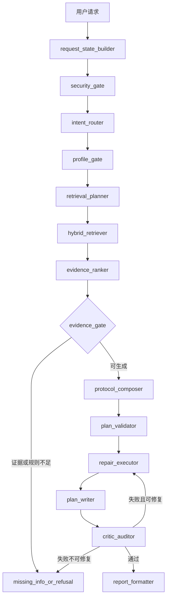

# 马拉松多智能体系统技术需求文档 (v2.0)

## 1. 多天联合决策调度器 (Multi-day Joint Decision Scheduler)

### 1.1 背景与动机
原有的计划生成逻辑采用“逐天独立决策”，模型在生成周二计划时无法感知周一的强度，导致经常出现连续高强度课（如连续两天间歇跑）或周质量课超标的情况。

### 1.2 实现方法
引入了 `plan_week_drafts` 全局调度器，采用“带状态推进”的算法：

- **状态对象 (WeekState)**: 追踪 `quality_count` (质量课计数), `last_quality_day` (上一个质量课索引), `long_run_done` (长距离是否完成)。
- **约束传播 (Constraint Propagation)**:
    - **48h 间隔**: 任何强度在 Z4 (Tempo) 及以上的课程，必须与上一个高质量课间隔至少 48 小时。
    - **周上限**: 每周高质量课 (Quality Sessions) 不超过 2 次，长距离 (Long Run) 不超过 1 次。
- **自动降级机制 (Auto-downgrade)**: 当某天预定的训练类型触发约束（Blocked）时，调度器会自动尝试从 `["轻松跑", "恢复跑", "休息"]` 中寻找替代方案，并记录 `adjustments`。

### 1.3 核心组件
- **服务层**: `marathon_qa_assistant/services/knowledge_graph.py` 中的 `plan_week_drafts`。
- **节点层**: `marathon_qa_assistant/nodes/expert_nodes.py` 已重构，不再调用 LLM 循环生成每一天，而是通过调度器一次性获取所有草案。

---

## 2. 多模态处理实时反馈机制 (Real-time Multimodal Feedback)

### 2.1 背景
多模态模型（如 Llama 3.2-Vision）加载与推理耗时较长（30s - 2min），用户在等待期间无法感知后端进度，且日志仅存在于终端，不利于生产环境调试。

### 2.2 实现方法
实现了基于回调的异步通知机制：

- **Provider 修改**: `multimodal.py` 中的 `call_vlm` 及其相关方法新增 `log_callback` 参数。
- **UI 挂载**: 在 `chainlit_app.py` 中，图片处理任务会创建一个临时的 `cl.Message`，并将其更新方法作为 `vlm_log_callback` 注入。
- **心跳式进度反馈**: 当图片已编码并进入 `Ollama` 推理等待后，前端每 3 秒刷新一次状态消息，持续显示“当前阶段 + 已等待秒数 + 最近一条后端状态”，避免用户误判为页面卡死。
- **反馈链路**:
    1. 开始调用 VLM (显示模型名与路径)
    2. 图片读取与 Base64 编码
    3. 请求发送至 Ollama API
    4. 长耗时阶段显示“已等待 N 秒”
    5. 显存不足自动切换模型 (如 11b -> 7b)
    6. 解析成功并回显总耗时

### 2.3 收益
用户可以在 UI 界面看到“图片编码完成”、“正在发送请求”、“已等待 27s”等具体步骤，能够区分“正在慢速推理”与“程序已卡死”，显著提升交互确定性与可诊断性。

---

## 4. 结构化报告渲染与 PDF 预览交互 (Structured Report & PDF Interaction)

### 4.1 背景
重构后的系统采用多智能体协作，最终输出为结构化 JSON。在 UI 展示时，需要将报告中的学术引用（如 `[1]`）与知识库原文关联，并支持在侧边栏即时预览 PDF，以实现“所见即所得”的证据溯源。

### 4.2 实现方法
- **引用展示与动作解耦**: 在 `legacy_ui.py` 中，正文与“参考来源”区块中的 `[n]` 仅作为展示标记，不再生成 `action:` Markdown 链接，避免被前端渲染为普通 `<a target="_blank">` 超链接。
- **统一预览入口**: PDF 预览统一通过 `build_evidence_preview_bundle()` 生成的 `view_pdf` 显式 Action 按钮触发，点击后始终在当前界面的侧边栏打开原文。
- **防御性路径补全 (Defensive Path Fallback)**: 在 `view_pdf` 动作回调（`chainlit_app.py` 及 `actions.py`）中增加兜底逻辑：若 `payload.path` 缺失、失效或仅为纯文件名，系统将自动调用 `infer_source_path()` 在 `uploaded_docs`、`domain_docs` 等预设目录中搜索匹配的绝对路径，确保预览的高可用性。
- **Chainlit Action 注册**: 在 `chainlit_app.py` 的消息发送链路中，必须通过 `msg.actions` 或独立消息 `actions` 显式注册预览 Action，禁止依赖正文中的超链接承担预览职责。
- **证据源路径持久化**: 在 `vector_store.py` 的分片采集、`chunks.jsonl` 持久化和 FAISS `Document.metadata` 中同时保存 `source_file` 与 `source_path`；其中 `source_file` 仅用于界面展示，`source_path` 必须保持绝对路径，供 `rag_sources -> structured_report.evidence_base -> view_pdf` 预览链路直接使用。
- **正文主展示字段不可裁剪**: `structured_report.summary` 当前承担 Chainlit/Gradio 共享渲染器中的正文主展示职责，因此格式化阶段必须保留完整 `final_report`，不得再用固定字符数截断，否则研究类长回答会在“核心摘要”区被提前截断。
- **Markdown 表格容错**: 为确保在深色模式下的渲染稳定性，对所有表格增加了强制空行隔离（Padding），并将单元格内的非法字符（如 `|`）转义为 `&#124;`。

### 4.3 交互链路
1. LLM 生成带 `[n]` 的 Markdown 正文。
2. 检索层返回证据时保留 `source_file + source_path` 双字段。
3. `UIHelper` 保留正文中的 `[n]` 引用展示，并生成同编号的 PDF 预览按钮。
4. 用户点击消息下方的 `view_pdf` 按钮，触发侧边栏预览。
5. 后端接收 `payload`（含绝对路径与页码），调用 `cl.Pdf` 在侧边栏渲染对应文档。

---

## 5. 训练画像九区模型全链路适配 (Full-stack Adaptation of 9-Zone Model)

### 5.1 背景
根据最新的运动生理学需求，系统需从传统的 5 区强度模型全面升级为 **LTHR (乳酸阈心率) 9 区** 与 **T-Pace (阈值配速) 9 区** 模型。原有的画像填写向导、缺失检查逻辑及计划生成 Prompt 仍停留在旧模型阶段，导致用户无法录入核心生理指标，且生成的计划配速不准。

### 5.2 实现方法
实现了从“数据录入 -> 逻辑校验 -> 自动化计算 -> 计划生成”的全链路闭环：

- **向导字段补全**: 在 `profile_and_retrieval.py` 中将 `lthr` 与 `t_pace` 插入 `PROFILE_FIELD_ORDER`。更新 `PROFILE_OPTIONS` 增加专业级备选项，并支持“自定义输入”以满足精英跑者需求。
- **缺失逻辑加固**: 修改 `_detect_missing_fields()`，将 `lthr` 提升为计划生成前的“必须指标”，若缺失则强制引导用户通过向导补全。
- **生理学计算引擎升级**: 在 `physiology.py` 中将 `is_zone_empty()` 的默认预期区间数由 5 提升至 9，确保 `profile_store.py` 在加载/保存时能准确识别并自动同步最新的 9 区数据。
- **UI 标签专业化**: 更新 `ui_config.py` 中的 `ZONE_LABELS`，采用“Z4 阈值下限”、“Z6 无氧阈”等专业生理学名词，提升报告的科学性。
- **前端入口模块化**: `chainlit_app.py` 现降为壳入口，仅负责 Chainlit 启动与会话初始化；训练画像逐步向导、消息处理与按钮回调统一挂到 `apps/chainlit/setup.py`、`apps/chainlit/logic.py`、`apps/chainlit/actions.py`，避免“新版向导代码已存在但未接入实际入口”的脱节。
- **侧边栏九区对齐**: 将 `chainlit_app.py::update_sidebar()` 的区间映射表改为复用 `ui_config.py` 中共享的 `Z1-Z9` 顺序与渲染逻辑，彻底移除旧版 `Z1-Z5` 硬编码，保证侧边栏展示与画像持久化、计划生成使用同一套九区口径。
- **计划生成深度适配**: 重构 `plan_nodes.py` 中的 `_compute_pace_zones()`，废弃旧的 7 类型偏移算法，优先读取画像中持久化的 9 区配速表；若数据缺失，则调用生理学引擎进行 9 区反推，确保生成的周计划配速与侧边栏显示的区间完全一致。

### 5.3 收益
- **高精度处方**: 训练计划中的“间歇跑”、“节奏跑”等配速现在精确对应用户的 LTHR 九区，不再依赖模糊的经验值。
- **一致性体验**: 用户填写的 LTHR 实时转化为完整 `Z1-Z9` 九区表展示在侧边栏，并同步驱动后台 LLM 的 Prompt 构建，实现了“所填即所得”。
- **系统稳健性**: 彻底解决了“填了画像但生成的计划还是旧配速”以及“缺失核心指标仍盲目生成计划”的问题。

### 5.4 训练画像向导交互可点击性优化 (Profile Wizard Clickability Fix)

**背景**：实测发现 Chainlit 训练画像逐步向导存在两项可用性问题 —— 多选题按钮数量过多导致确认按钮被淹没、按钮区贴近底部输入框容易点不中。

**修改文件**：`marathon_qa_assistant/apps/chainlit/wizard_logic.py` 中的 `_render_profile_step()`。

**改动内容**：

- **多选步骤按钮重排**：将 `confirm_multi`（确认并下一步）从 actions 列表末尾提前到第一位，使其在 Chainlit 消息下方成为最左侧、最突出的操作按钮，减少被 7-10 个选项按钮淹没的风险。
- **多选选项按钮简化**：标签从 `切换 周一` 改为 `周一 ✓`（选中时）/ `周一`（未选时），去掉冗余的 "切换" 前缀，降低视觉噪声。
- **底部防碰撞间距**：多选和单选步骤的 markdown 内容末尾均追加 `\n\n---\n\n` 分隔符，在按钮区与 Chainlit 聊天输入框之间插入额外垂直空白，降低"可见但点不中"的拦截风险。

**不涉及**：回调注册、步进防串写机制、画像持久化逻辑均未改动。

### 5.5 极速画像 3 步闭环 (Quick Profile Wizard)

**背景**：为降低新用户首次填写门槛，系统在完整画像之外新增极速画像入口，仅要求用户先完成 `goal / weekly_mileage / available_days` 三个最小必要字段，即可先生成基础训练计划；`vo2max / lthr / t_pace` 等增强字段改为后补，不再阻塞首次生成。

**修改文件**：`marathon_qa_assistant/apps/chainlit/setup.py`、`marathon_qa_assistant/apps/chainlit/actions.py`、`marathon_qa_assistant/apps/chainlit/wizard_logic.py`。

**改动内容**：

- **欢迎页新增极速入口**：`setup.py` 增加 `quick_profile` Action，用户可从欢迎页直接进入 3 步极速画像。
- **向导模式切换**：`actions.py` 新增 `on_quick_profile()`，启动向导时写入 `profile_wizard_mode="quick"`，并从 `goal` 开始。
- **模式感知字段顺序**：`wizard_logic.py` 新增 `QUICK_PROFILE_FIELD_ORDER = ["goal", "weekly_mileage", "available_days", "__confirm__"]`，`_get_active_field_order()` 会根据模式切换字段顺序，`_prev_field()` / `_next_field()` / 进度显示 / 确认页预览均按当前模式渲染。
- **提交后最小计划生成**：`profile_submit` 在 quick 模式下直接生成基础训练计划，优先让用户先拿到首版课表；随后如存在高级字段缺失，再由计划链路单独提示补全。
- **增强字段后补**：`profile_and_retrieval.py` 继续将 `vo2max / lthr / t_pace` 等字段归入增强精度字段，缺失时仅触发补全提示，不再硬阻塞首次生成。

**组间实现方法说明**：

- `setup.py` 负责暴露入口按钮，只决定用户从欢迎页进入哪种画像模式。
- `actions.py` 负责初始化向导状态，并通过 `profile_wizard_mode` 区分快速模式、完整模式和高级补全模式。
- `wizard_logic.py` 负责根据当前模式切换字段顺序、渲染步骤与确认页，不在 UI 层硬编码固定 12 步流程。
- `profile_and_retrieval.py` 负责最小必要字段与增强字段的缺失判断，确保“先生成、后补全”的业务契约一致。
- `logic.py` 负责在计划生成后接收增强字段缺失提示，并提供后补入口，不打断首轮计划交付。

**不涉及**：训练计划骨架、知识库检索、API Schema 与多周模板渲染逻辑均未改动。

### 5.6 极速画像提交后画像持久化容错 (Quick Profile Persistence Guard)

**背景**：真实 Chainlit + Chrome 端到端验证中，极速画像 3 步链路虽可提交并触发计划生成，但服务端日志暴露画像持久化异常：当 `lthr` 以字符串形式存在于当前画像中时，`save_user_profile()` 内部会直接执行 `>` 数值比较，导致保存阶段报错 `'>' not supported between instances of 'str' and 'int'`。

**修改文件**：`marathon_qa_assistant/core/profile_store.py`、`marathon_qa_assistant/apps/chainlit/actions.py`、`marathon_qa_assistant/apps/chainlit/logic.py`。

**改动内容**：

- **统一数值容错转换**：`profile_store.py` 新增 `_coerce_number()`，在 `sync_user_zones()` 与 `save_user_profile()` 中先把 `lthr` 规范化为可比较的数值，再决定是否重算 9 区心率。
- **前端提交阶段补齐数值字段名单**：`actions.py` 的 `profile_submit` 提交保存前，将 `lthr` 纳入与 `weekly_mileage / vo2max / max_session_minutes` 同级的数值字段转换逻辑，减少字符串脏值进入持久化层。
- **补填入口保持一致**：`logic.py` 的缺失字段手动补填流程同步把 `lthr` 视为数值型字段，避免“向导提交正常、后补入口异常”的双口径问题。

**组间实现方法说明**：

- `actions.py` 和 `logic.py` 负责在 Chainlit 入口层尽量把用户输入整理成稳定类型。
- `profile_store.py` 负责在最终持久化前兜底做一次数值规范化，避免历史画像或其他入口传入字符串时再次击穿。
- 该修复属于极速画像闭环内的稳定性补丁，不改变业务字段语义，也不改变最小必要字段策略。

---

## 6. Wiki 概念辅助检索模块 (Wiki-assisted Concept Retrieval)

### 6.1 背景与动机
用户在使用训练系统时，经常会提出“什么是乳酸阈”“VO2max 是什么”“节奏跑原理是什么”等概念理解类问题。这类问题不一定需要生成训练处方，但需要外部通识知识补充，帮助用户理解术语背景。

### 6.2 实现方法
- **触发规则**: `profile_and_retrieval.py::wiki_search_node()` 仅在概念解释、定义、原理、机制或研究模式问题中调用 Wiki；计划类问题直接跳过，避免把外部百科内容当作训练处方依据。
- **服务复用**: 复用 `services/wiki_agent.py` 中已有的 `WikiAgent`，输入来自实体抽取结果 `selected_entities / entities`，优先检索中文 Wiki。
- **Prompt 隔离**: `expert_nodes.py::_run_expert_llm()` 将 `wiki_context` 作为“Wiki 概念补充上下文”注入，但明确要求 Wiki 只用于概念背景解释，不作为本地知识库编号证据，也不得给 Wiki 内容编造 `[n]` 引用。
- **审计保留**: `output_nodes.py::_build_structured_report()` 在结构化报告中保留 `wiki_context`，并在 findings 中展示 Wiki 补充摘要，便于区分“本地 KB 证据”和“外部概念补充”。
- **前端显式展示**: `chainlit_app.py` 与 `apps/chainlit/logic.py` 会在主报告下方追加单独的 `Wiki补充` 区块，直接向用户展示完整 `wiki_context`，同时保留“仅用于概念解释、不作为训练处方依据”的边界说明。
- **契约测试**: `tests/test_wiki_module_contract.py` 覆盖触发规则、计划类跳过、专家 Prompt 消费与结构化报告保留，防止后续回归。

### 6.3 收益
- **概念解释更完整**: 用户询问术语、训练原理或研究背景时，可以获得本地 KB 之外的通识补充。
- **处方安全边界清晰**: 训练计划仍以本地 KB、图谱、画像和约束为主，Wiki 不参与计划参数决策。
- **可审计性提升**: 结构化报告中保留 Wiki 上下文，后续可以清晰追踪哪些内容来自外部概念补充。

## 7. 多周训练计划结构化基础层 (Structured Multi-week Training Plan Foundation)

### 7.1 背景与动机
当前训练计划主链仍以单周 Markdown 文本为主，难以稳定支持 4 周到 20 周以上的周期化生成，也无法可靠检测“第二周与第一周重复”这类周间回归问题。为支撑长期稳方案，必须先建立独立于渲染层的多周计划结构模型与重复检测规则。

### 7.2 实现方法
- **独立数据契约**: 新增 `marathon_qa_assistant/core/training_plan_models.py`，定义 `StructuredTrainingPlan / PlanMeta / PhaseBlock / WeekPlan / DayPlan / RepeatGuardSignature` 数据模型，作为后续多周生成、校验和模板渲染的统一真源。
- **周数解析与对齐层**: 新增 `marathon_qa_assistant/core/training_plan_context.py`，提供 `parse_requested_weeks()`、`derive_plan_duration_weeks()` 与 `align_plan_duration_context()`，统一解析用户请求中的 `4周/20周/1个月/半年` 等周期表达，并与画像中的 `target_race_date / plan_duration_weeks` 对齐。
- **结构化校验**: 提供 `validate_plan_meta()`、`validate_week_count()`、`validate_week_structure()`、`validate_phase_summary()` 与 `validate_full_training_plan()`，硬性约束 `requested_weeks` 范围、`week_index` 连续性、7 天完整覆盖、周目标与执行提醒完整性。
- **周重复检测**: 提供 `compare_adjacent_weeks()` 与 `compare_all_adjacent_weeks()`，按 `quality_sessions / long_run_minutes / key_intensity / weekly_volume_km` 等特征进行相邻周相似度评估，并输出 `pass / warn / fail` 三级结果。
- **signature 派生层**: `ensure_repeat_guard_signature()` 会在周对象缺少 `repeat_guard_signature` 时，根据 `days` 自动推导质量课、长距离、休息日等特征，避免后续生成链路尚未完全接线时无法比较周间差异。
- **状态扩展**: `state_models.py::IntegratedState` 新增 `structured_training_plan` 字段，为后续将多周结构挂入 LangGraph 主状态预留位置，但本轮不改动现有 Chainlit/FastAPI 渲染链路。
- **缺失信息契约显式化**: `state_models.py::IntegratedState` 现新增 `missing_info_status`；计划模式缺画像时，`missing_info_handler_node()` 通过 `missing_info_status="awaiting_profile"` 显式标记“待补画像”状态，替代把 `final_report="__FILL_FIELDS__"` 当作前后端主协议。
- **生成链路前半段接线**: `profile_and_retrieval.py::profiler_node()` 在计划模式下会先做周数对齐，再把结果写回 `user_profile.plan_duration_weeks` 并透出 `requested_weeks`；`plan_nodes.py::_build_plan_prompt()` 同步消费对齐后的周期信息和阶段摘要，避免再次回退到默认 12 周或“第一周训练计划”心智模型。
- **生成链路后半段接线**: 新增 `marathon_qa_assistant/core/training_plan_skeleton.py`，由 `plan_nodes.py::executor_node()` 在 LLM 文本计划之外同步产出 `structured_training_plan` 多周结构骨架，包含 `phase_summary + week_plans[] + repeat_guard_signature`，作为后续逐周模板渲染的真源。
- **输出层周级化**: `output_nodes.py::_build_structured_report()` 现除透出 `structured_training_plan` 外，还会从 `week_plans[]` 派生 `training_plan_overview + phase_summary + training_plan_weeks[]`，让 `structured_report` 自身具备稳定的逐周输出块。
- **展示契约稳定化（M1-TASK-09）**: `training_plan_models.py` 现将 `key_workouts[] / action_suggestions[] / first_week_actions[]` 收口为结构化计划正式字段；`training_plan_skeleton.py` 负责在生成骨架时直接产出这些展示字段，避免前端继续从 `days[]` 和原始 Markdown 临时猜测“关键训练”和“第一步做什么”。
- **渲染层优先消费展示字段**: `legacy_ui.py` 渲染多周计划时优先读取 `structured_training_plan.week_plans[].key_workouts / action_suggestions` 与 `training_plan_overview.first_week_actions`，仅在旧数据缺字段时才退回到本地推导，确保 4 周、8 周、12 周输出口径一致。
- **首周执行入口与失败兜底（M1-TASK-11）**: 新增 `apps/chainlit/plan_ui.py` 作为计划展示交互辅助层；`logic.py` 在计划成功后追加“开始第1周训练”按钮，在计划异常或未拿到可展示结果时追加“重试计划生成 / 检查训练画像”动作；`actions.py` 新增 `start_first_week` 与 `retry_plan_generation` 回调，让用户拿到计划后知道下一步做什么，失败时也有明确恢复路径。
- **训练反馈快速提交（Week 4-B）**: `apps/chainlit/plan_ui.py` 现补充 `render_training_feedback_input_md()` 与 `build_training_feedback_bundle()`，支持把用户在 Chainlit 中提交的 `完成状态 / 完成质量 / 疲劳 / 不适 / 睡眠 / 备注` 模板输入统一解析为 `训练反馈卡 + workout_feedback + adaptive_feedback + adaptive_adjustment`；`actions.py::start_first_week` 改为提供“完成后提交反馈 / 未完成也提交反馈”入口，`logic.py` 复用现有 `pending_operation` 机制接收真实反馈文本，写回 `latest_training_feedback_card` 与当前会话状态中的 `adaptive_feedback / adaptive_adjustment`，让 Week 4 的反馈提交可直接衔接 Week 5 自适应契约。
- **4/8/12 周展示验证矩阵与长计划导航（M1-TASK-13）**: `tests/test_high_risk_contracts.py` 现补齐 `4/8/12 周` 渲染矩阵，显式校验结构化真源优先、旧 Markdown 仅兜底、周卡片数量完整且无截断错乱；`legacy_ui.py` 对 `>=8 周` 长计划新增 `周卡片导航`，按阶段列出周次范围，帮助用户在 8 周和 12 周计划中快速定位当前训练阶段。
- **自适应调整 DTO / 状态契约（M2-W5-A）**: `state_models.py` 现正式定义 `WorkoutFeedback / AdaptiveReason / AdaptiveFeedback / AdaptiveAdjustment` 四层契约，并提供 `normalize_workout_feedback()`、`derive_adaptive_reasons()`、`build_adaptive_adjustment_contract()`。Week 5 当前先把训练反馈统一映射到 `mild_fatigue / high_fatigue / pain_risk / missed_workout` 四类原因，再输出 `next_day_adjustment / weekly_adjustment / alternative_workout / risk_alert / rationale` 五段式调整骨架，避免自适应链路继续只传一段原始自然语言。
- **自适应最小规则引擎（M2-W5-B）**: `state_models.py` 现内置最小规则库，把 `pain_risk / high_fatigue / mild_fatigue / missed_workout` 四类原因直接映射为结构化调整内容，而不再只返回空骨架。`build_adaptive_adjustment_contract()` 会按原因优先级组合生成 `next_day_adjustment / weekly_adjustment / alternative_workout / risk_alert / rationale`，无触发原因时也返回稳定的“按原计划执行”默认结构；`output_nodes.py` 同步把明日调整 / 本周微调 / 替代训练写入 `recommendations`，让 Week 5 的结构化结果无需等待前端新卡片也能被当前报告直接消费。
- **自适应前端展示卡（M2-W5-C）**: `legacy_ui.py` 现为 `structured_report.adaptive_adjustment` 增加共享 `自适应调整卡` 区块，在主报告中固定展示状态、触发原因、明日调整、本周微调、替代训练、风险提示与“为什么这么调”；`apps/chainlit/plan_ui.py` 同步新增 Chainlit 专用 `adaptive_adjustment_card` helper，`logic.py` 在工作流完成后额外发送一张显眼的自适应卡，并挂上“继续补充训练反馈”动作，形成“规则结果 -> 共享报告 -> Chainlit 专用卡”的完整展示闭环。
- **关键训练解释面板（M2-W6）**: `output_nodes.py` 现新增 `structured_report.training_explanation_panel`，按周为关键训练汇总 `为什么安排 / 主要训练目标 / 风险提醒 / 状态不佳时替代 / 决策摘要` 五段式解释；若原始 day draft 已带 `template_id / constraints / warnings / decision_trace`，则优先透传这些素材，否则退化为基于 `week_goal / phase / training_type / execution_reminder` 的最小稳定解释，确保前端无空白块。
- **Week 6 后端增强版 DTO**: 在原有展示字段之外，`training_explanation_panel` 现补充 `panel_version / coverage_status`，每周补充 `week_goal / execution_reminder / item_count`，每个解释项补充 `item_id / explanation_source / target_labels / warnings / adjustments / constraints / decision_trace` 等稳定结构字段，避免前端或后续 API 只能反解析自然语言摘要。
- **QA 引用格式双保险**: `expert_nodes.py::_run_expert_llm()` 的引用规则 prompt 已从单句升级为 4 条明确规则，新增"严禁 `[来源: xxx.pdf]` / `[ref: xxx]` / `[citation needed]`"等反例声明；同时 `legacy_ui.py` 新增 `_match_source_to_evidence_ids()` 作为后置兜底，能从 LLM 偶尔输出的 `[来源: filename.pdf]` 中提取文件名（含 URL 编码归一化），反向映射回 `evidence_base` 的数字编号，确保"查看证据（同号按钮）"面板不因格式违规而静默消失。
- **本周证据高亮补漏**: `legacy_ui.py` 与 `apps/chainlit/plan_ui.py` 现把关键训练解释项的 `warnings / adjustments / constraints / decision_trace / target_labels / evidence_ids` 收纳到 `<details>` 可展开区域，默认只显示摘要，点击后可查看决策细节和高亮后的关联证据编号，并附带"下方同编号按钮可预览原文"的提示；当周解释为空、未提取到 `evidence_ids` 或证据原文路径缺失时，界面会显式给出空态/异常态文案，不再静默消失。`output_nodes.py::_format_evidence_suffix()` 已同步改为 `` `[n]` `` 反引号格式，确保 `why_scheduled` 正文末尾的证据编号在 Chainlit/Gradio 中渲染为灰色代码标签而非纯黑字。
- **Week 6 API 快捷字段**: `apps/api_app.py` 的 `QueryResponse` 现额外提供顶层 `training_explanation_panel`，其值直接从 `structured_report.training_explanation_panel` 派生，方便前端在少解析一层结构的情况下快速获取 Week 6 解释面板。
- **Week 7 埋点闭环补齐**: `services/analytics.py` 作为本地 JSONL 事件记录器，统一生成 `event_name / user_id_hash / session_id / version / timestamp / properties` 公共字段；Chainlit 当前已接入路线图事件 `app_opened / profile_wizard_started / profile_submitted / plan_generate_clicked / plan_generated / workout_feedback_submitted / adaptive_plan_generated / weekly_review_viewed / evidence_opened`。其中 `plan_generate_clicked` 只从显式用户动作来源记录（自由输入、确认生成、重生成、重试、跳过补填），自动续跑和内部递归调用不再重复计数。事件默认写入运行期 `_runtime_data/<项目名>/analytics_events.jsonl`，避免写入项目源码目录触发热重载或污染提交。已对各事件 properties 追加可聚合结构化字段：`plan_generate_clicked` 区分 `source_type: message|action`；`app_opened` 追加 `entry/initial_mode/profile_field_count`；`profile_wizard_started` 追加 `has_existing_profile/pre_filled_field_count`；`profile_submitted` 追加 `total_fields_available`；`plan_generated` 追加 `final_report_length/plan_type/actual_weeks/rag_source_count`；`workout_feedback_submitted` 区分 `source_type: text|action`，文本路径追加 `feedback_length/has_keywords`；`adaptive_plan_generated` 追加 `recommendation_count/has_training_feedback`；`weekly_review_viewed` 追加 `workout_count`；`evidence_opened` 追加 `source_type/snippet_length`。
- **Week 6 渲染契约测试**: `tests/test_week6_explanation_dto_contract.py` 现同时覆盖结构化 DTO、共享报告渲染、Chainlit 专用卡片渲染，以及“仅靠 `evidence_ids` 也能进入 `参考来源 / 查看证据（同号按钮）` 预览链”“多周计划第 N 周解释卡说明”“路径缺失时显式报出无法预览”等回归场景，确保 `training_explanation_panel` 的展开细节、证据编号与决策轨迹在两条入口都能稳定显示。
- **Chainlit 消费收口**: `apps/chainlit/logic.py` 在每次新请求进入工作流前都会清空 `missing_info_status`，并在工作流结束后基于该显式状态决定是否弹出"逐字段补填"动作，避免会话态残留导致旧请求状态串写。
- **画像字段分层（极速画像 M1）**: `profile_and_retrieval.py` 新增 `MINIMUM_REQUIRED_FIELDS`（goal / weekly_mileage / available_days，3 个硬阻塞字段）和 `ENHANCEMENT_FIELDS`（vo2max / lthr / t_pace 等 9 个增强精度字段）；`_detect_missing_fields()` 仅校验最小必要字段，增强字段缺失不阻塞计划生成，由 `_detect_missing_enhancement_fields()` 独立检测。
- **增强字段补全链路**: `plan_nodes.py::_build_plan_prompt()` 在 LLM 提示中注入缺失增强字段清单及其默认估算说明；`logic.py` 在计划成功生成后弹出逐字段补全入口（最多 5 项），让用户在拿到首轮计划后仍可逐项补充精度。
- **极速画像前端闭环**: `logic.py` 现将补填链路拆为两类：`required` 模式用于最小必要字段补齐，补完后自动继续生成基础计划；`enhancement` 模式用于高级画像补全，补完后只提供“基于最新画像重生成计划”的显式入口，不再强制打断当前计划浏览。
- **目标赛事注入结构化骨架（D1.1）**: `training_plan_skeleton.py` 现会解析 `goal` 中的半马/全马目标，并在首周结构化计划中直接改变主质量课、周目标说明和长距离策略；半马优先阈值耐受与专项配速感，全马优先可持续马拉松配速、有氧容量与补给练习。
- **高级画像入口补齐**: `actions.py` 新增 `fill_advanced_profile` 与 `regen_plan_from_profile`；前者支持从缺失高级字段直接进入完整画像向导，后者支持用户在补全后手动触发重生成，更符合“先生成基础计划，后补强精度”的 M1 目标。
- **Coach Mode 状态契约收口（M1-TASK-06）**: 新增 `apps/chainlit/coach_state.py` 作为 Coach 前端状态真源，统一维护 `页面状态 + 消息状态 + session 默认值 + 状态文案 + 下一步提示`，覆盖 `idle_ready / workflow_running / awaiting_required_profile / profile_wizard_full / plan_ready_with_enhancement / error_fallback` 等主链路状态，避免继续把业务状态散落在 `logic.py / actions.py / setup.py` 的局部 `session key` 判断中。
- **侧边栏状态可视化**: `setup.py::update_sidebar()` 现采用中等轻量化侧边栏：默认展示核心画像、简化 Z1-Z9 强度速查、证据库一句话摘要与 `下一步` 区块；不再暴露页面状态、消息状态、知识密度、知识分片等开发态字段。
- **前端交互文案对齐**: `setup.py::show_profile_summary()` 在欢迎区展示状态与下一步建议；`actions.py::on_fill_field()` 区分基础画像和高级画像输入提示；`logic.py` 在缺基础画像、继续补字段、计划生成后补高级画像等节点明确告诉用户“当前在干什么、下一步点哪里”。
- **状态流转表自动化测试**: `tests/test_coach_ui_state_contract.py` 已按 `M1-STORY-03` 状态流转表补齐 14 类回归测试，覆盖进入 Coach、提交计划、缺基础画像、单字段补填、补齐后继续生成、计划完成后高级画像补全、显式重生成、异常兜底与非 Coach 入口隔离。
- **契约测试**: `tests/test_training_plan_models.py` 覆盖有效 4 周结构、缺天失败、相邻周完全重复 fail、渐进周 pass、减量周阈值放宽与 20 周长计划中部重复检测。
- **周数链路测试**: 新增 `tests/test_training_plan_context.py`，覆盖显式 `4周/20周` 请求解析、`target_race_date` 到周数的换算，以及“显式请求优先于画像倒计时”的对齐规则；`tests/test_high_risk_contracts.py` 同步校验 Prompt 已带入对齐后的周期上下文。
- **骨架生成测试**: 新增 `tests/test_training_plan_skeleton.py`，覆盖 4 周结构骨架合法性、24 周长计划支持，以及相邻周不出现直接 `fail` 级重复。

### 7.3 组间实现方法说明
- `training_plan_models.py` 负责“结构定义 + 校验 + 重复检测”，不直接拼接最终 Markdown。
- `training_plan_context.py` 负责“用户请求周数解析 + 比赛倒计时换算 + 周数对齐”，不直接生成课表文本。
- `profile_and_retrieval.py` 负责把对齐后的 `plan_duration_weeks` 写回计划生成所消费的画像状态。
- `training_plan_skeleton.py` 负责把周期阶段、训练日约束、目标赛事类型和基础 progression 组装为 `structured_training_plan` 骨架，不直接处理 UI。
- `training_plan_skeleton.py` 同时负责补齐周级展示字段：每周 `key_workouts[]`、`action_suggestions[]` 与计划级 `first_week_actions[]`，让后续周卡片渲染不再依赖 Markdown 反解析。
- `plan_nodes.py` 现同时产出 LLM 文本计划和 `structured_training_plan` 骨架，后续逐周渲染应优先消费结构化真源。
- `profile_and_retrieval.py::missing_info_handler_node()` 负责写入 `missing_info_status` 与缺失字段列表，不再让 UI 依赖哨兵字符串判断主链路状态。
- `output_nodes.py` 现额外把 `structured_training_plan.week_plans[]` 展开成 `structured_report.training_plan_weeks[]`，供当前渲染层直接消费。
- `apps/chainlit/logic.py` 负责消费 `missing_info_status` 并弹出逐字段补填入口；同时基于 `filling_field_mode` 区分基础画像补齐与高级画像补全，防止两条链路串写。
- `actions.py` 负责 `fill_profile / fill_advanced_profile / fill_field / regen_plan_from_profile` 等动作回调，并通过 `profile_wizard_mode` 区分“首次完整画像”和“高级画像补全”提交后的行为。
- `apps/chainlit/coach_state.py` 负责从 `state + user_session` 派生 Coach 页面状态、消息状态与下一步提示，并提供统一的 sidebar 状态文案；其余 UI 模块只消费该契约，不再重复发明状态枚举。
- `apps/chainlit/setup.py` 负责欢迎区与侧边栏状态展示，`actions.py` 负责字段输入提示，`logic.py` 负责缺字段、补字段和高级画像补全后的阶段文案，三者共同让用户能在每个阶段看清“当前状态 + 下一步动作”。
- `apps/chainlit/plan_ui.py` 负责从 `structured_report` 提炼首周执行上下文，并统一输出“首周执行入口 / 快速训练反馈模板 / 训练反馈卡 / 失败兜底”文案以及反馈状态 bundle；`logic.py` 只负责在 `pending_operation` 收到用户反馈文本后写回统一状态，`actions.py` 负责点击后的会话内交互，避免把反馈解析和状态组装散落在多个回调里。
- `legacy_ui.py` 现已优先使用 `structured_training_plan` 逐周模板渲染，`raw_report` 仅作为缺省兜底，减少多周截断和第二周格式错乱；长计划默认采用“周摘要 + 关键训练 + 折叠每日处方”的紧凑周卡片，且在 `>=8 周` 时补充阶段级 `周卡片导航`，避免 8/12/20 周计划全量平铺后难以快速定位。
- `adaptive_coach_node()` 现先消费标准化 `WorkoutFeedback` 和派生出的 `AdaptiveReason[]`，再把 `AdaptiveAdjustment` 骨架注入 Prompt；`output_nodes.py` 同步将该骨架透出到 `structured_report.adaptive_adjustment`，为后续 Week 5 规则引擎和前端调整卡提供稳定字段口径。
- `state_models.py` 在 Week 5-B 中继续承担“原因 -> 规则结果”的最小引擎职责：按 `pain_risk > high_fatigue > mild_fatigue > missed_workout` 顺序拼装结构化调整字段，并对“无风险信号”返回稳定默认值，避免下游再次判断空字符串。
- `legacy_ui.py` 在 Week 5-C 中负责共享渲染层展示，把 `adaptive_adjustment` 固化为统一 Markdown 区块；`apps/chainlit/plan_ui.py` 负责把同一份结构结果包装成 Chainlit 专用卡片，`logic.py` 决定何时追加单独消息与“继续补充训练反馈”动作，避免把自适应展示逻辑散落在多个入口。
- `output_nodes.py` 负责把周级展示字段继续透出到 `structured_report.training_plan_weeks[]` 与 `training_plan_overview.first_week_actions`；`legacy_ui.py` 直接消费这些字段，保证展示层级与 Week 3 路线图一致。
- `output_nodes.py` 在 Week 6 中继续承担解释 DTO 装配，把关键训练解释收口到 `structured_report.training_explanation_panel`；除展示文案外，还负责保留 `constraints / warnings / adjustments / decision_trace` 的结构化真源，并显式标记 `explanation_source=decision_graph|fallback_heuristic`，供后续前端面板、埋点和 API 统一消费。
- `legacy_ui.py` 负责共享报告中的周级解释区块、引用并表与证据预览提取，`apps/chainlit/plan_ui.py` 负责 Week 6 专用解释卡；两者都只默认展示五段式解释摘要，并把 `warnings / adjustments / constraints / decision_trace / evidence_ids` 放入可展开详情块，同时保证 `evidence_ids` 即使未内联到正文句子里，也能进入 `参考来源 / 查看证据（同号按钮）` 预览链；多周场景下，Chainlit 卡片需显式说明当前展示周次与完整覆盖周次，`logic.py` 负责在有无预览按钮两种情况下都把证据面板消息发出来，避免空态被静默吞掉。
- `services/analytics.py` 负责 Week 7 本地事件记录、公共字段生成与 `plan_generate_clicked` 口径收口，并在 `build_plan_click_properties` 中区分 `source_type: message|action`；`apps/chainlit_app.py` 在会话启动后记录 `app_opened`（附加 `entry/initial_mode/profile_field_count`）；`apps/chainlit/logic.py` 在显式用户入口记录 `plan_generate_clicked`、在计划型结果生成后记录 `plan_generated`（附加 `final_report_length/plan_type/actual_weeks/rag_source_count`）、在自适应调整卡生成后记录 `adaptive_plan_generated`（附加 `recommendation_count/has_training_feedback`）、文本反馈路径记录 `workout_feedback_submitted` 并标记 `source_type: text`（附加 `feedback_length/has_keywords`）；`apps/chainlit/actions.py` 负责把 `profile_submit / regen_plan_from_profile / retry_plan_generation / cancel_fill` 等显式按钮动作透传为点击来源，并接入 `profile_wizard_started`（附加 `has_existing_profile/pre_filled_field_count`）、`profile_submitted`（附加 `total_fields_available`）、`weekly_review_viewed`（附加 `workout_count`）、`evidence_opened`（附加 `source_type/snippet_length`），同时快捷反馈路径继续标记 `source_type: action`。

### 7.4 本轮收益
- **为 4-20 周扩展打底**: 先把多周结构和校验规则固化，后续接入 8 周、12 周、20 周时无需重写模型。
- **重复周可程序化拦截**: 周计划“只改标题不改内容”将可被自动标记为 `fail`，不再只能靠人工肉眼检查。
- **渲染与生成解耦**: 后续可改为“LLM 输出结构，代码模板渲染”，从根上减少第二周格式错乱和截断问题。
- **输出链可直接透传骨架**: 后续无论接 Chainlit、FastAPI 还是单独导出 JSON，都可以直接读取 `structured_training_plan`，不必再从 Markdown 反解析周计划。
- **多周展示开始转向结构驱动**: 当前共享渲染器已能基于结构化周计划生成稳定的逐周 Markdown，并通过折叠周卡片控制长计划输出长度，不再完全依赖 LLM 原始周计划文本。

## 8. 方案 A：每日课表检索卡最小闭环

### 8.1 背景与目标
当前多周计划已经具备 `structured_training_plan.week_plans[].days[]` 的日计划结构，但每日处方仍主要来自规则骨架和 LLM 文本，尚未把动作库中的课表证据稳定绑定到某一天的训练类型。为先验证“周二安排有氧阈值时，系统能从动作库检索并返回可追溯课表卡”的产品体验，本轮先落地方案 A 的最小闭环，只支持 `aerobic_threshold`。

### 8.2 实现方法
- **轻量课表召回器**: 新增 `marathon_qa_assistant/services/workout_template_retriever.py`，提供 `build_workout_template_query()`、`retrieve_daily_workout_template_card()` 与 `build_daily_workout_template_card_from_hits()`，复用现有 `vector_store.load_vector_kb()` / `retrieve()` 检索能力，不新增独立索引。
- **训练类型别名扩展**: `aerobic_threshold` 会扩展为“有氧阈值训练 / 最大脂肪氧化训练 / 有氧阈 / 乳酸阈值 / 阈值跑 / Aerobic Threshold / Steady-State / Endurance / 3-4*3000 / 5-6*2000 / 5000+3*2000”等查询信号，以提升动作库 chunk 召回稳定性。
- **动作库证据优先**: 最小闭环仅接受 `source_file=动作库.pdf` 且文本包含有氧阈值相关信号的命中，避免从其他论文或普通知识片段中拼出无来源课表。
- **每日课表卡结构**: 输出 `title / workout_type / training_type / source / main_set_candidates / intensity_target / training_objective / warmup_suggestion / evidence_status / evidence`，其中 `evidence_status` 显式区分 `direct / missing`，冷身和替代训练在当前库证据不足时保持 `missing`，不由 LLM 编造。
- **契约测试**: 新增 `tests/test_workout_template_retriever.py`，覆盖有氧阈值 query 扩展、动作库命中生成“周二｜有氧阈值训练课”卡片、证据缺失时返回“课表证据不足”且不生成主训练候选。

### 8.3 组间实现方法说明
- `workout_template_retriever.py` 只负责“训练类型 -> 检索 query -> 证据筛选 -> 每日课表卡结构”，不直接修改 `structured_training_plan`，也不处理前端 Markdown 渲染。
- `vector_store.py` 继续负责底层知识库加载与 FAISS 检索，方案 A 不改变现有 RAG 产物格式。
- `training_plan_skeleton.py` 仍负责生成周/日训练骨架；后续若进入方案 B，再把 `DailyWorkoutTemplateCard` 绑定到 `DayPlan` 或 `structured_report` 的专用字段。
- `legacy_ui.py` 暂不消费课表卡，避免一次性扩大到多入口渲染；当前先用服务层与契约测试验证“能稳定生成每日课表卡”。

### 8.4 本轮收益
- **先验证产品效果**: 可以基于 `workout_type=aerobic_threshold` 生成类似“周二｜有氧阈值训练课”的结构化卡片。
- **证据边界清晰**: 主训练、强度、目标、热身均来自动作库命中；冷身和替代训练缺证据时显式标记缺失。
- **为方案 B 铺路**: 后续可把该卡片接入 `structured_training_plan.week_plans[].days[]` 或 `structured_report.daily_workout_cards`，实现每天固定课表展示。

## 9. 方案 B：固定日课表结构接入结构化报告与共享渲染

### 9.1 背景与目标
在方案 A 已能生成 `DailyWorkoutTemplateCard` 后，本轮将每日课表卡接入结构化输出和共享 UI 渲染，目标是让计划型报告在识别到“周二｜有氧阈值训练”这类日计划时，能自动展示固定格式的每日课表卡，而不是只停留在服务层可调用。

### 9.2 实现方法
- **结构化输出接入**: `output_nodes.py::_build_structured_report()` 新增 `daily_workout_cards` 字段。该字段从 `structured_training_plan.week_plans[].days[]` 中识别有氧阈值相关日计划，并基于 `rag_sources -> evidence_base` 转换后的动作库证据生成课表卡。
- **训练类型识别**: 当前最小闭环只识别 `training_type/main_set` 中包含“有氧阈”或“最大脂肪氧化”的日计划，并归一化为 `aerobic_threshold`，避免一次性扩大到所有训练类型。
- **共享渲染接入**: `legacy_ui.py` 新增每日课表卡 Markdown 渲染逻辑，并在结构化报告摘要后、详细分析前展示 `daily_workout_cards`，使 Chainlit 与 Gradio 共用渲染入口都能消费该字段。
- **证据边界**: UI 展示 `来源 / 训练类型 / 主训练候选 / 强度目标 / 训练目标 / 热身建议 / 证据状态`，冷身和替代训练缺证据时继续显示“还需要补充课表库”，不做 LLM 补写。
- **契约测试**: 扩展 `tests/test_workout_template_retriever.py`，验证 `_build_structured_report()` 能暴露 `daily_workout_cards`，且 `UIHelper.render_structured_report()` 能渲染“每日课表卡”区块。

### 9.3 组间实现方法说明
- `workout_template_retriever.py` 继续保持服务层职责，只负责从证据命中构建每日课表卡，不直接操作 UI。
- `output_nodes.py` 负责把结构化计划和 RAG 证据组合为 `structured_report.daily_workout_cards`，这是方案 B 的最小数据接入点。
- `legacy_ui.py` 负责共享 Markdown 展示，当前不单独改 Chainlit/Gradio 入口，避免多入口重复实现。
- `training_plan_skeleton.py` 暂不修改；日计划骨架仍由原有结构生成，方案 B 只在报告输出阶段附加课表卡。

### 9.4 当前边界
- 当前只支持 `aerobic_threshold`/有氧阈值训练的固定日课表卡。
- 当前依赖 `rag_sources` 中已经包含 `动作库.pdf` 相关证据；如果上游检索没有召回动作库，课表卡会显示证据不足或不生成。
- 暂未把卡片反写入 `structured_training_plan.week_plans[].days[]`，避免影响现有多周计划真源结构。

## 10. 方案 C：月历课表、证据分层回退与 Z1-Z9 强度语义

### 10.1 背景与目标

方案 B 已能展示多训练类型每日课表卡，但在动作库缺少直接证据时会产生大量“课表证据不足”空卡，影响用户阅读。方案 C 的目标是把每日课表升级为一个月可点击日历视图：动作库有证据时直接使用动作库课表；动作库无证据时，继续从其他知识库中寻找相关内容生成参考课表；确实无可用证据时，只保留基础计划骨架，不再逐日堆叠空卡。同时，所有训练强度统一使用 LTHR 九区的 Z1-Z9 中文术语，配速仅作为参考，不作为固定执行目标。

### 10.2 实现方法

- **Z1-Z9 语义统一**：`workout_template_retriever.py` 新增 `ZONE_LABELS`、`ZONE_LABELS_DETAIL` 与 `zone_range`，所有训练类型的 `intensity_target` 改为中文 Z 区间表述。
- **证据分层**：新增 `EVIDENCE_TIER_LABELS`，稳定区分 `action_library`（动作库课表）、`kb_fallback`（参考知识库生成）、`plan_only`（基础计划）。
- **月历生成服务**：新增 `daily_schedule_generator.py`，把 `structured_training_plan` 转成 `MonthlyTrainingCalendar.days[]`，并为每一天补齐训练类型、Z 区间、热身、主课、放松、替代训练、证据状态和来源信息。
- **知识库回退**：当动作库未命中直接证据时，服务层会过滤掉动作库以外的 KB 命中，并基于相关知识片段生成参考课表字段；无可用命中时才退回 `plan_only`。
- **结构化报告接入**：`output_nodes.py` 额外输出 `monthly_training_calendar`、`daily_schedule_cards` 与 `evidence_tier_map`，使 Chainlit、FastAPI 和后续 App 层共用同一数据真源。
- **Chainlit 月历组件**：新增 `public/elements/MonthlyTrainingCalendar.jsx`，通过月历网格展示每天训练，点击日期后用右侧抽屉展示当日课表详情。
- **Markdown 空卡过滤**：`legacy_ui.py` 不再逐日渲染缺证据空卡；如果所有每日课表均无有效内容，只展示一条汇总提示。
- **FastAPI 端点**：`api_app.py` 新增 `/training-calendar`、`/zone-reference` 与 `/evidence-tier-reference`，为后续独立前端或 React Native 迁移提供接口契约。

### 10.3 组间实现方法说明

- `workout_template_retriever.py` 负责训练类型注册表、Z1-Z9 术语、动作库证据卡和证据分层标签。
- `daily_schedule_generator.py` 负责月历课表编排与 KB fallback，不直接处理 UI。
- `output_nodes.py` 负责把结构化计划、每日课表卡和月历数据统一写入 `structured_report`。
- `apps/chainlit/plan_ui.py` 负责从 `structured_report` 提炼 `MonthlyTrainingCalendar` props；`apps/chainlit/logic.py` 负责发送 CustomElement。
- `ui/legacy_ui.py` 负责共享 Markdown 兜底，重点保证缺证据时不刷屏。
- `apps/api_app.py` 负责外部接口层，不复制课表生成逻辑。
- `tests/test_daily_schedule_generator.py` 负责覆盖 Z 区间、证据分层、KB 回退、月历序列化、结构化报告接入和空卡过滤回归。

### 10.4 当前边界

- 当前 KB fallback 为确定性模板化生成：基于检索命中的知识片段填充参考课表字段；如需真正调用 LLM 改写，可在该服务层继续接入现有 LLM 调用器。
- `/training-calendar/day-detail/{day_index}` 当前保持轻量占位契约，客户端优先从 `/training-calendar` 返回的完整日历中按 `day_index` 查找详情。
- 月历组件已具备可点击日期和详情抽屉，仍需在真实 Chainlit 浏览器中进行视觉验收。

### 10.5 待优化与未来方向

## 11. 方案 B 升级：训练类型注册表驱动多类型课表卡接入

### 11.1 背景与目标

方案 A/B 初始实现仅支持 `aerobic_threshold`（有氧阈值训练）单一训练类型。其他类型（长距离、轻松跑、间歇跑、节奏跑等）虽然已经在 `training_plan_skeleton.py` 中由骨架生成器正常产出，但 `output_nodes.py` 的 `_build_daily_workout_cards()` 无法识别它们，导致无法生成课表卡。

目标：将所有训练类型的课表卡生成统一到注册表驱动架构，实现"新增训练类型只需加配置，不改逻辑"。

### 11.2 实现方法

新增 `WORKOUT_TEMPLATE_REGISTRY` 作为核心配置中心，取代原有的 `AEROBIC_THRESHOLD_ALIASES` + `WORKOUT_TYPE_ALIASES` 硬编码。

**注册表结构** (`workout_template_retriever.py`):

```python
WORKOUT_TEMPLATE_REGISTRY = {
    "aerobic_threshold": {
        "display_name": "有氧阈值训练",
        "training_type_label": "有氧阈值训练（最大脂肪氧化训练）",
        "aliases": [...],
        "title_template": "有氧阈值训练课",
        "source_priority": ["动作库.pdf"],
        "intensity_target": "75-85% HRmax",
        "intensity_keywords": ["75", "85", "HRmax"],
        "extractor": "aerobic_threshold",
    },
    # ... 共 8 种训练类型
}
```

**支持的训练类型**:

| 注册表 key | 中文名称 | extractor 类型 |
|---|---|---|
| `aerobic_threshold` | 有氧阈值训练 | 专用抽取器 |
| `long_run` | 长距离 | 通用抽取器 |
| `easy_run` | 轻松跑 | 通用抽取器 |
| `tempo_run` | 节奏跑 | 通用抽取器 |
| `interval_run` | 间歇跑 | 通用抽取器 |
| `anaerobic_threshold` | 无氧阈跑 | 通用抽取器 |
| `marathon_pace` | 马拉松配速跑 | 通用抽取器 |
| `progression_run` | 渐进跑 | 通用抽取器 |
| `vo2max_interval` | 摄氧量训练 | 通用抽取器 |

**类型识别**: 新增 `WORKOUT_TYPE_KEYWORD_MAP` + `normalize_workout_type_for_template()` 函数，按关键词长度降序匹配，确保"无氧阈跑"不会误匹配到"间歇跑"（因为"间歇"是"巡航间歇"的子串）。

**通用抽取器**: 新增三个通用抽取函数替代原有的有氧阈值专用抽取：
- `_extract_generic_main_set_candidates()`：从证据文本中提取训练候选（支持 `content:`、`主训练:`、`a./b./c.` 等多种格式），并保留换行作为候选边界，避免把整段证据误拼成一个候选。
- `_extract_generic_objective()`：提取 `objective:` 字段，遇到热身、冷身或下一段标题时截断。
- `_extract_generic_warmup()`：提取热身建议。

`build_daily_workout_template_card_from_hits()` 改为注册表驱动：查注册表 → 选择 extractor → 抽取字段 → 填卡。

### 11.3 组间职责边界

| 组件 | 改动 | 职责 |
|---|---|---|
| `training_plan_skeleton.py` | 个性化周结构 | 新增 `weekly_structure_constraints` 解析、首周训练日约束覆盖和 `weekly_structure_validation` 生成后校验，支持用户指定“一节有氧阈、一节节奏跑、一节摄氧量”等周结构；增强解析时将“周二节奏跑”识别为日期绑定而非数量 2，并按逗号/顿号/周几/安排等片段隔离“周一休息，安排一节XXX”这类串句 |
| `workout_template_retriever.py` | 核心重构 | 新增 `WORKOUT_TEMPLATE_REGISTRY`、`WORKOUT_TYPE_KEYWORD_MAP`、通用抽取器、`normalize_workout_type_for_template()` |
| `output_nodes.py` | 委托升级 | 移除本地 `_normalize_workout_type_for_template()`，改为 `from ... import normalize_workout_type_for_template`，并把周结构约束与校验结果写入结构化报告 |
| `legacy_ui.py` | 渲染升级 | `_render_daily_workout_cards_md()` 按 `DailyWorkoutTemplateCard` 结构渲染每日课表卡，新增 `_render_weekly_structure_md()` 展示个性化周结构要求与满足情况 |
| `tests/test_workout_template_retriever.py` | 测试矩阵升级 | 覆盖全部类型的识别、单类型课表生成、多类型结构化报告、注册表一致性、个性化周结构生成与 UI 渲染回归测试 |

**验证闭环**: `test_single_day_daily_workout_card_matrix_for_all_training_types()` 以单天证据模拟覆盖 9 类训练类型（新增 `vo2max_interval` 摄氧量训练），逐项验证 `training_type/main_set -> workout_type` 识别、卡片标题、训练类型标签、动作库来源、主训练候选、强度目标、训练目标、热身建议与证据状态，避免后续改动导致某一训练类型 silently 退化。`test_structured_report_renders_daily_cards_for_all_training_types()` 进一步覆盖 `structured_training_plan -> _build_structured_report() -> daily_workout_cards -> UIHelper.render_structured_report()` 整链路，确保多类训练日都能进入结构化报告并在共享 UI 中渲染对应每日课表卡；该测试同时锁定每日课表卡构建使用完整 RAG 来源，而不受报告参考来源 Top-5 展示限制影响。`test_personalized_week_structure_constraints_are_applied_and_rendered()` 覆盖“这周我想要安排一节有氧阈，一节节奏跑一节摄氧量”的用户个性化周结构解析、首周计划覆盖、生成后校验和 UI 显示。`test_personalized_week_structure_parses_weekday_bindings_without_count_leakage()` 锁定“周二节奏跑，周四摄氧量，周日长距离”不会把周几误识别为数量；`test_personalized_week_structure_isolates_rest_day_segment_from_later_workouts()` 锁定“周一休息，安排一节马拉松配速跑，一节渐进跑”中休息日片段不会串联污染后续专项课；`test_personalized_week_structure_combination_matrix_for_common_user_demands()` 进一步把常见用户需求组合纳入回归矩阵，覆盖“两节轻松跑 + 一节长距离”、“不安排间歇跑 + 无氧阈跑 + 轻松跑”和“四个指定星期训练日”的解析、首周落位与满足状态。

### 11.4 当前边界

- 通用抽取器的召回率依赖于动作库中训练条目的结构化程度（有 `content:/objective:/热身:` 等标签则效果好）
- 用户个性化周结构当前优先作用于首周计划；多周逐周差异化约束后续可扩展为按 week_index 分组
- `休息` 和 `恢复跑` 等低结构化类型暂不生成课表卡（`normalize_workout_type_for_template` 返回空字符串）
- intensity_target 采用强度关键词全匹配策略（至少 2 个关键词命中），未命中时为空
- 暂未接入"模板库兜底"（方案 C），缺证据时仍显示"还需要补充课表库"

### 11.5 长计划防重复增强（半年级专项强化）

**背景**：用户可能有半年（20-26 周）甚至半年后的比赛，当前周质量课模板轮换策略在 20 周以上时后半程变化偏弱、减量期不够细腻，容易出现非相邻周模式复用。

**策略**：对 `>=20 周` 长计划自动切换半年级路径，按阶段（`_phase_family`）提供独立的训练类型池与递进序列，而非简单地在 3-4 个训练类型间轮换。

**核心改动**：

| 组件 | 改动 |
|---|---|
| `training_plan_skeleton.py` | 新增 `_is_half_year_plan()` 阈值判断（≥20 周）；新增 `_phase_family()` 将阶段名归一化到 `base_1/base_2/build_1/build_2/peak/taper`；`_build_quality_session()` 加入长计划参数，按阶段独立提供 3 种训练类型的选项池；`_build_secondary_session()` 在长计划中采用条件分支（恢复跑/轻松跑/节奏跑/马拉松配速跑/渐进跑）；`_build_long_run_main_set()` 在长计划中采用递进式长距离变化（含减量期逐步下行、马拉松配速插入、巅峰期附加递进）；`total_weeks` 从 `build_structured_training_plan_skeleton` 级联传递至所有分支函数 |
| `tests/test_training_plan_skeleton.py` | 新增 `test_half_year_plan_anti_duplication_for_half_marathon()` 与 `test_half_year_plan_anti_duplication_for_marathon()`，覆盖 26 周半马/全马计划的全周无重复、阶段多样性、减量期下行、长距离模式多样性、马种训练类型逐阶段差异 |

**验证闭环**：

- `test_half_year_plan_anti_duplication_for_half_marathon()`：26 周半马计划通过 `compare_all_adjacent_weeks` 全相邻周比较无 `fail`；减量期 >=3 周，长距离分钟数逐步下行；至少 5 种不同长距离主课片段；含恢复跑或渐进跑等新训练类型
- `test_half_year_plan_anti_duplication_for_marathon()`：26 周全马计划无完全相同的周；每个阶段的周二质量课类型 >=2 种；覆盖基础期/建设期/巅峰期/减量期四个阶段；`validate_full_training_plan` 全部通过

**组间实现方法说明**：

- 半年级强化路径不会改变 `<20 周` 短计划的既有效果，`total_weeks` 默认为 0 时完全走原分支
- `_build_quality_session` 和 `_build_secondary_session` 中的半年级分支使用 `phase_family != "taper"` 控制减量期单独走普通策略，避免减量期被错误注入高质量课
- 长距离变化在长计划中采用 `week_index % 5/4/3` 多样化策略，并在 26 周级别将上限拉高到 150（半马）/185（全马）分钟，且减量期额外按 `taper_step` 逐周下行

---

## 12. 20 周半马大周期生成与专业评审（2026-05-04）

### 12.1 生成概要

**目标**: 验证系统能否生成完整的 20 周半马大周期计划，并对其进行多维度专业评审。

**生成参数**:
- `goal`: 半马 1小时30分
- `experience_level`: 进阶
- `weekly_mileage`: 50km
- `t_pace`: 4:15/km
- `available_days`: 周二,周四,周六,周日
- `max_session_minutes`: 110min
- `requested_weeks`: 20
- `plan_type`: multi_week

**生成结果**: 成功生成 20 周 6 阶段结构化训练计划，包含 20 个完整周计划、80 个训练日、6 个阶段摘要。

### 12.2 专业评审结果

按照五个维度对生成计划进行系统评审，综合得分 **8.0/10**：

| 维度 | 得分 | 权重 | 关键发现 |
|------|------|------|----------|
| 周期化结构 | 8.0 | 25% | 六阶段结构完整（基础期-1/2 → 建设期-1/2 → 巅峰期 → 减量期）；巅峰期仅 2 周偏短 |
| 防重复性 | 8.5 | 20% | 19 组相邻周对比：18 pass / 1 warn / 0 fail；半年防重复机制成功激活 |
| 负荷渐进 | 8.0 | 20% | 长距离跑 113→135min 渐进合理，减量期 77→70→63→56 梯次下行；W10-W16 瓶颈于 135min |
| 训练多样性 | 7.5 | 20% | 10 种训练类型；节奏跑占比 17.5% 偏高；马拉松配速跑仅 2 次；摄氧量训练仅 2 次 |
| 个体适应性 | 8.0 | 15% | 训练日严格匹配；配速与 1:30 目标吻合；缺失赛前测试跑 |

### 12.3 系统验证状态

| 测试项 | 结果 | 耗时 |
|--------|------|------|
| `test_build_structured_training_plan_skeleton_outputs_valid_four_week_plan` | ✅ PASS | - |
| `test_build_structured_training_plan_skeleton_supports_twenty_four_weeks_without_adjacent_failures` | ✅ PASS | - |
| `test_goal_race_type_changes_first_week_structure_and_long_run_strategy` | ✅ PASS | - |
| `test_half_year_plan_anti_duplication_for_half_marathon` | ✅ PASS | - |
| `test_half_year_plan_anti_duplication_for_marathon` | ✅ PASS | - |
| **总计** | **5/5 PASS** | **10.16s** |

### 12.4 评审工具

生成脚本: `scripts/generate_review_20w_half.py`
- 调用 `build_structured_training_plan_skeleton()` 生成 20 周计划
- 按阶段分组逐周打印训练内容
- 运行 `compare_all_adjacent_weeks()` 和 `validate_full_training_plan()` 进行结构校验
- 自动统计训练类型分布、长距离跑模式、各阶段质量课多样性

### 12.5 改进方向

| 优先级 | 建议 | 维度 |
|--------|------|------|
| P0 | 巅峰期从 2 周扩展到 3-4 周，为半马 1:30 留出充足的速度储备 | 周期化 |
| P1 | 建设期增加 1-2 次马拉松配速跑专项训练（目前仅 2 次/20 周） | 多样性 |
| P1 | 插入一次超长距离（140-150min）突破训练上限瓶颈 | 负荷渐进 |
| P2 | 巅峰期前插入 10km 测试跑作为能力基准 | 适应性 |
| P2 | 减量期周跑量增加递减梯度（替代当前 4 周均 37.5km） | 负荷渐进 |
| P3 | 增加摄氧量训练至 4-6 次，强化最高有氧能力 | 多样性 |

---

## 13. 跑量硬约束分配引擎（4周板块驱动）

### 13.1 背景与目标

此前周跑量 `weekly_volume_km` 仅为展示用目标值，各天 DayPlan 的实际距离与目标跑量完全解耦。用户要求实现：
- 4 周为一块：适应 → 加量 → 峰值 → 小减量
- 用户画像 `weekly_mileage` 是当前基准跑量，不是阶段折扣后的峰值；非减量板块必须在该基准上加量
- 板块间跑量系数渐进递增
- 每天显式标注 warmup_km / main_km / cooldown_km
- 硬约束：Σ 周总跑量 ≈ 板块目标跑量（±2km）

### 13.2 实现方法

**DayPlan 扩展** (`training_plan_models.py`)：
- 新增 `warmup_km: float = 0.0`, `main_km: float = 0.0`, `cooldown_km: float = 0.0` 字段
- 新增 `total_km` 属性：`warmup_km + main_km + cooldown_km`
- 向后兼容：旧数据不传则默认 0.0

**4 周板块系统** (`periodization.py`)：
- 新增 `BlockParams` 数据类：`block_index / start_week / end_week / weeks / block_coeff / block_peak_km`
- `resolve_4week_blocks()`：将总周数拆分为 4 周板块，非减量板块以用户画像 `weekly_mileage` 为基准下限，叠加板块间递进系数；减量板块保留阶段递减系数
- `WITHIN_BLOCK_FACTORS = {1: 1.00, 2: 1.06, 3: 1.10, 4: 0.90}`：板块内适应/加量/峰值/恢复周节奏，W4 为明确 cutback 周，需相对 W3 回落约 10%，但仍由板块系数确保前 3 周围绕用户基准跑量上移
- `compute_week_volume_factor()`：计算单周跑量缩放因子，减量板块 (block_coeff ≤ 0.65) 使用逐周递减模式

**分配引擎** (`training_plan_skeleton.py`)：
- 新增 `TRAINING_DISTANCE_FRACTIONS`：10 种训练类型的距离占比区间（如长距离 22-35% 周总跑量）
- 新增 `FIXED_WARMUP_COOLDOWN`：按训练日类型固定热身/冷身距离
- 新增 `_allocate_weekly_volume()`：核心分配引擎，按优先级分配：
  1. 固定热身/冷身距离（质量课 4.5km、长距离 3.5km、轻松跑 3.0km）
  2. 长距离 main_km（板块周次决定取 lower/mid/upper）
  3. 主质量课 main_km（板块周次 + 训练类型区间）
  4. 次课 main_km（始终取 lower 避免超支）
  5. 轻松跑均分剩余跑量（下限 3.0km/天）
  6. 无轻松跑候选时，剩余跑量回流至 easy/recovery 类型的主/次课
- 减量板块自动强制 lower 配比
- 主/次课为轻松跑/恢复跑时自动降级固定成本
- 新增 `_allocate_high_load_four_day_main_km()`：高负荷四日分配模式，当训练日 ≤4 天且日均跑量 ≥18km 时自动激活：
  - 按角色权重分配日跑量上限：质量课 (primary) 28%、次课 (secondary) 28%、轻松跑 25%、长距离 35%
  - 权重基线：primary 0.24、secondary 0.21-0.24、easy 0.19、long_run 0.33
  - 分配后剩余跑量按 cap 上限向可调日回流（步长 1.0km），避免单个轻松跑撑爆
  - 最终从日总跑量中扣除 warmup/cooldown 固定距离，产出 per-day `main_km`
- 新增 `_fixed_km_for_training_type()`：按训练类型+角色返回热身/冷身固定距离

**渲染升级** (`legacy_ui.py`)：
- 每日处方新增跑量行：`热身Xkm + 主课Xkm + 冷身Xkm = 总Ykm`
- 周摘要展示实配跑量与目标对比：`周跑量 Xkm (目标 Ykm)`

### 13.3 组间职责边界

| 组件 | 改动 | 职责 |
|------|------|------|
| `training_plan_models.py` | DayPlan 加三字段 + total_km | 数据模型扩展，向后兼容 |
| `periodization.py` | 新增 BlockParams + resolve_4week_blocks + compute_week_volume_factor | 板块拆分与周跑量因子计算 |
| `training_plan_skeleton.py` | 新增 TRAINING_DISTANCE_FRACTIONS / FIXED_WARMUP_COOLDOWN / _allocate_weekly_volume / _main_km_for_type / _easy_km_text；替换 _build_weekly_volume 签名为 blocks 驱动；重写 _build_week_days 接入分配引擎 | 跑量约束核心引擎 |
| `legacy_ui.py` | 日跑量行 + 周实配/目标对比 | 前端跑量展示 |
| `tests/test_volume_allocation.py` | 13 项回归测试 | 覆盖 DTO 向后兼容、板块分辨率、画像跑量基准与恢复周语义、板块内峰值、减量递减、20周四类约束、4周3天约束、每日 km 填充、板块峰值递进、80km四练高负荷无离谱轻松跑、日均<18km不误激活高负荷、基础期禁止高强度间歇 |

### 13.4 验证闭环

- `test_volume_allocation.py` 13 项全部通过：
  - DayPlan km 默认值、total_km 聚合
  - 4 周板块参数：20 周 → 5 块，块 5 为减量
  - 用户画像 `weekly_mileage=80` 时，板块前 3 周以 80km 为基准递增，第 4 周按方案 B cutback 至约 72km
  - 板块内节奏：W3 跑量 > W1/W2，W4 < W3
  - 减量板块：W17→W20 逐周递减
  - 20 周半马全约束：≥18/20 周在 ±2km 内
  - 4 周 3 天紧凑日程跑量约束
  - 日类型 km 填充质量课 >1.5km、长距离 >5km
  - 板块峰值跨块递进
  - 80km 四练高负荷：轻松跑单日≤22km，正常周≤周跑量25%，杜绝 30km+ 极端轻松跑
  - 日均<18km（55km/4天）不误激活高负荷分配，普通场景跑量一致
  - 基础期（4/8/12周短中计划）不出间歇跑/摄氧量等高强度课
- 原有 26 项测试全部回归通过

### 13.5 当前边界

- 跑量约束精度目标 ±2km，80km四练高负荷场景达成 20/20 周
- 高负荷四日分配激活条件：训练日 ≤4 且日均跑量 ≥18km；低于此阈值走原有均分路径
- 高负荷模式下单日上限：质量课 28%、次课 28%、轻松跑 25%、长距离 35%（基于周跑量百分比）
- 减量/taper 周轻松跑不强制 25% 比例约束（绝对值合理即可，当前 ≤22km）
- 训练类型距离占比基于目标跑量百分比，受训人周跑量过低 (<30km) 时可能无法满足最低质量课距离 → 已自动降级至 lower 配比
- 非减量板块内 W4 采用传统恢复周/cutback 语义，允许相对用户画像基准短暂回落，以换取更明确的负荷吸收窗口
- 暂未支持用户自定义板块节奏比例（如 2:1:1 块模式）
- 暂未针对 3 天及以下的高负荷场景做特殊适配

---

## 12. 周期化训练课分配改造 (Periodization Workout Type Allocation)

### 12.1 背景与动机
前期短计划（<20周）在基础期仍可能安排间歇跑、无氧阈跑等低收益高强度训练，不符合周期训练共识：基础期应聚焦有氧基础（有氧阈值、节奏跑、渐进跑、法特莱克），高强度（间歇、VO2max）应在建设期/巅峰期引入。同时训练类型仅 9 种，缺少法特莱克、坡道训练、短冲等关键课型。

### 12.2 实现方法
- **基础期课型池重定义**: `_build_quality_session()` 基础期选项从 `[节奏跑, 间歇跑, 无氧阈跑]` 改为 `[有氧阈值训练, 节奏跑, 渐进跑]`，仅长计划（≥20周）额外加入法特莱克和短冲。
- **新训练类型注册**: `WORKOUT_TEMPLATE_REGISTRY` 从 9 种扩充至 12 种，新增 法特莱克 (`fartlek`)、坡道训练 (`hill_repeats`)、短冲 (`strides`)。
- **训练类型全链路扩展**: `TRAINING_DISTANCE_FRACTIONS`、`_classify_day_label()`、`_build_quality_session()` option pools、`QUALITY_WORKOUT_TYPES`、`WORKOUT_MAIN_SET_HINTS`、`WORKOUT_NOTES` 同时补全新课型。
- **冷身与备选训练提取**: `DailyWorkoutTemplateCard` 新增 `cooldown_suggestion` 与 `alternative_workout` 字段；`_extract_generic_cooldown()` 和 `_extract_alternative_workout()` 从动作库命中中提取冷身建议和备选训练；`evidence_status` 改用提取值替代硬编码 `"missing"`。
- **阶段感知次课分配**: `_build_secondary_session()` 新增建设期分支：偶数周安排节奏跑、奇数周安排法特莱克，取代之前全周期统一用轻松跑的默认逻辑。
- **短路路径重排**: `_build_quality_session()` 的 elif 链中将 `"基础" in phase_name` 检查提到 `race_type == "half_marathon"` 之前，确保短计划基础期不受半马课型池污染。
- **自动化验证**: `tests/test_volume_allocation.py` 新增 `test_phase_workout_safety_base_phase_no_high_intensity_intervals`，覆盖 4/8/12 周计划中基础期不出间歇跑/摄氧量训练/无氧阈。

### 12.3 组间实现方法说明
- `training_plan_skeleton.py` 负责课型池定义、基础期安全约束和阶段感知次课分配。
- `workout_template_retriever.py` 负责新训练类型注册、冷身/备选提取和 DailyWorkoutTemplateCard 字段扩展。
- `legacy_ui.py` 负责冷身建议和备选训练的共享 Markdown 渲染。
- `tests/test_volume_allocation.py:test_phase_workout_safety` 负责跨周期回归验证。

### 12.4 本轮收益
- 训练类型从 9 种扩充至 12 种，支持更丰富的训练课型（法特莱克、坡道训练、短冲）
- 基础期彻底杜绝间歇跑/VO2max/无氧阈，符合周期训练科学
- 每日课表卡支持冷身建议和备选训练展示
- 建设期次课（周四）开始按周奇偶切换节奏跑与法特莱克
- 34/34 自动化测试通过

---

## 13. 工作流路由缺陷修复 (Bug Fixes)

### 13.1 missing_info_handler_node 无条件设置 awaiting_profile
**问题**: 当 `intent_type="plan"` 时，无论 `missing_fields` 是否为空，`missing_info_handler_node()` 始终返回 `missing_info_status="awaiting_profile"` 和 `final_report="需要补充训练画像"`，导致画像完整的计划请求也被错误阻塞。

**修复**: 增加 `if missing:` 守卫，仅当确实存在缺失字段时才返回阻塞状态；否则正常放行。

**涉及文件**: `nodes/profile_and_retrieval.py::missing_info_handler_node()`

### 13.2 entity_route_decision 空 gate_hits 阻断计划生成
**问题**: 当知识库检索无命中（`gate_hits` 为空列表）时，`entity_route_decision()` 的 `not gate_hits` 条件无条件路由到 `missing_info_handler`，导致所有无 RAG 命中的计划请求均被拦截。

**修复**: 将 `(not gate_hits or is_plan_missing_evidence)` 改为仅检查 `is_plan_missing_evidence`，因为 `evaluate_plan_evidence()` 已在 gate_hits 为空时通过查询文本自身判断计划证据可用性。

**涉及文件**: `nodes/routing/__init__.py::entity_route_decision()`

---

## 14. Chainlit 计划流式输出修复与阶段生成式交互改造

### 14.1 背景与动机
Chainlit 端计划生成存在两个体验缺陷：
1. **executor 节点对前端不可见**：`executor` 不在 `on_chain_start` 和 `on_chat_model_stream` 的白名单中，导致 planner 之后用户看不到任何输出，以为流程卡住。
2. **长计划（≥4 周）一次性生成体验差**：12 周完整计划一次性等待 3-5 分钟无反馈，且输出过长难以消化。

### 14.2 实现方法

#### 14.2.1 executor 流式输出与异常诊断
- **logic.py**: `executor` 加入 `on_chain_start` 节点提示白名单和 `on_chat_model_stream` 流式转发白名单，用户可实时看到计划生成进度和 LLM token 输出。
- **plan_nodes.py**: `executor_node` 的 `ai_invoke()` 异常不再静默吞掉，而是将失败原因写入 `reasoning_log`，前端可看到 `[executor] LLM 调用失败，已使用静态模板兜底: {exc}` 的诊断提示。

#### 14.2.2 周期阶段总览与分阶段生成
- **plan_ui.py**: 新增 `extract_phase_overview_context()` 和 `render_phase_overview_md()`，从 `structured_training_plan.phase_summary` 提取阶段列表并渲染 Markdown 表格。
- **logic.py**: 长计划（≥2 个阶段且 ≥4 周）生成后先展示周期总览卡片而非完整报告；完整报告缓存到 session 供"查看完整计划"按钮调用。短计划（<4 周）保持原有完整输出行为，同时享受 executor 流式优化。
- **actions.py**: 新增两个回调：
  - `generate_phase_training`：从 session 中的 `structured_training_plan` 提取指定阶段的 `week_plans`，构造聚焦 Prompt 调用 `ai_invoke` 生成该阶段详细课表。
  - `show_full_plan`：读取缓存的完整报告 `full_plan_report_html` 和 `full_plan_final_state`，全量渲染 EntryStatusBar、WeekTrainingCard、ExplanationDrawer 和首周执行入口。

#### 14.2.3 阶段 Prompt 构造
`_build_phase_detail_prompt()` 将阶段内每周的骨架数据（训练类型、热身、主课、冷身、场地、提醒）序列化为结构化文本，合并运动员画像和知识库证据，沿用主计划 Prompt 的主课格式、配速标注和一周七天全覆盖等硬性约束。

### 14.3 组间实现方法说明
- `logic.py` 负责 executor 流式白名单、阶段总览拦截、完整状态缓存和返回。
- `plan_nodes.py` 负责 executor 异常日志而非静默兜底。
- `plan_ui.py` 负责周期总览的上下文提取和 Markdown 渲染。
- `actions.py` 负责阶段生成 LLM 调用和完整计划回显。
- 共享层（`legacy_ui.py`、`output_nodes.py`、`training_plan_skeleton.py`）无改动。

### 14.4 本轮收益
- executor 节点支持前端可见进度提示和流式 token 输出，彻底解决 planner 后"空白等待"问题。
- 长计划（≥4 周）默认先展示周期阶段总览，用户可按需逐阶段生成详细课表，避免一次性长时间等待。
- LLM 调用失败时前端可看到诊断信息，不再静默显示空报告或模板草案。
- 短计划仍走完整报告直出路径，不受阶段总览逻辑影响。
- 31/33 自动化测试通过（2 个预存失败与本次改动无关）。

---

## 15. 数据库主存储与 Google Calendar OAuth 同步链路

### 15.1 背景与动机
训练计划已具备多周结构化生成与月历展示能力，但此前主要保存在会话态和结构化报告中，缺少可长期追踪、反馈回写和外部日历同步的持久化底座。为支撑方案 C，需要先建立本地数据库主存储，再接入 Google Calendar OAuth 与事件同步。

### 15.2 实现方法
- **运行期路径收口**：`app_state.py` 新增 `GOOGLE_CREDENTIALS_PATH`，默认指向运行期 `_runtime_data/<项目名>/google_credentials.json`，避免 OAuth 凭据进入源码目录或触发热重载。
- **SQLite 持久化底座**：新增 `services/database.py`，初始化 `training_plans / training_calendar_events / training_event_feedback / training_event_exceptions / sync_state` 表，作为训练计划、日历事件、训练反馈和同步状态的统一存储基础。
- **Google Calendar Provider**：新增 `services/google_calendar_provider.py`，封装 OAuth 桌面授权、加密 token 保存、token 刷新、事件插入、事件更新、事件删除和日历事件构造。
- **Token 加密约束**：OAuth access token 与 refresh token 使用 `MARATHON_SYNC_KEY` 派生的 Fernet 密钥加密后写入 `sync_state`，未配置密钥时拒绝保存或解密令牌。
- **Chainlit 动作入口**：`apps/chainlit/actions.py` 新增 `authorize_google_calendar / sync_to_google_calendar / revoke_google_calendar` 三个回调，分别负责浏览器授权、将未同步训练事件推送到 Google Calendar、撤销本地授权状态。
- **消息更新兼容**：同步回调沿用项目现有 `content + update()` 消息更新方式，避免依赖不稳定的消息编辑接口。

### 15.3 组间实现方法说明
- `app_state.py` 只负责运行期文件路径定义，不承载授权业务逻辑。
- `database.py` 负责 SQLite schema 和最小 CRUD，后续计划生成链路只通过该层写入计划与日历事件。
- `google_calendar_provider.py` 负责外部 Google Calendar API 边界，不直接读取 Chainlit 会话态。
- `actions.py` 负责用户点击后的交互编排、状态提示和埋点，不直接拼接数据库 schema。
- 后续将由计划持久化层把 `structured_training_plan.week_plans[].days[]` 转换为 `training_calendar_events`，再由同步回调推送到外部日历。

### 15.4 当前边界
- 当前采用 **方案 B3：纯本地 SQLite + Chainlit 内嵌月历组件**，不依赖任何外部日历服务。
- 计划生成成功后，`structured_training_plan.week_plans[].days[]` 写入 `training_calendar_events`，并生成 `training_plan_id`。
- Chainlit 计划完成后提供"查看已保存计划"和"查看训练日历"入口，浏览已保存计划并通过 `MonthlyTrainingCalendar` 组件渲染月历视图。
- Google Calendar Provider 与授权/同步回调代码保留在仓库中，但不接入 UI 入口；如需外部日历同步，可后续重新接入。
- 当前验证覆盖语法编译、日历持久化测试、日历组件 props 转换测试和相关 UI/日历回归测试。

### 15.5 训练计划入库实现补充
- `services/database.py` 新增 `save_training_plan()`，负责写入 `training_plans` 主记录，并按 `week_index + day_label` 生成本地日历事件。
- 日历事件默认以当前日期为第 1 周周一推导 `scheduled_date`，以 `07:00` 作为默认训练开始时间；后续可在用户配置中进一步开放训练日期与时间偏好。
- 事件字段保留 `warmup/main_set/cooldown/venue/notes/km/phase/load_level/content_json/ics_uid`，保证回查和后续反馈回写都有稳定来源。
- `apps/chainlit/logic.py` 新增计划生成成功后的持久化接入：未缺基础画像且存在 `structured_training_plan.week_plans` 时写入数据库，并把 `training_plan_id` 写回 `final_state`。
- 新增 `tests/test_training_calendar_persistence.py` 覆盖计划主记录、日历事件、未同步事件查询和同步状态更新。

### 15.6 本地日历浏览实现（B3）
- `services/database.py` 新增 `list_training_plans()`，按创建时间倒序返回最近 20 条已保存计划。
- `apps/chainlit/plan_ui.py` 新增 `build_calendar_props_from_db(plan_id)`，从 SQLite `training_calendar_events` 表读取事件并转换为 `MonthlyTrainingCalendar` CustomElement 所需 props 格式。
- `apps/chainlit/actions.py` 新增 `browse_saved_plans` 和 `view_saved_plan` 两个回调：
  - `browse_saved_plans`：列出所有已保存计划，点击可跳转日历视图
  - `view_saved_plan`：根据 `plan_id` 读取事件、构建 props、渲染 `MonthlyTrainingCalendar` 组件
- `apps/chainlit/logic.py` 中的 `_send_calendar_sync_actions` 替换为 `_send_saved_plan_browse_action`，Google Calendar 授权/同步按钮替换为本地"查看已保存计划"和"查看训练日历"按钮。
- Google Calendar 回调代码（`authorize_google_calendar`、`sync_to_google_calendar`、`revoke_google_calendar`）保留在 `actions.py` 中，仅从 UI 入口移除；`google_calendar_provider.py` 保持完整，后续可重新激活。

---

## 16. 半马 HMP 百分比训练核心协议（第一阶段）

### 16.1 背景与动机

`Sub-70半程马拉松训练_图片OCR整理.md` 被确定为半马训练计划制定的核心资料。该资料的价值不在于让系统照搬 Sub-70 跑者的 70-90 英里/周跑量，而在于提供一套围绕目标半马配速（HMP）的百分比训练方法、阶段化构建逻辑、跑者画像个性化策略和关键课表进阶原则。

为避免仅依赖 RAG 检索导致计划生成不稳定，本阶段先将该资料沉淀为“人可读协议 + 机器可读规则层”，暂不强制接入主训练计划生成链路。

### 16.2 实现方法

- **核心协议文档**：新增 `docs/half_marathon_hmp_protocol.md`，定义 HMP 百分比区间、阶段模型、跑者画像原型、关键课表库、进阶规则和安全约束。
- **机器规则模块**：新增 `marathon_qa_assistant/core/half_marathon_protocol.py`，提供：
  - `HMP_ZONES`：55%、60-70%、75-85%、90%、95%、100%、105%、107-110% HMP 区间定义。
  - `HM_PHASE_RULES`：导入期、基础阶段、专项能力构建阶段、比赛专项阶段。
  - `RUNNER_ARCHETYPE_RULES`：A/B/C/D 四类跑者原型及通用半马跑者兜底。
  - `HM_WORKOUT_RULES`：95% 长距离快速跑、100% 巡航恢复间歇、105% 专项速度、110% 辅助速度等关键课表规则。
  - `HM_SAFETY_CONSTRAINTS`：不得照搬 Sub-70 跑量、刚比完全马需导入、关键课恢复间隔、长距离快速跑进阶、HMP 动态校准等约束。
  - 配速换算、跑者原型推荐、阶段序列选择和协议摘要导出函数。
- **自动化测试**：新增 `tests/test_half_marathon_protocol.py`，覆盖 HMP 百分比配速换算、配速区间表、跑者画像识别、阶段序列选择和协议摘要完整性。

### 16.3 组间实现方法说明

- `docs/half_marathon_hmp_protocol.md` 作为训练规划产品与教练逻辑的“训练宪法”，供后续评审和迭代对齐。
- `half_marathon_protocol.py` 作为确定性规则层，后续可被 `training_plan_skeleton.py`、`workout_template_retriever.py` 和计划校验器逐步调用。
- RAG 证据层继续负责解释“为什么这样安排”，但半马关键约束不应只依赖召回文本，而应由规则层兜底。

### 16.4 当前边界

- 当前阶段尚未修改 `training_plan_skeleton.py` 主生成逻辑。
- 当前阶段尚未将新增课表 ID 注册到 `WORKOUT_TEMPLATE_REGISTRY`。
- 当前阶段尚未把半马专项校验接入 `validate_full_training_plan()`。
- 后续接入应分阶段完成：先用协议层影响阶段目标和课表候选，再接入模板库，最后加入计划验证器。

### 16.5 第二阶段接入：半马计划骨架读取 HMP 协议

**目标**：当训练目标被识别为半马时，`training_plan_skeleton.py` 在生成周计划前先调用 `half_marathon_protocol.py`，完成跑者画像原型识别，再把 HMP 协议阶段目标和关键课表候选写入结构化输出。

**实现方法**：

- `training_plan_skeleton.py` 新增半马协议上下文构建：
  - 根据 `goal` 识别半马目标后启用。
  - 从 `profile` 中读取 `recent_marathon / training_background / race_history / strengths / weaknesses / injury_or_fatigue` 等字段。
  - 调用 `recommend_archetypes()` 选择 A/B/C/D 或通用半马原型。
  - 调用 `select_phase_sequence()` 和 `workout_rules_for_archetype()` 决定阶段序列与关键课表候选。
- `phase_summary[].objective` 追加 `HMP协议阶段目标`，让阶段目标从普通周期化目标升级为半马专项目标。
- `week_plans[].week_goal` 追加本周 HMP 协议说明，包括协议阶段、跑者画像和候选课表。
- `week_plans[].key_workouts` 与 `action_suggestions` 增加 HMP 协议候选信息，后续 UI 或详细计划生成器可读取。
- `plan_dict["half_marathon_protocol"]` 输出完整协议上下文，包含：
  - `selected_archetype`
  - `archetype_candidates`
  - `phase_sequence`
  - `preferred_workouts`

**边界**：

- 当前阶段仍不改变 `WORKOUT_TEMPLATE_REGISTRY`，候选课表先作为协议候选输出，不作为每日模板卡强制渲染。
- 当前阶段不强行覆盖每日训练课主项，避免破坏基础期“不出高强度间歇/VO2/无氧阈”的安全约束。
- 非半马计划不输出 `half_marathon_protocol`，全马和通用计划保持原逻辑。

**验证**：

- `tests/test_training_plan_skeleton.py` 新增半马协议接入测试，覆盖刚比完全马场景下识别为 C 型，并输出 HMP 协议候选。
- 更新半马/全马差异测试：半马计划应输出 HMP 协议候选，全马计划不输出。
- 本轮通过：
  - `python -m py_compile marathon_qa_assistant\core\training_plan_skeleton.py marathon_qa_assistant\core\half_marathon_protocol.py tests\test_training_plan_skeleton.py`
  - `python -m pytest tests/test_half_marathon_protocol.py tests/test_training_plan_skeleton.py tests/test_volume_allocation.py`

### 16.6 第三阶段接入：HMP 协议课表进入模板注册表与每日课表层

**目标**：让第二阶段输出的半马 HMP 候选课表不再停留在周计划说明中，而是进入 `WORKOUT_TEMPLATE_REGISTRY` 和 `daily_schedule_generator.py`，成为每日课表卡可以消费的结构化模板。

**实现方法**：

- `workout_template_retriever.py` 注册 5 类半马专项 HMP 模板：
  - `hm_90_support_endurance`：90% HMP 辅助耐力。
  - `hm_95_long_fast_run`：95% HMP 专项耐力长距离快速跑。
  - `hm_100_float_intervals`：100% HMP 巡航恢复间歇。
  - `hm_105_specific_speed`：105% HMP 专项速度。
  - `hm_110_support_speed`：107-110% HMP 辅助速度。
- 每个 HMP 模板补齐结构化字段：`zone_range`、`intensity_target`、`main_set_candidates`、`training_objective`、`warmup_suggestion`、`cooldown_suggestion`、`alternative_workout` 与适用阶段。
- `normalize_workout_type_for_template()` 支持通过课表 ID、`90% HMP / 95% HMP / 100% HMP / 105% HMP / 107-110% HMP` 和中文关键词识别半马专项模板。
- `build_daily_workout_template_card_from_hits()` 对 `extractor="protocol"` 的 HMP 模板提供确定性 `plan_only` 卡片；这些卡片来自 HMP 协议层，后续可再由 RAG 证据增强，但不依赖召回才能生成。
- `daily_schedule_generator.py` 在 `half_marathon_protocol.active=True` 时读取每周 `key_workouts / action_suggestions / week_goal` 中的候选课表，只把匹配到的 HMP 候选温和投射到合适的质量训练日：
  - 90/95% HMP 只投射到长距离、渐进、配速、阈值等耐力型质量日。
  - 100/105/107-110% HMP 只投射到间歇、VO2、阈值、法特莱克、坡道、短冲等速度型质量日。
  - 保留原始 `training_type` 与 `main_set`，只增强 `workout_type`、强度目标、训练目标和替代方案。

**边界**：

- 第三阶段仍不直接重写 `training_plan_skeleton.py` 的每日主课安排。
- 若某周 HMP 说明处于导入期，且没有匹配到已注册的 HMP 专项模板，日历层不会把后期 95/100% HMP 课表提前投射进去。
- HMP 协议模板默认保持 `plan_only` 证据等级，表示它来自确定性协议而非动作库直接证据；后续 RAG/UI 阶段再展示更细的证据链。

**验证**：

- `tests/test_daily_schedule_generator.py` 新增覆盖：
  - HMP 模板注册与归一化识别。
  - HMP 协议模板无检索命中时仍能生成结构化卡片。
  - 半马协议候选能投射到合适质量训练日且保留原始主课。
  - 导入期未匹配候选不会提前投射 95% HMP 高风险课表。

### 16.7 第四阶段接入：HMP 专项验证器与基石文档补漏审计

**目标**：在 HMP 协议已进入计划骨架、模板库和每日课表层之后，新增半马专项验证器，让系统不仅知道“该安排什么”，也能识别“什么时候不能安排”。

**实现方法**：

- 新增 `marathon_qa_assistant/core/half_marathon_validator.py`：
  - `validate_half_marathon_protocol_plan(plan_dict)` 返回结构化验证报告。
  - 报告包含 `passed / errors / warnings / issues[] / checked_constraints[]`。
  - 每条 issue 包含 `severity / constraint_id / label / week_index / day / workout_type / message / recommendation`。
- `training_plan_skeleton.py` 在半马计划输出中追加：
  - `half_marathon_protocol.input_weekly_mileage_km`
  - `half_marathon_protocol_validation`
- `half_marathon_protocol.py` 扩展安全约束：
  - `race_specific_timing`：100% HMP 巡航恢复课应主要位于赛前约 6 周内，并按 1km -> 2km -> 3km 逐步推进。
  - `environment_or_fatigue_downgrade`：高温、强风、伤痛、酸痛或疲劳状态下，需要降级、延后或替代方案。
- 新增 `docs/half_marathon_source_audit.md`，记录基石文档已覆盖内容和待补 OCR 缺口。

**验证器当前覆盖规则**：

- 刚比完全马后前 1-2 周不得出现 95/100/105/107-110% HMP 高消耗专项课。
- 普通跑者不得默认照搬 Sub-70 案例 110-130km/周级别跑量。
- 半马专项质量课之间应保留约 48 小时恢复。
- 95% HMP 长距离快速跑不得直接跳到 20-25km 上限课，需有 90% HMP 或较短 95% HMP 支撑。
- 100% HMP 核心专项课不得过早进入基础/导入阶段，并检查 6/4/2 周进阶节奏。
- 105-110% HMP 速度课需要当前 5K/8K/10K 能力或测试赛校准。
- 环境/伤病/疲劳异常时需要显式降级或替代安排。

**基石文档补漏结论**：

- `Sub-70半程马拉松训练_图片OCR整理.md` 已覆盖 HMP 主协议所需的阶段、强度、案例、关键课表、进阶和风险边界。
- 当前明确缺口是末尾“补充 1：马拉松/半马训练专业术语参考表”只有标题，没有表格内容。
- 该缺口不阻塞 HMP 验证器，但后续做术语解释、UI 标准文案和证据展示时应回到原图或原文补齐。

**验证**：

- `tests/test_half_marathon_validator.py` 覆盖非半马 noop、刚比完全马导入期硬课、95% HMP 跳级、90% HMP 支撑后放行、100% HMP 过早和恢复间隔不足、Sub-70 跑量照搬、速度课缺校准、环境风险未降级。
- `tests/test_training_plan_skeleton.py` 覆盖半马骨架输出包含 `half_marathon_protocol_validation`。

### 16.8 第五阶段接入：HMP 协议解释层与报告展示

**目标**：把 `half_marathon_protocol` 和 `half_marathon_protocol_validation` 从内部结构字段提升为可读的报告/UI 解释层，让用户能直接看到系统为何选择某个 A/B/C/D 半马画像、采用哪些阶段目标和关键课表候选，以及当前计划是否通过 HMP 专项风险校验。

**实现方法**：

- `nodes/output_nodes.py` 新增 `half_marathon_protocol_panel`：
  - 汇总选中跑者画像、候选阶段序列、关键 HMP 课表候选、近期全马与输入周跑量。
  - 读取 `half_marathon_protocol_validation`，输出 `status / passed / error_count / warning_count / checked_constraints / issues[]`。
  - 每条 issue 保留 `severity / constraint_id / label / week_index / day / workout_type / message / recommendation`，供报告层直接渲染。
  - 同步把 `half_marathon_protocol` 与 `half_marathon_protocol_validation` 暴露为 structured report 顶层字段，减少前端/报告层重复解析 `structured_training_plan`。
- `training_explanation_panel` 增加 `protocol_context`：
  - 当 HMP 协议存在时，解释面板可读取画像与验证摘要，避免关键训练解释脱离半马核心协议。
- `ui/legacy_ui.py` 新增 HMP 协议 Markdown 区块：
  - 展示协议状态、选中画像、画像依据、输入周跑量、近期全马状态、验证摘要。
  - 展示阶段目标、关键课表候选表格、验证问题与建议、基石资料来源。
- `apps/chainlit/plan_ui.py` 在轻量计划摘要中增加 HMP 状态行：
  - 用户在 Chainlit 计划入口即可看到半马画像与验证是否通过。
  - 完整 HMP 细节仍放在“查看完整计划”的共享报告中，避免首屏过载。

**边界**：

- 本阶段不修改 `frontend/` CustomElement 组件，不新增独立 HMP 前端卡片。
- 本阶段不改变每日训练安排逻辑，只展示第四阶段已经产出的协议与验证结果。
- HMP 面板只在 `half_marathon_protocol.active=True` 时出现，非半马计划保持原报告结构。

**验证**：

- 新增 `tests/test_half_marathon_protocol_panel.py`：
  - 覆盖 structured report 输出 `half_marathon_protocol_panel` 与 `training_explanation_panel.protocol_context`。
  - 覆盖共享报告 Markdown 渲染 HMP 画像、阶段/课表候选、验证 issue 与基石资料。
  - 覆盖 Chainlit 轻量计划摘要展示 HMP 验证状态。
  - 覆盖非半马计划不渲染空 HMP 区块。

### 16.9 第六阶段接入：HMP 约束感知生成器与自动修复

**目标**：让半马计划不只是在生成后被验证，而是在生成时就按照基石文章的阶段逻辑主动排课，并在发现风险时提供可执行的降级替代方案。

**实现方法**：

- 新增 `core/half_marathon_schedule_composer.py`：
  - 根据 `phase_id`、`archetype_id`、`recent_marathon`、`weekly_volume_km` 生成 HMP 周课表建议。
  - 导入期自动屏蔽 95/100/105/107-110% HMP 硬课，优先输出法特莱克和坡跑导入。
  - 基础期优先输出 `hm_base_threshold_progression`，补阈值、有氧功率和跑步经济性。
  - 专项构建期优先输出 `hm_90_support_endurance`、`hm_95_long_fast_run`、`hm_105_specific_speed`、`hm_110_support_speed` 的组合，并按画像偏置不同课表。
  - 比赛专项期按赛前约 6 周窗口推进 `hm_100_float_intervals` 的 1km -> 2km -> 3km 梯度。
  - 输出 `repair_notes` 和 `build_hmp_repair_suggestions()`，把验证器发现的问题映射为可执行替代动作。
- `training_plan_skeleton.py` 在半马计划生成时接入 composer：
  - `_build_week_days()` 先生成常规骨架，再由 HMP composer 选择性覆盖半马主课、次课与专项长跑文案。
  - 减量/调整阶段保留原始长距离分钟制逻辑，避免 HMP 生成器破坏 taper 结构。
  - `half_marathon_protocol.weekly_decisions` 记录每周生成器决策轨迹，便于解释层和后续回放。
  - `half_marathon_protocol_validation` 附带 `repair_suggestions`，将错误/提醒转成可执行修复建议。
- `half_marathon_validator.py` 继续保留拦截逻辑，但同时返回修复建议，形成“生成 -> 校验 -> 自动修复建议”的闭环。

**边界**：

- 第六阶段只影响半马计划，不改变全马和通用计划的排课主逻辑。
- 不新增新的前端组件，仍沿用既有 structured report / Chainlit 入口。
- 仍然不对术语 OCR 缺口做自动推断，术语表仍需后续回源补齐。

**验证**：

- 新增 `tests/test_half_marathon_schedule_composer.py`：
  - 覆盖导入期硬课屏蔽、100% HMP 赛前窗口进阶、验证问题到修复动作的映射。
  - 覆盖 A/B/C/D 四类画像在半马生成器中的不同偏置。
- 继续保留既有 `tests/test_half_marathon_validator.py` 与 `tests/test_training_plan_skeleton.py` 作为回归护栏。

### 16.10 第七阶段接入：HMP 闭环修复执行器

**目标**：将第六阶段产出的 `repair_suggestions` 从“建议文本”推进为“可执行修复”，让半马计划在最终输出前完成一轮 HMP 风险修正与复验。

**实现方法**：

- 新增 `core/half_marathon_repair_executor.py`：
  - `apply_half_marathon_repairs(plan_dict, validation)` 接收原计划与 HMP 验证结果，返回修复后的计划副本。
  - 修复器只做确定性文本级降级，不重算跑量，避免破坏已有周跑量分配器。
  - 支持的修复动作包括：
    - `marathon_recovery_intro`：刚比完全马导入期硬课降级为 `hm_intro_fartlek_hills`。
    - `progress_long_fast_run`：过早长距离快速跑降级为 `hm_90_support_endurance`。
    - `race_specific_timing`：过早核心专项课延后，替换为 90% HMP 支撑跑。
    - `quality_recovery_gap`：恢复间隔不足的后一堂 HMP 质量课改为轻松跑。
    - `dynamic_hmp_calibration`：给速度课补当前 5K/8K/10K 能力校准说明。
    - `environment_or_fatigue_downgrade`：给环境/疲劳/伤痛风险课补显式降级方案。
    - `no_sub70_volume_copy`：在协议与周执行提醒层写入跑量缩放要求。
- `training_plan_skeleton.py` 的半马输出流程变为：
  1. 生成半马计划。
  2. 执行 HMP 验证器。
  3. 若存在 issue，调用 repair executor。
  4. 将修复后的计划再次验证。
  5. 写入 `half_marathon_protocol_repair_log`、`half_marathon_protocol.repair_log` 与 `half_marathon_protocol_validation.repair_log`。
- `nodes/output_nodes.py` 与 `ui/legacy_ui.py` 展示修复记录：
  - HMP 协议面板新增 `repair_applied / repair_log / repair_suggestions`。
  - 完整报告中新增“自动修复记录”或“修复建议”区块。

**边界**：

- 第七阶段不对跑量进行二次重分配；涉及 Sub-70 跑量照搬时先写入明确缩放要求，后续可升级为跑量重算。
- 修复器会避免在修复后的可执行课表文本中保留会再次触发验证器的硬课关键词。
- 当前只执行一轮修复与复验，不做多轮迭代，避免隐藏复杂错误。

**验证**：

- 新增 `tests/test_half_marathon_repair_executor.py`：
  - 覆盖刚比完全马导入期硬课自动降级并复验通过。
  - 覆盖过早 100% HMP 核心课自动替换为 90% HMP 支撑跑。
  - 覆盖速度校准与环境/疲劳降级说明自动补齐。
- 扩展 `tests/test_half_marathon_protocol_panel.py`：
  - 覆盖共享报告渲染“自动修复记录”。

### 16.11 第八阶段接入：画像补全与 HMP 配速校准闭环

**目标**：

- 将“目标 HMP”和“当前能力 HMP”拆开，避免把用户目标配速直接当作当前可承受训练配速。
- 在半马计划生成前识别画像缺口，明确缺少目标半马成绩、当前 5K/10K、周跑量、可训练日、疲劳/伤病/恢复状态时的影响。
- 当缺少当前 5K/10K 成绩时，105-110% HMP 速度课不再按目标配速硬推，而是自动降为体感 10K 强度或保守速度刺激。

**实现**：

- 新增 `marathon_qa_assistant/core/half_marathon_pace_calibration.py`：
  - `detect_half_marathon_profile_gaps(profile)` 输出结构化 `profile_gaps`。
  - `build_half_marathon_pace_calibration(profile)` 输出 `pace_calibration`，包含 `status`、`speed_calibration_available`、目标/当前 HMP、差值、HMP 区间配速表、来源估算与提示。
  - 支持目标半马文本解析（如 `半马 90 分`、`半马130`）、5K/10K Riegel 半马能力估算、半马 PB 直接估算，以及缺少比赛成绩时的 `t_pace` 兜底。
- `training_plan_skeleton.py` 在 `_build_hm_protocol_context()` 中写入：
  - `half_marathon_protocol.profile_gaps`
  - `half_marathon_protocol.pace_calibration`
- `half_marathon_schedule_composer.py` 增加校准输入：
  - `speed_calibration_available`
  - `pace_calibration_status`
  - 当短距离成绩缺失时，`hm_105_specific_speed` 与 `hm_110_support_speed` 的执行文本加入“体感10K强度”保守策略。
  - 当目标明显快于当前能力估计时，周决策 `repair_notes` 写入按当前能力保守推进。
- `nodes/output_nodes.py` 与 `ui/legacy_ui.py` 扩展 HMP 协议面板：
  - 结构化报告透出 `profile_gaps` 与 `pace_calibration`。
  - Markdown 报告新增“HMP 配速校准”“校准提示”“画像缺口”区块，并展示核心 HMP 区间配速表。

**边界**：

- 当前阶段只建立配速校准与保守降级闭环，不自动向用户追问缺口字段。
- `t_pace` 仅作为兜底估算，不能等同于当前 5K/10K 速度课校准；因此 `speed_calibration_available` 仍保持 `False`。
- 速度课是否投射到可执行日仍由周课编排器控制，校准器只提供风险状态和配速依据。

**验证**：

- 新增 `tests/test_half_marathon_pace_calibration.py`：
  - 覆盖 `半马 90 分` 与 `半马130` 的目标 HMP 解析。
  - 覆盖 10K/5K 当前能力估算、画像缺口、目标过激状态与 `t_pace` 兜底。
- 扩展 `tests/test_half_marathon_schedule_composer.py`：
  - 覆盖有当前短距离成绩时速度课保留“按当前能力校准”。
  - 覆盖缺少当前 5K/10K 时速度课降为体感 10K 强度，并写入修复提示。
  - 覆盖骨架计划输出 `pace_calibration` 与 `profile_gaps`。
- 扩展 `tests/test_half_marathon_protocol_panel.py`：
  - 覆盖 HMP 协议面板结构化透出配速校准与画像缺口。
  - 覆盖共享报告渲染“HMP 配速校准”“目标 HMP”“当前能力 HMP”“画像缺口”。

### 16.12 第九阶段接入：HMP 容量预算与跑量缩放闭环

**目标**：

- 将“不得照搬 Sub-70 跑量”从提示升级为确定性容量预算。
- 让 95/100/105/107-110% HMP 关键课先经过周跑量、可训练日、恢复状态和速度校准状态缩放，再进入周课表生成。
- 验证器可以识别实际课表超过当前画像预算，修复器可以把超额 HMP 课降级。

**实现**：

- 新增 `marathon_qa_assistant/core/half_marathon_capacity_budget.py`：
  - `build_half_marathon_capacity_budget(...)` 输出 `quality_sessions_max`、`long_run_max_km`、`hmp_90_max_km`、`hmp_95_max_km`、`hmp_100_total_max_km`、`hmp_105_total_max_km`、`hmp_110_total_max_km` 与 `notes`。
  - 按阶段区分导入期、基础期、专项构建期、比赛专项期。
  - 低跑量、可训练日少、近期全马、疲劳/伤病和缺少短距离校准会自动下调容量。
- `training_plan_skeleton.py`：
  - 每周生成 HMP 课表前先构建 `capacity_budget`。
  - `half_marathon_protocol.weekly_decisions[].capacity_budget` 记录每周预算。
  - `half_marathon_protocol.capacity_budget` 暴露代表性预算，供报告面板展示。
- `half_marathon_schedule_composer.py`：
  - `compose_hmp_week_sessions()` 接收 `capacity_budget`。
  - 100% HMP 巡航恢复课按预算选择 4/6/8/9km 级别。
  - 105% HMP 速度课按预算选择 600m/800m/1200m/2km 级别。
  - 107-110% HMP 辅助速度在预算较低时缩短为轻量 45 秒重复跑。
  - 当预算只允许一堂质量课时，周决策写入压缩提示。
- `half_marathon_validator.py`：
  - 新增 `capacity_budget_exceeded` 检查。
  - 对比每周 HMP 硬课数量与 `quality_sessions_max`。
  - 解析常见 `x×km`、`km × 组数`、`累计HMP约Xkm` 文案，检查 95/100/105% HMP 实际容量是否超过预算。
- `half_marathon_repair_executor.py`：
  - 对 `capacity_budget_exceeded` 执行一轮确定性修复。
  - 将超额 HMP 课降级为 `hm_90_support_endurance` 支撑跑，并写入修复日志。
- `nodes/output_nodes.py` 与 `ui/legacy_ui.py`：
  - HMP 协议面板透出并渲染 “HMP 容量预算”。

**边界**：

- 当前容量预算是确定性缩放规则，不引入外部训练负荷模型或机器学习估计。
- 修复器对超预算课采用保守降级，而不是复杂重排整周结构。
- 107-110% HMP 以时间型速度刺激为主时暂不做精确公里换算，主要由生成器预算和质量课数量约束控制。

**验证**：

- 新增 `tests/test_half_marathon_capacity_budget.py`：
  - 覆盖低跑量缩放、高跑量比赛专项容量、近期全马导入期屏蔽硬课容量。
- 扩展 `tests/test_half_marathon_schedule_composer.py`：
  - 覆盖容量预算压缩 100% HMP 和 105% HMP 课表。
  - 覆盖骨架计划输出每周 `capacity_budget`。
- 扩展 `tests/test_half_marathon_validator.py`：
  - 覆盖 HMP 硬课数量和 100/105% HMP 累计量超过预算时输出 `capacity_budget_exceeded`。
- 扩展 `tests/test_half_marathon_repair_executor.py`：
  - 覆盖容量超额课自动降级为 90% HMP 支撑跑，并复验不再出现容量超额问题。
- 扩展 `tests/test_half_marathon_protocol_panel.py`：
  - 覆盖报告面板结构化输出与 Markdown 渲染“HMP 容量预算”。

### 16.13 第十阶段前置：RAG 高可用性与检索链路检查

**目标**：

- 在推进 HMP 术语表与证据解释层之前，先确认本地 RAG 检索链路具备高可用启动、回退和可观测能力。
- 避免 Chainlit、API、知识库管理动作分别维护不同的知识库初始化逻辑，导致一个入口有证据、另一个入口空库。
- 让健康检查能直接暴露当前 RAG 运行时状态，包括是否 ready、来源库、chunk 数和 FAISS 状态。

**审计发现**：

- `vector_store.py` 已具备较好的底层兜底：
  - `probe_vector_kb_health()` 可探测 chunks、FAISS index、pickle 是否完整。
  - `_load_faiss_store()` 已包含 Windows 中文路径、多路径加载和内存反序列化兜底。
  - `retrieve()` 支持中文查询的英文术语变体和多 query 融合排序。
- `chainlit_app.py` 已有懒加载、用户库优先和默认库回退逻辑。
- `apps/chainlit/setup.py` 仍保留一套旧初始化逻辑，存在入口漂移风险。
- `apps/api_app.py` 原本未显式初始化知识库，API 单独启动时可能出现 RAG 运行时为空的问题。
- 测试桩原本只模拟了 `OllamaEmbeddings`，缺少 `ChatOllama` 和 `langchain_core.messages`，导致 RAG 评测/安全相关测试在收集阶段失败。

**实现**：

- 新增 `marathon_qa_assistant/core/kb_bootstrap.py`：
  - `bootstrap_knowledge_base()` 统一执行 user KB -> default KB -> empty mode 的回退链。
  - `ensure_knowledge_base_ready()` 用于入口层懒加载与 API 查询前自愈。
  - `get_knowledge_base_health_snapshot()` 输出当前 RAG 运行时健康快照。
  - `is_kb_runtime_ready()` 判断 chunks、FAISS matrix 与 retrieve 函数是否已就绪。
- `apps/chainlit_app.py`：
  - 改为调用共享 bootstrap。
  - 继续保持模块导入阶段不加载 KB。
  - 会话启动时仍懒加载，并同步 `global_state.kb_source / kb_chunks_len / kb_health_reason`。
- `apps/chainlit/setup.py`：
  - 知识库管理动作复用共享 bootstrap，避免旧逻辑绕过健康探测。
- `apps/api_app.py`：
  - FastAPI startup 阶段调用 `bootstrap_knowledge_base()`。
  - `/query` 入口前调用 `ensure_knowledge_base_ready()`，防止未触发 startup 的运行环境进入空 RAG。
  - `/health` 响应新增 `rag` 字段，暴露 `ready/source/chunks_count/faiss_ready/reason`。
- `scripts/evaluate_rag_ragas.py`：
  - `ragas.run_config.RunConfig` 改为可选导入，避免只测试纯检索指标函数时被额外评测依赖阻塞。
- `tests/conftest.py`：
  - 补齐 `ChatOllama`、`langchain_core.messages` 和 Chainlit 测试桩，保证 RAG/安全/启动契约测试能在无完整外部服务时收集并运行。

**边界**：

- 当前阶段不重建向量库、不下载模型、不运行真实 Ollama/Ragas 端到端评测。
- 健康检查只报告 RAG 运行时可用性，不代表某个具体问题一定能召回正确证据；召回质量仍由 `scripts/evaluate_rag_ragas.py` 的评测集负责。
- `empty mode` 是显式降级状态，后续计划型处方仍由 Evidence Gate 和 missing info handler 拦截，不能静默伪造证据。

**验证**：

- 新增 `tests/test_kb_bootstrap.py`：
  - 覆盖用户库不健康时回退默认库。
  - 覆盖所有候选库不健康时进入 empty mode。
- 扩展 `tests/test_chainlit_startup_contract.py`：
  - 验证 Chainlit 导入阶段不加载知识库。
  - 验证会话懒加载与幂等。
  - 验证 Chainlit 入口读取共享 bootstrap 的结果同步全局状态。
- 扩展 `tests/test_api_cli_startup_contract.py`：
  - `/health` 必须返回 RAG 健康快照字段。
- 修复测试桩后，以下 RAG/启动/安全聚焦集通过：
  - `tests/test_kb_bootstrap.py`
  - `tests/test_chainlit_startup_contract.py`
  - `tests/test_api_app.py`
  - `tests/test_api_cli_startup_contract.py`
  - `tests/test_vector_store_query_fusion.py`
  - `tests/test_security_guards.py`
  - `tests/test_evaluate_rag_ragas_metrics.py`

### 16.14 第十阶段主体：HMP 术语表与证据解释层

**目标**：

- 把基石文章中的 HMP 百分比训练术语、关键课表和安全约束显式结构化，避免报告只给“结论”却不说明依据。
- 让半马验证器的每条 issue 都能追溯到术语 ID、证据摘要和来源文档。
- 让共享报告和旧版 Markdown UI 展示术语解释与验证依据，为后续 RAG 证据引用、前端卡片和用户可解释训练计划打基础。

**实现**：

- 新增 `marathon_qa_assistant/core/half_marathon_glossary.py`：
  - 定义 `HMPGlossaryTerm` 与 `HMP_GLOSSARY_TERMS`。
  - 覆盖 `HMP`、`90% HMP`、`95% HMP`、`100% HMP`、巡航恢复、`105% HMP`、`107-110% HMP`、导入期、容量预算、动态配速校准、Sub-70 跑量缩放。
  - 提供 `term_ids_for_workout()`、`term_ids_for_constraint()`、`term_ids_for_phase()` 和 `evidence_basis_for_constraint()`，把课表、阶段和安全约束映射到术语与证据摘要。
- `half_marathon_validator.py`：
  - `HMPlanValidationIssue` 扩展 `term_ids` 与 `evidence_basis`。
  - `_issue()` 自动根据 `constraint_id` 与 `workout_type` 合并术语 ID，并写入证据摘要与来源文档。
- `nodes/output_nodes.py`：
  - HMP 协议面板新增 `glossary_terms`。
  - `issues[]` 保留 `term_ids` 与 `evidence_basis`。
  - 对旧格式 validation issue 提供兼容：如果上游未携带 evidence，也会按 `constraint_id` 补齐解释依据。
- `ui/legacy_ui.py`：
  - HMP 协议 Markdown 面板新增“术语解释”区块。
  - 验证问题下方新增“依据”行，直接展示该 issue 的证据口径。

**边界**：

- 本阶段不新增训练判断规则，不改变排课器、修复器和容量预算器的行为。
- 术语表先覆盖已进入 HMP 协议的核心术语；基石 OCR 文档末尾缺失的完整“专业术语参考表”仍需要后续回源补齐。
- 证据摘要目前是规则层可解释口径，不伪造页码、chunk id 或未召回到的 RAG 引文。

**验证**：

- 新增 `tests/test_half_marathon_glossary.py`：
  - 覆盖核心术语查询。
  - 覆盖 `hm_100_float_intervals` 映射到 `hmp / race_specific_100 / cruise_recovery`。
  - 覆盖 `capacity_budget_exceeded` 映射到容量预算与 Sub-70 跑量缩放。
  - 覆盖 evidence basis 输出来源文档与解释摘要。
- 扩展 `tests/test_half_marathon_validator.py`：
  - 验证 validator issue 携带 `term_ids` 与 `evidence_basis`。
- 扩展 `tests/test_half_marathon_protocol_panel.py`：
  - 验证结构化 HMP 面板输出 `glossary_terms`。
  - 验证共享报告渲染“术语解释”和 issue “依据”。

---

## 17. 稳健 RAG 工作流基线：规则骨架 + 证据包 + 审计修复

### 17.1 背景与动机

当前主工作流已经具备 HMP 基石协议、容量预算、专项验证器、修复执行器、RAG 健康检查和证据展示层，但 agent 编排仍存在几个系统性风险：

- 会话内上一轮 `mode / draft_plan / is_approved / structured_training_plan` 等运行态字段可能影响下一轮路由。
- `research / adaptive` 等模式在 router 后没有形成权威分支，部分路径依赖入口旧 `mode` 短路。
- 计划生成节点会提前写入 `is_approved=True`，审计节点容易变成分数记录器，而不是独立质量门。
- RAG 命中、协议规则、动作库模板和 Wiki 概念补充混在同一条输出链路中，后续很难判断某个结论到底来自证据、规则还是 LLM 表达。

因此后续主链路应收敛为“规则负责排课，RAG 负责证据，LLM 负责表达，审计负责放行”的工作流。

### 17.2 推荐工作流



### 17.3 核心状态契约

每轮请求必须由 `request_state_builder` 构造新的 `WorkingState`，只允许继承：

- `query`
- `user_profile`
- `history` 的只读摘要
- `adaptive_feedback` 中与本轮明确相关的反馈
- 当前知识库健康快照

每轮必须重置：

- `mode`
- `intent_type`
- `category`
- `subtasks`
- `draft_plan`
- `review_feedback`
- `is_approved`
- `iteration_count`
- `final_report`
- `structured_training_plan`
- `structured_report`
- `rag_sources`
- `ranked_evidence`
- `gate_hits`
- `missing_info_status`

`mode` 不再作为入口短路依据。router 只输出 `workflow_kind`，图边只根据 `workflow_kind` 决定下一节点。

### 17.4 EvidenceBundle 契约

RAG 检索结果必须先归一化为不可变证据包，后续 LLM、审计和 UI 都只能引用证据包中的编号。

```python
EvidenceBundle = {
    "query": str,
    "evidence_items": [
        {
            "evidence_id": str,
            "citation_label": "[1]",
            "tier": "protocol_rule | action_library | kb_fallback | graph | wiki_context | plan_only",
            "source_file": str,
            "source_path": str,
            "page": int | None,
            "chunk_id": str,
            "snippet": str,
            "text": str,
            "score": float,
            "trace": dict,
        }
    ],
    "health": {
        "kb_ready": bool,
        "source": str,
        "chunks_count": int,
        "faiss_ready": bool,
    },
}
```

证据分层规则：

- `protocol_rule`：来自 HMP 基石规则、术语表、容量预算和验证器，不伪造页码或 chunk。
- `action_library`：来自动作库直接课表证据，可支持具体主课候选。
- `kb_fallback`：来自普通知识库，可用于解释和参考，但不应覆盖 HMP 安全约束。
- `graph`：来自知识图谱路径，必须保留边、节点和映射依据。
- `wiki_context`：只用于概念解释，不作为处方依据，不允许编号引用。
- `plan_only`：来自规则骨架或模板兜底，必须在 UI 中显式标注证据等级。

### 17.5 节点职责

- `intent_router`：只做意图分类，输出 `qa / plan / research / adaptive / profile_update` 与 `workflow_kind`，不读取旧 `mode`。
- `profile_gate`：检查目标、周跑量、可训练日、当前 5K/10K、疲劳伤病、恢复状态和 HMP 配速校准缺口。
- `retrieval_planner`：根据意图生成检索 query；半马计划必须追加 HMP 术语、关键课表 ID 和安全约束 query。
- `hybrid_retriever`：统一调用向量库、动作库、图谱和必要的 Wiki 概念检索。
- `evidence_ranker`：去重、分层、重排、注入扫描，生成 `EvidenceBundle`。
- `evidence_gate`：判断证据或确定性规则是否足够支撑处方级输出。
- `protocol_composer`：半马计划优先调用 HMP 协议、画像原型、配速校准和容量预算生成结构化骨架。
- `plan_validator`：运行 HMP 验证、周结构验证、恢复间隔验证、容量验证和输出 schema 验证。
- `repair_executor`：最多执行 1 到 2 轮确定性修复，修复后必须复验。
- `plan_writer`：LLM 只负责把通过验证的结构化骨架写成用户可读文本，不允许新增未验证课表。
- `critic_auditor`：独立检查引用、证据等级、HMP 约束、输出安全和结构完整性；生成节点不得自我批准。
- `report_formatter`：输出 `structured_report / evidence_base / training_explanation_panel / half_marathon_protocol_panel`。

### 17.6 放行规则

计划型请求只有在满足以下条件之一时才可进入 `plan_writer`：

- 存在 HMP 或通用周期化规则骨架，且通过容量预算与安全约束。
- 存在动作库或知识库证据，且 evidence gate 判定可支撑当前训练处方。
- 用户请求只是整理、解释或展示已有计划，不新增处方级训练负荷。

必须拒答或转为补信息：

- 画像缺少最小必要字段，且 query 本身无法补足。
- 本地知识库为空，且没有确定性规则可支撑该处方。
- RAG 召回与用户请求主题明显不相关。
- 审计发现引用不存在、来源路径缺失、HMP 容量超额且无法修复。

### 17.7 审计与重试

`is_approved` 只能由 `critic_auditor` 写入。生成节点只能返回：

- `draft_ready`
- `validation_result`
- `repair_suggestions`
- `fallback_reason`

审计失败时：

1. 如果失败原因可映射到确定性修复动作，进入 `repair_executor`。
2. 如果修复后仍失败，进入 `missing_info_or_refusal`。
3. 如果失败原因是引用或证据缺失，不允许 LLM 自行补写来源。
4. 最大修复轮数建议为 2，避免隐藏复杂错误。

### 17.8 与基石文档的关系

HMP 基石文档不应只是 RAG 召回文本，而应作为三层资产进入工作流：

- 人可读协议：`docs/half_marathon_hmp_protocol.md`
- 机器规则层：`half_marathon_protocol.py / half_marathon_capacity_budget.py / half_marathon_validator.py / half_marathon_repair_executor.py`
- 证据解释层：`half_marathon_glossary.py` 与 `EvidenceBundle.tier=protocol_rule`

RAG 对 HMP 的主要职责是：

- 给用户解释“为什么这样安排”。
- 给动作库卡片补充可追溯课表证据。
- 给报告保留来源、路径、页码和 chunk。
- 当规则层无法覆盖时，明确说明证据不足，而不是让 LLM 补空。

### 17.9 最小落地顺序

第一步：修正跨轮状态污染。

- 新增或抽取 `build_working_state()`。
- Chainlit 和 API 共用同一份初始状态构造函数。
- 为上一轮 `adaptive/intercepted/research` 不污染下一轮普通问题补测试。

第二步：重排 router 权威分支。

- router 输出 `workflow_kind`。
- `research/adaptive/profile_update/plan/qa` 都必须在图上有明确路径。
- 删除或限制 `gate_decision()` 对旧 `mode` 的依赖。

第三步：引入 `EvidenceBundle`。

- 将 `rag_sources / ranked_evidence / wiki_context` 统一折叠成证据包。
- UI 和 prompt 都只消费证据编号。
- `wiki_context` 不进入编号证据。

第四步：拆分生成和审批。

- `executor_node` 不再写 `is_approved=True`。
- `auditor_node` 改为独立检查器。
- 审计失败必须消费 `review_feedback` 或进入拒答/补信息。

第五步：把 HMP 规则链前置为 plan 主干。

- 半马计划先走协议、容量预算、验证、修复，再进入 LLM 表达。
- `structured_training_plan` 成为真源，Markdown 只是展示。

### 17.10 验证矩阵

- 路由测试：
  - 研究类问题在 Coach 入口也进入 `research` 路径。
  - 自适应请求在普通初始态进入 `adaptive` 路径。
  - 上一轮 `intercepted/adaptive/research` 不污染下一轮。
- RAG 测试：
  - 空库进入显式降级。
  - Wiki 只作为概念上下文。
  - 证据编号、路径、页码和 chunk 稳定透出。
- HMP 测试：
  - 半马计划必须带协议上下文、容量预算和验证结果。
  - 容量超额必须修复或拒绝输出。
  - 缺少 5K/10K 校准时速度课降级。
- 审计测试：
  - 生成节点不能写 `is_approved=True`。
  - 引用不存在时审计失败。
  - 修复最多执行 2 轮。
- UI 测试：
  - `protocol_rule / action_library / kb_fallback / plan_only` 证据等级可见。
  - 缺路径时证据预览显示异常态，而不是静默消失。

### 17.11 当前边界

本章是后续主工作流重排的基线规格，不代表当前代码已经全部实现。当前已有 HMP 协议、验证、修复、容量预算、术语解释和 RAG 健康检查能力，后续应优先解决跨轮状态、router 分支、证据包统一和审计独立性四个问题。

### 17.12 第十七阶段闭环修复记录

本阶段实现目标是先闭合主工作流，而不是新增训练处方规则。实现边界如下：

- `WorkingState`：通过 `build_working_state` 为每轮 API 请求构造干净状态，重置 `mode`、`workflow_kind`、草稿、审批标记、审计分数、证据包和修复计数，只继承用户画像、必要历史和自适应反馈。
- `workflow_kind`：router 显式输出 `qa / plan / research / adaptive / profile_update`，图路由优先使用 `workflow_kind`，`mode` 仅保留为兼容字段。
- `EvidenceBundle`：新增统一证据包，将 `ranked_evidence`、`rag_sources` 和 HMP `protocol_rule` 证据合并并统一编号；formatter 的 `evidence_base` 优先从证据包生成。
- `critic_auditor`：主图节点统一改为 `critic_auditor`；`executor_node` 和 `security_gate_node` 不再写入 `is_approved`；审批只由独立审计节点决定。
- 审计闭环：`executor -> critic_auditor -> formatter / executor`；非计划分支统一经 `therapist -> critic_auditor`，失败后按 `workflow_kind` 回到对应生成节点，最多修复 2 轮。
- HMP 优先级：半马基石规则仍是机器规则层，证据包中的 `protocol_rule` 只用于解释和审计追踪，RAG 不得覆盖 HMP 安全约束。

当前不把 Chainlit 作为现行前端入口改造对象；涉及前端渲染和交互联调时，需要先确认真实前端入口。

### 17.13 Astro 计划生成重建

当前真实前端入口是 Astro，不是 Chainlit。训练计划生成这条链路已经改为“骨架先返回、后端补全”的两段式工作流，目的是避免页面长时间停留在“正在请求后端生成训练建议...”。

- 前端契约：Astro 在请求 `/query` 时显式携带 `llm_provider / llm_model / ds_api_key / timeout_sec / response_mode`，并提供取消按钮与超时状态提示。
- 后端契约：`/query` 入口接受上述字段，并将 `llm_provider` 归一为 `ollama` 或 `ds`；`llm_model` 优先使用请求传入值，其次回退到环境默认模型。
- 骨架模式：当 query 命中训练计划意图且 `response_mode=skeleton` 时，后端直接返回确定性的 `structured_training_plan` 骨架、`generation_status=skeleton_ready`、`generation_timings` 和可保存的 `training_plan_id`，不等待完整 LLM 工作流。
- 轻响应边界：骨架模式不得调用 `formatter_node`，但必须同步返回轻量 `monthly_training_calendar / daily_schedule_cards`；这些日卡只消费结构化规则、HMP 基石协议和动作库注册表，不触发完整 LLM 解释链路。
- 快路径约束：骨架模式不得被知识库冷启动、完整 RAG 检索或 LLM 补全阻塞；知识库健康只作为证据包健康快照读取，不能成为日历骨架返回的前置条件。
- 日历增强约束：骨架模式下 `monthly_training_calendar` 不执行逐日知识库 fallback 检索，只消费结构化规则和 HMP 基石协议模板；完整模式可做 KB fallback，但同一 `workout_type` 在一次日历生成中最多检索一次。
- 补全模式：Astro 在骨架返回后可继续发起 `response_mode=full` 的异步补全请求；若完整工作流超时或失败，后端回退为 `llm_timeout_skeleton` 或 `llm_error_skeleton`，前端仍可继续展示可用骨架。
- LLM 透传：`ai_invoke()` 读取 LangGraph `configurable` 中的 `llm_provider / llm_model / ds_api_key / llm_timeout_sec`，从而支持 Ollama 和 DeepSeek 的按请求选择，而不是只依赖进程级全局变量。
- 验证要求：计划查询必须至少覆盖三类测试场景，分别是普通问答完整返回、计划骨架快速返回、完整计划超时回退骨架。

### 17.14 Astro 计划生成可视化

计划生成页新增“计划生成轨迹”组件，用来显式展示训练日历生成到哪一步，避免用户只看到单一 loading 文案。

- 组件位置：`frontend/src/pages/index.astro` 的 Plan Builder 区域，紧跟生成/取消工具栏。
- 可视化形态：采用赛道式进度轨迹，包含 `识别目标 / 匹配画像 / 生成骨架 / 排布日历 / 绑定证据 / 补全解释` 六个阶段节点。
- 状态来源：前端根据请求生命周期和后端 `generation_status` 驱动状态，不伪造模型内部 token 进度。
- 日历优先：当 skeleton-first 响应返回并渲染出日历后，轨迹立即显示“日历骨架已生成/日历已就绪”；LLM 解释补全进入单独的异步阶段，不阻塞日历查看。
- 超时重试：骨架请求使用长等待窗口，避免 24/26 周计划在临界时间被前端提前 abort；若长等待仍超时，Astro 会进入“骨架请求重试中”，用更长窗口重试一次，再决定是否显示失败。
- 异常可见：取消、请求失败、LLM 超时/错误回退分别显示 `cancelled / error / fallback` 视觉状态，避免静默卡住。

### 17.15 Astro 日历日卡片交互

训练日历在骨架返回后应可直接点击某一天查看当天训练卡，不再只依赖页面右侧静态详情区。

- 入口行为：点击 `.day-card` 时直接弹出 `dayModal` 当天训练卡；页面不再保留独立的 `Session Detail` 静态详情区，避免同一信息重复渲染。
- 卡片内容：训练卡展示日期/训练类型、周期阶段、距离、时长、强度、训练负荷、热身、主课、冷身、训练目的、风险调整、场地备注和基石依据；半马 HMP 协议课表需要把内部 `hm_*` ID 转成可读课表名与主课说明。
- 反馈闭环：卡片内提供 `标记完成 / 部分完成 / 不适或跳过` 三个快捷动作，并内嵌完成状态、疲劳、疼痛、睡眠、补充说明表单；用户可直接在弹窗内生成调整提示或提交反馈接口。
- 可访问性与退出：弹窗使用 `role="dialog"`，支持关闭按钮、背景点击和 `Escape` 关闭；移动端网格折叠为单列，避免卡片文字溢出。

### 17.16 Astro 训练计划生成器首轮产品化

为修复“页面像开发迁移工作台、默认端口导致离线、用户不知道如何生成日历”的问题，Astro 前端先做连接止血和主入口产品化。

- 默认端口：`frontend/src/pages/index.astro` 的 `API Base` 默认值调整为 `http://127.0.0.1:8010`，与当前推荐的 FastAPI 启动端口一致。
- 自动探测：启动时先检查当前 `API Base`，失败后按 `8010 -> 8000` 顺序探测 `/health`；探测成功后同步写回输入框和本地缓存。
- 离线诊断：健康检查失败不再只显示笼统“离线”，而是区分连接失败、健康检查超时和 HTTP 错误，并提示优先确认 8010 端口。
- 主入口文案：首屏和主面板从 “Chainlit 迁移 / Command Center / 发送” 调整为训练日历生成器心智，主按钮固定为“生成训练日历”。
- 画像字段：计划画像增加 `目标配速/成绩` 与 `伤病/疲劳限制`，并在提交 `/profile` 时同步为 `target_pace / injury / recovery_state / injury_or_fatigue`，供后端半马校准和风险降级规则消费。
- 空输入生成：当补充说明为空但画像中存在任一字段时，点击“生成训练日历”会自动基于画像生成计划 prompt，避免用户以为必须先写一段聊天式问题。
- 保存容错：画像保存接口使用短超时，后端不可用时先保存到浏览器本地，不阻塞本次计划生成。

### 17.17 Astro 日历完整浏览、依据与反馈闭环

在首轮产品化后，继续按“完整日历 -> 真实进度 -> 基石可信度 -> 反馈闭环 -> 交付稳定化”的顺序收口。

- 完整日历：移除前端 `days.slice(0, 42)` 截断，训练日历现在按完整 `normalizeCalendarDays()` 结果渲染，避免 12/16/24 周计划只显示前 6 周。
- 视图切换：日历增加 `按周 / 按月 / 按阶段 / 全部` 分段控件，并显示总天数、周数、休息日数和关键训练次数；月视图在无真实日期时按每 4 周分组。
- 进度真实化：计划生成轨迹阶段调整为 `连接后端 / 解析画像 / 生成骨架 / 安全校验 / 排布日历 / 绑定依据 / 补全解释`；后端返回后展示 `generation_timings`、HMP 校验摘要和证据绑定状态，前端等待动画明确标注为等待状态。
- 基石依据：每日训练卡不只显示来源文件名，而是显示依据来源、依据影响了什么（长距离上限、质量课间隔、恢复安排等）和 HMP 安全校验摘要；HMP 课表默认关联 `docs/half_marathon_hmp_protocol.md` 与 OCR 整理文档。
- 反馈闭环：当天卡片内提交反馈后，弹窗直接展示明日调整、本周微调、替代训练、风险提醒和可能影响的后续训练，并提供“生成调整版计划”入口。
- 稳定性测试：新增 Astro 前端契约测试，固定检查默认 8010、自动探测、日历视图控件、无 42 天截断、反馈结果卡和基石依据说明，防止后续回归。

### 17.18 半马骨架污染修复与校验回归

为修复“旧画像中的 `t_pace=3:15/km` 污染普通半马用户计划”和“HMP 修复后 warning 仍可能让前端误判为未解决风险”的问题，半马骨架链路增加了回归约束。

- 配速校准：半马骨架优先从 `target_pace / goal` 中解析目标成绩或目标配速，按半马目标成绩反推出阈值配速；当旧画像 `t_pace` 明显快于目标能力时，不再直接把精英配速写入主课。
- 前端清洗：骨架内部可继续使用 `hm_*` 作为规则识别 ID，但返回给 Astro 的 `day.main_set` 不应以 `hm_*` 开头；课表类型由 `workout_type` 保留，UI 展示使用可读主课文案。
- 校验透出：`/query` 的 `QueryResponse` 顶层透出 `half_marathon_protocol_validation`，Astro 不需要从深层结构里重复解析 HMP 校验结果。
- 修复复验：HMP 发现容量超额、恢复间隔不足等 issue 后，先执行确定性修复，再重新校验；最终返回给前端的 `warnings / issues` 应反映复验后的状态，修复日志通过 `repair_log / repair_applied` 保留审计痕迹。
- 回归测试：`tests/test_training_plan_skeleton.py` 增加 12 周半马 1:45 场景，固定检查复验后无 warning/issue、无 `hm_*` 主课泄漏、无 `3:15/km / 3:20/km` 污染配速或 `配速3:xx/km` 精英配速泄漏。

### 17.19 Astro 用户体验修复：周期、反馈、历史与证据

基于真实网页生成计划体验，修复用户在“生成计划 -> 查看日卡 -> 反馈调整”链路中的五个可感知问题。

- 计划周期可控：
  - 画像表单新增 `计划周期` 字段，提交画像时写入 `plan_duration_weeks`。
  - 画像生成 prompt 显式包含 `计划周期：X周`，避免用户想要 12 周却被比赛日期隐式推成其他周期。
  - 结果摘要增加 `周期说明`，当用户填写周期与实际生成周期一致时确认“已按 X 周生成”，不一致时明确提示比赛日期/画像解析造成了周期差异。
- 日卡反馈闭环：
  - 日卡备注不再默认填入原主课内容，避免把计划内容误当作用户反馈。
  - `不适/跳过` 快捷动作会同步设置 `未完成 / 高疲劳 / 疼痛风险 / 一般睡眠`，并写入保守调整备注。
  - `生成调整建议` 与 `提交反馈并计算` 都在弹窗内调用 `/feedback`，直接展示明日调整、本周微调、替代训练、风险提醒和可能影响的后续训练。
  - 前端提交 `/feedback` 时同时传递中文快捷字段 `completion / fatigue / pain / sleep`，确保后端归一化能识别疼痛风险和疲劳等级。
- 历史计划降噪：
  - 历史计划默认只展示最近 3 条。
  - 超出部分显示“X 条历史已折叠”，通过 `展开全部历史 / 收起历史计划` 控制。
- 证据空态修复：
  - 当后端没有返回可编号 RAG 证据但计划包含 HMP 协议时，证据预览自动显示 `半马 HMP 基石协议` 与 `半马 OCR 训练资料整理` 两条 `protocol_rule` 依据。
  - 非 HMP 且无证据时，空态明确说明“骨架模式下日卡会优先展示结构化规则依据”，避免“有基石依据但证据 0 条”的信任断层。
- 回归测试：
  - `tests/test_astro_frontend_contract.py` 覆盖计划周期字段、历史折叠、反馈字段映射、卡片内反馈结果与 HMP 协议证据兜底。

### 17.20 半马课表去通用模板化

用户体验审计发现：半马计划首周经常出现 `3×2000m`，虽然整体半马原则来自 HMP 基石协议，但这个具体主课来自 `training_plan_skeleton.py` 的通用基础期候选项，容易让用户感知为“套模板”。

**修复原则**：

- 半马计划的主质量课应优先由 HMP 基石协议生成器提供，不应在基础期回落到通用 `3×2000m` 模板。
- 通用训练骨架仍可作为非半马计划和兜底路径使用。
- 动作库可继续为日卡提供训练类型解释、强度区间、替代训练和证据增强，但半马专项课表的安全边界由 HMP 协议、容量预算和验证器决定。

**实现**：

- `training_plan_skeleton.py` 中 `_build_week_days()` 对 HMP `primary` session 不再排除 `phase_id == "general"`。
- 这意味着基础期半马主课会从 HMP composer 接管，例如：
  - `3×10分钟有氧阈值，组间3分钟慢跑，控制在75-85% HMP`
  - `4×8分钟阈值巡航，整体不超过85% HMP`
  - `50分钟渐进跑，从轻松跑逐步进到85% HMP`
- `_clean_hmp_ids_for_frontend()` 继续把内部 `hm_*` ID 从 `main_set` 中剥离，保留到 `workout_type`，让前端可展示可读课表并追溯协议来源。

**验证**：

- `tests/test_training_plan_skeleton.py` 增加断言：12 周半马首周主课不得再出现 `3×2000m`，且应包含 HMP 基础期有氧阈值、阈值巡航或渐进跑内容。
- 组合测试覆盖 HMP composer、validator、API skeleton 返回和测试桩互不污染。

### 17.21 Skeleton 日卡片证据链重建

为把项目从“能生成日历”推进到“可发表论文的方法系统”，快速计划返回链路必须展示每天训练的来源、目的和执行依据，而不是只暴露 `week_plans.days` 骨架。

**核心原则**：

- `基石协议` 决定半马专项排课、安全边界、容量预算和阶段逻辑。
- `动作库注册表` 为训练单元提供执行细节，包括训练目标、热身、冷身、强度区间和替代方案。
- `RAG/知识库` 用于证据增强和解释追踪，不覆盖 HMP 的安全约束。
- Astro 首屏日历应优先使用 `daily_schedule_cards`，只有缺失时才回退到 `structured_training_plan.week_plans[].days[]`。

**实现**：

- `/query` 的 `response_mode=skeleton` 在生成 `structured_training_plan` 后，会立即调用 `generate_daily_schedule(..., enable_kb_fallback=False)`。
- skeleton 响应现在同步返回：
  - `monthly_training_calendar`
  - `daily_schedule_cards`
  - `generation_timings.calendar_enrich_sec`
- HMP 协议课表不再标记为模糊的 `plan_only`，而是使用独立证据层 `protocol_rule = HMP 基石协议`。
- HMP 课表类型识别先处理具体主课语义，再处理宽泛百分比；例如 `有氧阈值 + 75-85% HMP` 归入 `hm_base_threshold_progression`，不能因 `75-85% HMP` 被误判为导入期法特莱克。
- `DailyScheduleItem` 增加 `phase` 字段，前端可按阶段分组并在弹窗中显示周期阶段。
- `evidence_summary` 按 `EVIDENCE_TIER_LABELS` 动态统计，覆盖 `action_library / protocol_rule / kb_fallback / plan_only`。
- Astro 的证据标签映射增加 `protocol_rule -> HMP 基石协议`，日卡弹窗继续展示协议文档来源、依据影响和安全校验摘要。

**验证**：

- API skeleton 测试固定检查快速返回中存在 `monthly_training_calendar.days` 和 `daily_schedule_cards`。
- HMP 日卡必须包含 `workout_type=hm_*`、`evidence_tier=protocol_rule`、训练目标和协议来源文档。
- 回归固定检查 `3×10分钟有氧阈值，控制在75-85% HMP` 的 `workout_type` 为 `hm_base_threshold_progression`。
- 日历生成测试固定检查 HMP 基础期课表不会泄漏内部 `hm_*` ID，且证据层为 `HMP 基石协议`。

### 17.22 论文级工作流验收测试

为避免系统继续以“局部功能能跑”为目标漂移，新增 `tests/test_plan_workflow_expectations.py`，把当前推进方向固化为跨场景验收测试。

**测试场景**：

- 半马 PB 画像：
  - HMP 协议必须激活且校验通过。
  - 日卡必须包含 `protocol_rule`、协议来源、训练目标、热身、冷身和替代方案。
  - 主课不得出现 `3×2000m` 通用模板、`hm_*` 内部 ID 泄漏或旧画像精英配速污染。
- 半马短周期画像：
  - `有氧阈值 / 阈值巡航 / 渐进跑 + 75-85% HMP` 必须识别为 `hm_base_threshold_progression`。
  - 证据标签和主课语义必须一致，避免“主课是阈值、卡片却显示法特莱克”的错配。
- 全马画像：
  - 不应激活 HMP 协议层。
  - 不应生成 `hm_*` 日卡或 `protocol_rule` 证据计数。
- 低跑量/疲劳半马画像：
  - HMP 校验必须通过。
  - 每周质量课和 hard day 上限保持保守，避免把高水平模板迁移给低跑量用户。
- API skeleton 前端契约：
  - `response_mode=skeleton` 不调用完整 LLM workflow。
  - 必须同步返回 `monthly_training_calendar.days`、`daily_schedule_cards` 和 `calendar_enrich_sec`。
  - 返回日卡中必须存在可解释字段，供 Astro 首屏直接渲染。
- 显式点名课型请求：
  - 用户请求“今天安排有氧阈值 / 无氧阈跑 / 节奏跑 / 间歇跑 / 摄氧量训练”时，首个训练日必须保留对应 `workout_type`。
  - 这类用户显式指定的通用课型不得被 HMP 候选课强行改写为 `hm_95_long_fast_run` 或 `hm_100_float_intervals`。
  - 证据优先级为 `动作库 action_library -> 普通知识库 kb_fallback -> needs_evidence`。
  - 若动作库没有直接证据，骨架模式允许轻量检索普通知识库；只有动作库与普通知识库都不能提供可绑定候选时，才标记 `needs_evidence = 证据不足待补全`。
  - `WORKOUT_MAIN_SET_HINTS` 只能作为内部排课草稿或最终兜底计算信号，不得在缺证据时直接展示给用户。
  - 通用课型的可见主课必须来自动作库或普通知识库候选；不得把内部草稿主课包装成用户建议。

**定位**：

这组测试不是替代单元测试，而是作为“方法系统是否还按论文逻辑运作”的验收层。后续每次修改排课、证据、日历或前端契约，都应优先保证这组测试通过。

### 17.23 动作库基石化

动作库不再只是解释补充层，而是通用训练课型的内部基石证据。HMP 协议负责半马专项排课与安全边界，动作库负责有氧阈值、无氧阈、节奏跑、间歇跑、摄氧量训练等通用动作单元的可见执行内容。

**证据优先级**：

1. `action_library`：优先使用 `动作库.pdf` 中已审计切块，返回 `source_file / page / chunk_id / text` 可追溯来源。
2. `kb_fallback`：当动作库没有覆盖某个课型或缺少局部字段时，允许轻量检索普通知识库；只有从检索文本中抽到候选主课、热身或冷身字段时才补充展示。
3. `needs_evidence`：动作库与普通知识库都不能提供可绑定候选时才进入缺证据状态。

**实现边界**：

- `workout_template_retriever.py` 内置 `ACTION_LIBRARY_FOUNDATION_HITS`，来自 `动作库.pdf` 已切块内容，保留页码与 chunk id。
- Skeleton 日卡不再把 `WORKOUT_MAIN_SET_HINTS` 作为用户可见主课。
- `daily_schedule_generator.py` 先把通用课型映射到动作库命中，再将动作库主课候选写入 `daily_schedule_cards[].main_set`。
- 若动作库缺少冷身等字段，可尝试从其他知识库抽取；抽不到时只标记该字段待补，不用固定模板硬补。

**当前真实请求结果**：

- `有氧阈值训练 -> action_library -> 动作库.pdf，第 6/7 页`
- `无氧阈跑 -> action_library -> 动作库.pdf，第 13 页`
- `节奏跑 -> action_library -> 动作库.pdf，第 8 页`
- `间歇跑 -> action_library -> 动作库.pdf，第 12 页`
- `摄氧量训练 -> action_library -> 动作库.pdf，第 18 页`

这些课型的主课来自动作库候选；冷身若未在动作库或普通知识库中抽到，继续显示字段级待补，而不是回落到模板。

### 17.24 受控训练计划生成器审计契约

本阶段把产品侧输出从“能展示训练卡”升级为“核心训练决策可追踪、可审计、可拒绝”。系统定位不是聊天式跑步教练，而是受控训练计划生成器。

**字段级来源**
- `daily_schedule_cards[].field_sources` 必须给关键字段保留来源标签，字段值至少包括 `source_type / source_id / page / chunk_id / confidence / note`。
- 来源类型限定为 `protocol / action_library / kb_fallback / llm_expression / needs_evidence`。
- 核心处方字段 `workout_type / main_set / intensity / duration / weekly_quality_count / long_run_cap / progression / risk_downgrade` 不允许由 LLM 自由生成；若缺少协议或动作库证据，必须标为 `needs_evidence`。

**协议检查**
- 每张训练日卡必须输出 `protocol_check`，包含 `allowed / phase / quality_sessions_this_week / quality_session_cap / long_run_cap_km / violations / decision_reason`。
- HMP 计划优先消费 `half_marathon_protocol.capacity_budget` 或周级 `capacity_budget`；非 HMP 计划也保留同构协议检查，便于论文侧横向统计。

**动作库匹配**
- 动作库命中的训练日卡必须输出 `action_match`，包含 `workout_type / action_id / source / page / chunk_id / main_set / alternatives`。
- 若动作库未命中，不允许让 LLM 或普通知识库编主课；卡片进入 `needs_evidence`，并在 trace 中保留缺证据原因。

**KB fallback 边界**
- 普通知识库只允许补 `warmup / cooldown / notes / alternative / terminology / recovery_advice` 等非核心字段。
- 普通知识库检索到的主课候选只能进入 `kb_fallback.blocked_core_candidates`，用于人工审阅和失败案例分析，不能进入用户可见 `main_set`。

**反馈风险门**
- `/feedback` 必须先输出 `risk_gate`，再输出 `protocol_recheck`，最后才给 `adaptive_adjustment`。
- 疲劳高、睡眠差、疼痛等反馈触发降级；胸痛、头晕/晕厥、中暑迹象进入阻断状态，`adjustment_action=deescalate_or_refuse`，`generation_status=medical_referral`。

**Trace 与状态**
- 每张训练卡必须保留 `trace.intent_parse / protocol_check / action_match / kb_fallback / risk_gate / final_card`。
- 产品状态允许 `generated / partial_generated / needs_evidence / needs_user_info / risk_refused / medical_referral`，不得把所有分支硬塞成“已生成训练安排”。

**训练负荷口径**
- 当前日卡与负荷曲线使用 `planned_load_proxy`，即“计划代理负荷”：由计划时长与强度区权重估算，用于比较课表内部负荷，不等同于 COROS/Garmin 等设备基于心率、HRV、睡眠或个体恢复状态计算的真实生理负荷。
- 后端必须保留 `training_load_method / training_load_factors`，前端展示时必须说明负荷来源；若前端因缺少后端字段进行兜底估算，必须标记为 `frontend_estimated_duration_type`，不得作为论文侧负荷证据。
- `load_impact_7d` 的展示口径为“7日累计负荷”；`base_fitness_42d_weekly_equivalent` 的展示口径为“42日折算周负荷”，不得命名为真实“基础体能评分”。
- 负荷计算不得把 `distance_km/total_km` 与 `warmup_km/main_km/cooldown_km` 重复相加；若同时存在总距离与分段距离，优先采用总距离。

### 17.26 HMP 协议主课动作库化

HMP 基石协议只决定阶段、训练意图、强度边界、容量预算和安全校验；用户可见 `main_set` 必须由 `动作库.pdf` 命中的动作库条目提供，不能直接展示协议候选或骨架模板文案。

- `daily_schedule_generator.py` 对 `hm_*` 协议课型增加动作库执行映射，例如 `hm_base_threshold_progression + 有氧阈值训练 -> aerobic_threshold`，`hm_base_threshold_progression + 渐进跑 -> progression_run`。
- 日卡保留 `evidence_tier=protocol_rule`，表示训练意图和安全约束来自 HMP 基石协议；但 `field_sources.main_set.source_type` 必须为 `action_library`。
- `action_match` 增加 `protocol_workout_type` 与 `selection_reason=protocol_intent_projected_to_action_library`，用于论文侧追踪协议意图如何落到动作库动作。
- 动作库候选只选择一个明确 `main_set` 展示给用户，其他候选进入 `action_match.alternatives`，不得用 `" / "` 拼成候选列表。
- 若 `protocol_check.allowed=false`，日卡状态必须为 `needs_protocol_recheck`，前端显示为“待协议复核”，不得伪装成正常可执行训练。

验证样例：协议候选 `3×10分钟有氧阈值，75-85% HMP` 不再直接展示，日卡主课改为 `动作库.pdf p.6` 的 `3-4 × 3000，组间 2min`；协议候选 `45分钟肯尼亚式渐进跑` 不再直接展示，日卡主课改为 `动作库.pdf p.16` 的 `45分钟从Z1渐进到Z4`。

### 17.25 竞技跑者目标能力校准

针对“半马 1:25 水平，目标突破 1:20”这类竞技跑者场景，计划生成前必须先把当前能力、目标成绩与目标 HMP 配速校准为结构化字段，避免页面只给通用训练日历而不解释差距。

**后端契约**
- `half_marathon_pace_calibration.py` 必须把半马成绩字段中的 `1:25 / 1:20` 解析为 `1小时25分 / 1小时20分`，不得误判为 85 秒或 80 秒；含 `/km` 或“配速”的文本仍按配速处理。
- `target_pace` 若包含“半马/半程/half + 成绩”，可作为目标半马成绩来源；字段来源写入 `source_fields`。
- `build_structured_training_plan_skeleton()` 在 `plan_meta.performance_calibration` 中透出校准结果，至少包括 `current_half_time_seconds / target_half_time_seconds / current_hmp_pace / target_hmp_pace / gap_seconds_per_km / time_gap_seconds / improvement_percent / status / decision_reason`。
- `recent_four_week_mileage / recent_4_week_mileage` 进入 HMP 容量预算：当近4周平均周跑量低于计划周跑量时，`build_half_marathon_capacity_budget()` 使用近4周跑量作为 `effective_weekly_volume_km` 保守计算，并写入 `volume_basis=recent_four_week_mileage`。
- `half_marathon_protocol` 透出 `input_recent_four_week_mileage_km`；周级 `capacity_budget` 透出 `weekly_volume_km / effective_weekly_volume_km / recent_four_week_mileage_km / volume_basis`，供论文 trace 和前端审计读取。

**Astro 展示**
- 画像表单新增 `当前半马 PB` 与 `近4周平均周跑量`，提交时映射为 `current_half_time / recent_four_week_mileage`。
- 生成结果摘要新增“能力差距”卡，展示当前半马 PB、当前 HMP、目标半马、目标 HMP、秒/公里差距、总时间差距、提升幅度和校准状态。
- 校准卡只展示后端结构化结果，不让前端自行推断训练处方；信息缺失时显示待校准，而不是伪造目标配速。
- 训练日卡审计链路新增 `容量依据 / 有效预算跑量 / 近4周跑量`，让用户和审阅者能看到系统何时按近期跑量降级，而不是只看最终课表。
