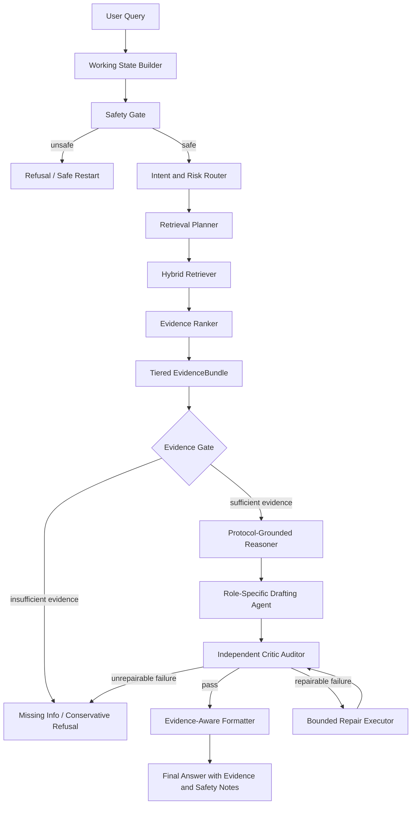

# Agent Workflow 方法草图

## 0. 文档目的

本文件用于把论文中的核心方法从“项目工程实现”抽象成可投稿的 agent workflow。它不是最终论文正文，也不是代码实现说明，而是方法图、节点职责、输入输出契约和可评测字段的中间规格。

拟命名：

> Protocol-Grounded Evidence-Gated Agentic RAG for Endurance Training Advice

核心思想：

- 领域协议先约束。
- 证据包再支撑。
- 生成器只负责表达与有限推理。
- 独立审计节点负责放行。
- 证据不足或风险过高时进入补信息、降级或拒答。

## 1. 与普通 RAG 的差异

普通 RAG 通常是：

```text
query -> retrieve -> generate -> answer
```

本文目标工作流是：

```text
query
 -> working-state reset
 -> safety gate
 -> intent / risk routing
 -> retrieval planning
 -> multi-source retrieval
 -> tiered evidence bundle
 -> evidence gate
 -> protocol-grounded reasoning
 -> answer drafting
 -> independent audit
 -> bounded repair or refusal
 -> evidence-aware output
```

关键差异：

| 维度 | 普通 RAG | 本文工作流 |
|---|---|---|
| 知识形式 | 检索文本为主 | 领域协议、动作库、知识库、图谱、概念解释分层 |
| 生成约束 | 依赖 prompt | 规则、证据门、审计节点共同约束 |
| 证据处理 | 上下文拼接 | `EvidenceBundle` 统一编号、分层、追踪 |
| 风险处理 | 常规回答 | 风险驱动 agent 激活、降级、拒答 |
| 审计方式 | 可选自检 | 独立 auditor，生成节点不可自我批准 |
| 失败路径 | 仍可能输出 | 补信息、修复、保守 fallback 或拒答 |

## 2. 方法总览图



说明：

- `Working State Builder`、`Safety Gate`、`Intent Router`、`EvidenceBundle`、`Critic Auditor` 在当前仓库已有相应资产或雏形。
- `Evidence Gate`、`Risk Router`、`Claim-level Audit` 是论文增强方向，当前需要进一步显式化和评测化。
- `Protocol-Grounded Reasoner` 对训练计划类问题尤其重要；对纯 QA 问题则表现为“训练协议与安全边界参与回答约束”。

## 3. 节点职责与契约

### 3.1 Working State Builder

目标：

- 为每轮请求建立干净运行态。
- 避免长期会话中上一轮 `mode / draft_plan / is_approved / evidence` 污染下一轮。

输入：

- 用户 query。
- 用户画像。
- 有限历史摘要。
- 当前知识库健康状态。

输出：

- `WorkingState`。

当前仓库对应：

- `marathon_qa_assistant/core/working_state.py`

可评测字段：

- 跨轮污染测试是否通过。
- 上一轮高风险 / adaptive / research 状态是否影响下一轮普通 QA。

### 3.2 Safety Gate

目标：

- 拦截提示注入、越权、敏感探测和不安全历史上下文。

输入：

- query。
- 最近历史消息。

输出：

- `safe / unsafe`。
- 拦截原因。

当前仓库对应：

- `marathon_qa_assistant/nodes/security.py`

可评测字段：

- unsafe query 拦截率。
- 正常 query 误拦截率。

### 3.3 Intent and Risk Router

目标：

- 判断请求属于 QA、训练计划、研究分析、自适应调整或画像更新。
- 判断是否涉及伤痛、异常心率、高疲劳、医学化风险、营养补给等高风险类别。

输入：

- query。
- user profile。
- adaptive feedback。

输出：

- `workflow_kind`。
- `intent_type`。
- `risk_level`。
- `required_agents`。

当前仓库对应：

- `marathon_qa_assistant/nodes/router.py`

论文增强建议：

- 将风险分类从关键词规则扩展为显式字段。
- 引入风险驱动 agent activation：低风险事实题不必走完整多 agent，高风险题必须启用 therapist / auditor。

可评测字段：

- 意图分类准确率。
- 风险题召回率。
- agent 激活是否符合 SOP。

### 3.4 Retrieval Planner

目标：

- 根据意图生成检索 query。
- 对训练计划、伤痛、营养等任务追加领域术语和安全约束。

输入：

- query。
- workflow kind。
- risk level。
- user profile。

输出：

- 检索 query 列表。
- 所需证据类型。

论文增强建议：

- 把检索规划显式记录到实验日志。
- 区分事实证据、协议规则、动作模板和概念解释。

可评测字段：

- 检索 query 是否覆盖关键实体。
- query expansion 是否提高 Recall@k。

### 3.5 Hybrid Retriever

目标：

- 从多源知识中召回候选证据。

候选来源：

- 向量知识库。
- 动作库或课表模板。
- 图谱路径。
- 领域协议规则。
- Wiki 概念解释。

输出：

- raw evidence candidates。

当前仓库对应资产：

- `vector_kb/`
- `marathon_qa_assistant/services/vector_store.py`
- `marathon_qa_assistant/services/knowledge_graph.py`
- `marathon_qa_assistant/services/workout_template_retriever.py`
- HMP protocol 相关模块。

可评测字段：

- Recall@5。
- MRR@5。
- 同文档 / 同页 / 同 chunk 命中。

### 3.6 Evidence Ranker and Tiered EvidenceBundle

目标：

- 对召回证据去重、分层、编号、清洗和追踪。
- 后续生成、审计和 UI 都只能引用证据包中的证据编号。

核心数据结构：

```python
EvidenceBundle = {
    "query": str,
    "evidence_items": [
        {
            "evidence_id": str,
            "citation_label": "[1]",
            "tier": "protocol_rule | action_library | kb_fallback | graph | wiki_context | plan_only",
            "source_file": str,
            "source_path": str,
            "page": int | None,
            "chunk_id": str,
            "snippet": str,
            "text": str,
            "score": float,
            "trace": dict,
        }
    ],
    "health": dict,
}
```

当前仓库对应：

- `marathon_qa_assistant/core/evidence_bundle.py`

论文创新点：

- 不是把所有检索内容拼成 prompt，而是用分层证据契约控制“什么证据可以支撑什么类型的结论”。

可评测字段：

- invalid citation rate。
- evidence tier visibility。
- source path completeness。
- claim evidence coverage。

### 3.7 Evidence Gate

目标：

- 判断证据是否足以支撑回答。
- 对缺证、弱证、冲突证据或主题不相关召回进行阻断。

输入：

- `EvidenceBundle`。
- question category。
- risk level。

输出：

- `pass / missing_info / conservative_refusal / retrieve_more`。
- gate reason。

论文增强建议：

- 明确实现 evidence sufficiency rubric。
- 风险安全题中，证据不足不能让 LLM 自行补空。

可评测字段：

- answerable 判断准确率。
- unsupported answer 拦截率。
- 缺证拒答正确率。

### 3.8 Protocol-Grounded Reasoner

目标：

- 对训练相关问题，优先应用领域协议、周期化原则、容量预算、安全约束。
- 将规则结果作为生成前的结构化骨架。

输入：

- user profile。
- EvidenceBundle。
- HMP / training protocol。
- risk level。

输出：

- 结构化建议骨架。
- 安全边界。
- 不允许生成器突破的约束。

当前仓库对应资产：

- `half_marathon_protocol.py`
- `half_marathon_capacity_budget.py`
- `half_marathon_validator.py`
- `half_marathon_repair_executor.py`
- `half_marathon_glossary.py`

论文创新点：

- 协议不是 RAG 文本，而是机器可执行约束。
- RAG 负责解释和补充证据，不能覆盖安全约束。

可评测字段：

- protocol violation rate。
- unsafe load prescription rate。
- repair success rate。

### 3.9 Role-Specific Drafting Agent

目标：

- 根据任务类型选择 coach、therapist、nutritionist 或 research analyst 风格的生成节点。
- 将结构化骨架和证据包转为用户可读答案。

输入：

- query。
- EvidenceBundle。
- protocol-grounded skeleton。
- required agents。

输出：

- draft answer。
- draft claims。
- cited evidence labels。

当前仓库对应：

- `marathon_qa_assistant/nodes/expert_nodes.py`
- `marathon_qa_assistant/nodes/plan_nodes.py`

论文增强建议：

- 不要把“角色 prompt”当创新。
- 需要把每个角色的输出字段标准化，便于审计。

可评测字段：

- answer relevancy。
- faithfulness。
- role activation correctness。

### 3.10 Independent Critic Auditor

目标：

- 独立检查生成结果是否可放行。
- 生成节点不能写入最终批准标记。

检查项：

- 引用是否存在。
- 关键结论是否有证据。
- 是否违反协议规则。
- 高风险问题是否有降级或专业建议。
- 是否存在无证据承诺。
- 输出结构是否完整。

输出：

- `is_approved`。
- audit score。
- failure reason。
- repair suggestions。

当前仓库对应：

- `critic_auditor` 节点。

论文增强建议：

- 将失败原因标准化为标签，便于统计。
- 增加 claim-level audit。

可评测字段：

- unsupported claim rate。
- invalid citation rate。
- unsafe answer rate。
- auditor precision / recall。

### 3.11 Bounded Repair Executor

目标：

- 对可修复错误执行有限轮确定性修复。
- 修复失败后转为拒答、补信息或保守输出。

输入：

- draft。
- audit feedback。
- repair attempt count。

输出：

- repaired draft。
- repair log。

限制：

- 最多 1-2 轮。
- 不允许 LLM 补造证据。
- 引用缺失时必须回到证据包或拒答。

当前仓库对应资产：

- `half_marathon_repair_executor.py`
- workflow 中的审计失败重试链路。

可评测字段：

- repair success rate。
- post-repair violation rate。
- excessive retry rate。

### 3.12 Evidence-Aware Formatter

目标：

- 输出最终答案、证据列表、风险提示和解释面板。

输入：

- approved answer。
- EvidenceBundle。
- audit result。

输出：

- final report。
- evidence base。
- structured report。

当前仓库对应：

- `marathon_qa_assistant/nodes/output_nodes.py`

可评测字段：

- evidence visibility。
- citation rendering validity。
- user-facing safety note completeness。

## 4. Agent 激活策略草图

论文中不应描述为“所有问题都调用所有 agent”，而应描述为风险与复杂度驱动的动态激活。

| 问题类型 | 风险等级 | 推荐 agent 路径 |
|---|---|---|
| 事实抽取 | 低 | retriever -> evidence gate -> answer writer -> auditor |
| 概念解释 | 低 | retriever/wiki -> answer writer -> auditor |
| 应用推理 | 中 | retriever -> protocol reasoner -> coach -> auditor |
| 营养补给 | 中 | retriever -> nutritionist -> auditor |
| 疲劳/恢复 | 中/高 | retriever -> therapist -> auditor |
| 伤痛/异常心率 | 高 | safety gate -> therapist -> auditor -> conservative refusal or advice |
| 证据不足 | 任意 | evidence gate -> missing info / refusal |
| 训练计划生成 | 中/高 | protocol composer -> validator -> repair -> writer -> auditor |

## 5. 方法贡献可写法

### 贡献 1：协议约束的 Agentic RAG

本文将耐力训练协议编码为可执行约束，并放在生成前，而不是把协议材料作为普通检索文本交给模型自由解释。

### 贡献 2：分层证据包

本文提出面向训练建议的分层证据契约，将协议规则、动作模板、知识库证据、图谱证据和概念解释拆开管理，支撑引用、审计和 UI 展示。

### 贡献 3：证据门控与独立审计修复

本文将证据充足性判断、独立审计和有界修复作为工作流节点，使缺证问题进入补信息、保守降级或拒答，而不是生成无证据建议。

### 贡献 4：耐力训练问答 Benchmark

本文构建小规模高质量 pilot benchmark，覆盖事实抽取、应用推理和风险安全三类问题，用于评估证据一致性和安全处理能力。

## 6. 当前实现与待增强项

| 模块 | 当前状态 | 投稿前建议 |
|---|---|---|
| WorkingState | 已有实现 | 增加跨轮污染测试记录 |
| Safety Gate | 已有实现 | 扩展风险分类标签 |
| Router | 已有实现 | 加入 `risk_level` 和 `required_agents` |
| EvidenceBundle | 已有实现 | 增加 claim-level evidence mapping |
| Evidence Gate | 部分隐含 | 显式实现 evidence sufficiency rubric |
| Protocol Reasoner | 计划类较强 | QA 类问题也需明确协议边界 |
| Critic Auditor | 已有实现 | 标准化失败原因和审计指标 |
| Repair Executor | 计划类已有资产 | 扩展到引用缺失、证据不足等通用修复 |
| Benchmark | 设计中 | 建立 30-50 题 pilot 数据表 |

## 7. 最小实验闭环

第一版论文实验建议至少包含：

| 设置 | 描述 |
|---|---|
| S1 No-RAG LLM | 直接回答 |
| S2 Vanilla RAG | 检索上下文后回答 |
| S3 Agentic RAG without evidence gate | 有 agent 编排但不阻断缺证 |
| S4 Full workflow | 协议约束 + 证据门 + 独立审计 + 有界修复 |

第一版主指标：

- Recall@5。
- MRR@5。
- Faithfulness。
- Answer Relevancy。
- Claim Evidence Coverage。
- Unsupported Claim Rate。
- Invalid Citation Rate。
- Safe Refusal / De-escalation Rate。

## 8. 论文方法章节草案结构

建议 Method 章节可以写成：

1. Problem Formulation
   - endurance training advice as evidence-grounded QA。
   - answerable / unanswerable / risk-sensitive cases。
2. Workflow Overview
   - 总图和节点链路。
3. Tiered EvidenceBundle
   - 证据分层、字段、引用约束。
4. Protocol-Grounded Reasoning
   - 领域协议如何约束生成。
5. Evidence Gate and Audit-Repair Loop
   - 缺证、冲突、高风险时如何处理。
6. Benchmark and Evaluation Metrics
   - 与实验章衔接。

## 9. 关键风险

- 不能把尚未实现的 `Evidence Gate` 写成已实现结果。
- 不能把 HMP OCR 文档中未审计内容作为正式科学依据。
- 不能把 agent 角色设定当作实证创新。
- 不能把 LLM 生成的训练建议写成经过真实训练验证。
- 若使用 API 模型，必须记录模型版本、调用日期和参数。
