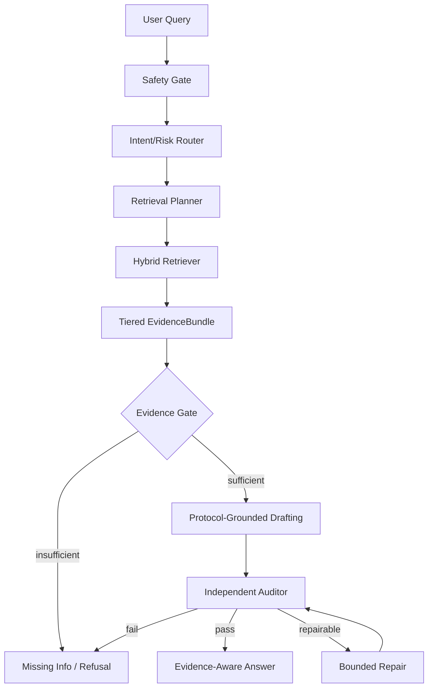

# STAI 2026 投稿冲刺计划

## 0. 目标

近期目标：

> 面向 STAI 2026 Workshop @ ECML PKDD，准备一篇 6 页以内的 short research statement。

拟题：

> Evidence-Gated Agentic RAG for Trustworthy Endurance Training Advice

投稿定位：

- 不是体育训练论文。
- 不是完整系统介绍论文。
- 是一篇面向 secure and trustworthy AI 的 agentic RAG 工作流短文。
- 耐力训练/运动健康建议作为 safety-sensitive case study。

当前日期：2026-05-10
投稿截止：2026-06-05 AoE
剩余时间：约 26 天

## 1. 与 STAI 主题的对应关系

| STAI 关注方向 | 我们的对应内容 |
|---|---|
| Security and trustworthiness of agentic and autonomous AI systems | agentic RAG 工作流中的安全门、证据门、独立审计和有界修复 |
| System-level robustness beyond predictive accuracy | 不只看 accuracy/relevancy，还看 unsupported claim、invalid citation、safe refusal |
| Trustworthiness evaluation metrics and holistic benchmarks | 耐力训练问答 pilot benchmark，覆盖事实抽取、应用推理和风险安全 |
| Human-centered or safety-critical applications | 运动健康/耐力训练建议中的风险边界、降级和专业评估提示 |
| Robustness against unsafe or unreliable outputs | 缺证拒答、风险题降级、审计失败不放行 |

## 2. 投稿核心论点

核心论点：

> In safety-sensitive fitness guidance, retrieval alone is insufficient. Agentic RAG systems need explicit evidence gating, protocol grounding, independent auditing, and bounded repair/refusal to reduce unsupported or unsafe advice.

中文解释：

在运动健康建议场景中，仅靠 RAG 检索并不能保证可信。系统必须知道什么时候证据不足、什么时候不能直接建议训练、什么时候需要降级或拒答。

## 3. 最小论文贡献

6 页短文建议只主打 3 个贡献：

1. **Workflow**
   提出 protocol-grounded, evidence-gated, audit-and-repair agentic RAG 工作流。

2. **Evidence Contract**
   引入分层 `EvidenceBundle`，区分 protocol rule、knowledge-base evidence、graph evidence、wiki/context 和 plan-only fallback。

3. **Pilot Evaluation Design / Preliminary Results**
   构建 10-18 题最小 pilot benchmark，评估 No-RAG、Vanilla RAG 和 Full Workflow 在证据覆盖、安全拒答和无证据结论上的差异。

## 4. 6 页结构草案

### 4.1 Abstract

核心句式：

- LLM-based fitness assistants can generate plausible but unsupported or unsafe advice.
- We propose an evidence-gated agentic RAG workflow.
- The workflow combines protocol grounding, tiered evidence bundles, independent auditing, and bounded repair/refusal.
- We evaluate it on a pilot endurance-training QA benchmark.

### 4.2 Introduction

要讲清楚：

- 运动健康建议属于 safety-sensitive advice。
- 普通 LLM 容易幻觉，普通 RAG 仍可能误用证据。
- agent workflow 的可信性不能只靠角色 prompt。
- 本文关注系统层 trustworthiness。

### 4.3 Related Work

压缩到三类：

- Agentic RAG / self-reflective RAG：Self-RAG、CRAG、RAGTruth。
- Multi-agent / tool-using agents：ReAct、AutoGen、MetaGPT。
- Safety-sensitive AI / health guidance：只简要引出应用风险，不展开体育科学综述。

### 4.4 Method

重点图：

方法小节：

- Working-state reset。
- Tiered EvidenceBundle。
- Evidence gate。
- Independent critic auditor。
- Bounded repair/refusal。

### 4.5 Pilot Benchmark and Metrics

最小版本：

- 10-18 道题。
- 覆盖事实抽取、应用推理、风险安全。
- 证据来源：优先使用 verified 的 T02/T03/T12/R11/R13。

指标：

- Claim Evidence Coverage。
- Unsupported Claim Rate。
- Invalid Citation Rate。
- Safe Refusal / De-escalation Rate。
- Answer Relevancy。

### 4.6 Preliminary Results or Experimental Plan

如果能跑出实验：

- 放一张小表，比较 No-RAG、Vanilla RAG、Full Workflow。
- 明确样本量是 pilot，不夸大结论。

如果实验结果不足：

- 写成 research statement / design paper。
- 展示 benchmark 构建、workflow、指标和预期验证路线。
- 但最好至少完成 10-18 题初测。

### 4.7 Discussion and Limitations

必须诚实说明：

- 当前 benchmark 小。
- 证据库还在扩展。
- 不能证明真实训练效果。
- 不提供医疗诊断。
- API 模型版本和输出不稳定。

## 5. 最小实验闭环

STAI short paper 最小可交付实验：

| 组件 | 最低要求 |
|---|---|
| Benchmark | 10-18 道 verified pilot 题 |
| 题型 | fact / applied reasoning / risk safety 都至少有 3 题 |
| 系统设置 | No-RAG LLM, Vanilla RAG, Full Workflow |
| 模型 | 先用本地 Ollama；若时间够，再加一个 API 模型 |
| 指标 | Claim Evidence Coverage, Unsupported Claim Rate, Safe Refusal Rate |
| 错误分析 | 至少列 3 类典型失败 |

可选增强：

- w/o Evidence Gate 消融。
- w/o Independent Auditor 消融。
- API 模型复现。

## 6. 接下来 26 天任务拆解

### Week 1：证据验证与样本

目标：

- 完成 10-18 条 verified 证据。
- 生成 10-18 道 pilot 题。

任务：

- 验证 T02/T03/T12/R11/R13 的证据段落。
- 将 `08_v0.1证据段落抽取表.md` 中部分 `todo` 改成 `verified`。
- 创建正式 pilot benchmark 样本表。

### Week 2：最小实验

目标：

- 跑通 No-RAG、Vanilla RAG、Full Workflow。
- 保存原始输出。

任务：

- 确定模型和参数。
- 固定知识库版本。
- 写或整理运行脚本。
- 记录每个系统输出。

### Week 3：指标与初稿

目标：

- 完成 claim-level 标注和指标表。
- 写出 6 页初稿。

任务：

- 标注 unsupported claims。
- 标注 safe refusal / de-escalation。
- 生成结果表和错误案例。
- 写 Method、Benchmark、Results。

### Week 4：压缩与投稿

目标：

- 压缩到 6 页。
- 补 references。
- 检查格式。
- 提交。

任务：

- 避免长篇系统细节。
- 只保留最能说明 trustworthiness 的实验。
- 完成 limitations。

## 7. 文件路线

已有支撑文件：

- `03_agent_workflow_创新性文献矩阵.md`
- `04_agent_workflow方法草图.md`
- `05_agent_workflow消融实验设计.md`
- `06_benchmark专用证据库纳入标准.md`
- `07_benchmark专用证据库候选文献.md`
- `08_v0.1证据段落抽取表.md`

建议新增文件：

- `10_STAI2026_pilot_benchmark样本表.md`
- `11_STAI2026_实验运行记录.md`
- `12_STAI2026_claim_level标注表.md`
- `13_STAI2026_short_paper大纲.md`

## 8. 当前不做的事

暂不做：

- 大规模下载文献。
- 大规模重构代码。
- 完整 36 题 benchmark。
- SCI 期刊完整论文。
- 用户研究。
- 专家评审。

这些都可以作为后续扩展。

## 9. 最近一步

下一步最优先：

> 验证 T02/T03/T12/R11/R13 中的 10-18 条证据段落，并把它们转成正式 pilot benchmark 题。

原因：

- 这是 STAI short paper 最小实验的地基。
- 证据验证完成后，才能合法地计算 evidence coverage 和 unsupported claim。
- 没有 verified 证据，后续实验表没有学术说服力。
