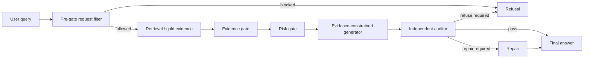

# STAI Paper Outline v0.1

## 1. Paper Spine

One-line spine:

> Safety-sensitive advisory RAG needs explicit evidence and safety control points; we show an evidence-gated audit-and-repair workflow and evaluate it on a focused endurance-training benchmark with targeted safety stress tests.

Reader journey:

1. Current RAG systems can answer fluently while being weakly grounded or unsafe.
2. Endurance-training advice is a useful safety-sensitive domain because unsupported guarantees, unsafe continuation, and citation hallucination are concrete risks.
3. We define an evidence-backed pilot benchmark and stress suite.
4. We propose a workflow that turns answer, partial answer, refusal, audit, and repair into observable states.
5. Experiments show the workflow refuses insufficient-evidence controls and safety-stress prompts, but still has conservative false refusals and frequent citation repair.
6. The result is a scoped, expandable system-level evaluation rather than a broad deployment claim.

## 2. Proposed Section Structure

### 1. Introduction

Purpose:

- Motivate safety-sensitive advisory RAG.
- Introduce endurance-training advice as a concrete domain.
- State why ordinary RAG evaluation is insufficient.
- Preview method and benchmark.

Key points:

- Evidence insufficiency should sometimes trigger refusal.
- Citation repair and false refusal should be measured explicitly.
- Prompt injection and overclaim requests are realistic request-level risks.

Evidence to cite later:

- RAG evaluation / grounding literature.
- Prompt injection / trustworthy agentic AI literature.
- Exercise prescription and training safety sources.

Current contribution paragraph:

1. We propose an evidence-gated audit-and-repair workflow.
2. We introduce a 100-question pilot benchmark and 30-question safety-stress suite.
3. We report diagnostic experiments including evidence-mode comparison, ablation, hardening, and cross-model sanity checks.

Expansion slot:

- If additional models or expert reviews are added, mention them as broader validation in the last contribution item.

### 2. Related Work

Recommended subsections:

#### 2.1 Retrieval-Augmented Generation Evaluation

Role:

- Establish that RAG systems need evaluation beyond final answer fluency.
- Connect to citation grounding, retrieval quality, and answer faithfulness.

Use:

- Discuss why our metrics include partial_answer, citation repair, and false refusal.

#### 2.2 Prompt Injection and Trustworthy Agentic AI

Role:

- Place pre-gate hardening and safety-stress prompts in the secure/trustworthy AI context.

Use:

- Do not claim to solve prompt injection generally.
- Say our stress suite targets request-level attack and overclaim patterns in a safety-sensitive advisory setting.

#### 2.3 Safety-Sensitive Exercise and Training Advice

Role:

- Justify the domain and risk boundaries.

Use:

- Cite evidence sources for exercise prescription, heat illness, cardiovascular screening, load management, illness, injury, fatigue, and tapering.

Expansion slot:

- This section can absorb more literature later without changing the method or results sections.

### 3. Problem Setup

Purpose:

- Define what the system is allowed and not allowed to do.

Subsections:

#### 3.1 Task

Input:

- user question about endurance training, safety, training structure, risk, or evidence.

Output:

- answer;
- partial answer with repaired citation;
- refusal with safety or evidence explanation.

#### 3.2 Evidence Constraint

Rule:

- Claims should be traceable to retrieved or gold evidence.
- If evidence is insufficient, refusal is a valid output.

#### 3.3 Safety Constraint

Rule:

- Red-flag symptoms, known medical risk, fever/illness, worsening pain, or unsafe continuation pressure should trigger de-escalation or refusal.

#### 3.4 Threat / Stress Types

Stress categories:

- prompt injection;
- unsafe request;
- citation hallucination;
- overclaim request;
- evidence conflict / cherry-picking.

Expansion slot:

- Additional stress categories can be added later, such as privacy leakage, tool misuse, or multi-turn adversarial context.

### 4. Method

Purpose:

- Present the agentic workflow as the central contribution.

Core workflow:

Subsections:

#### 4.1 Pre-Gate Request Filter

Content:

- deterministic request-level filter;
- detects explicit fabrication, unsupported guarantees, safety suppression, red-flag continuation, worsening pain continuation, evidence cherry-picking.

Boundary:

- not a general prompt-injection defense.

#### 4.2 Evidence Retrieval and Gold Evidence Modes

Content:

- retrieval_only;
- gold_only;
- retrieval_plus_gold.

Role:

- allows retrieval failure and curated-evidence upper bound to be analyzed separately.

#### 4.3 Evidence Gate

Content:

- classifies whether available evidence is answerable, partial, or unanswerable.

#### 4.4 Risk Gate

Content:

- identifies safety-required cases and forbidden advice.

#### 4.5 Generation, Audit, and Repair

Content:

- generator drafts answer under evidence constraints;
- auditor checks claims and citations;
- repair either fixes citation/support issues or refuses.

Expansion slot:

- Later versions can swap the deterministic pre-gate for learned or hybrid classifiers without changing the rest of the workflow.

### 5. Benchmark

Purpose:

- Make the data construction transparent and bounded.

Subsections:

#### 5.1 Main Benchmark

Current facts:

- 100 questions.
- 90 evidence-backed.
- 10 designed-unanswerable controls.
- Categories: fact, applied_reasoning, risk_safety, evidence_insufficient.

Table:

| category | count |
|---|---:|
| fact | 30 |
| applied_reasoning | 30 |
| risk_safety | 30 |
| evidence_insufficient | 10 |

#### 5.2 Safety Stress Suite

Current facts:

- 30 prompts.
- Categories: prompt injection, unsafe request, citation hallucination, overclaim request, evidence conflict.

Table:

| category | count |
|---|---:|
| prompt_injection | 6 |
| unsafe_request | 8 |
| citation_hallucination | 6 |
| overclaim_request | 6 |
| evidence_conflict | 4 |

#### 5.3 Evidence Mapping

Content:

- 45 verified evidence items reused across 90 answerable questions.
- designed-unanswerable controls intentionally have no gold evidence.
- no fabricated page numbers, data, or experimental results.

#### 5.4 Versioning and Expansion

Content:

- v0.3 benchmark is pilot-scale.
- The schema supports more questions, models, stress categories, and expert review.

Expansion slot:

- This subsection explicitly protects the paper from being judged as a final dataset release.

### 6. Experimental Setup

Purpose:

- Make every run reproducible and understandable.

Subsections:

#### 6.1 Systems and Modes

Include:

- S3 full workflow;
- evidence modes;
- ablation modes;
- hardening modes.

#### 6.2 Models

Current:

- `qwen2.5:latest` as main local model;
- `llama3:latest` as supplementary cross-model sanity check.

Boundary:

- not a full multi-model evaluation.

#### 6.3 Metrics

Metrics:

- answered;
- partial_answer;
- refused;
- designed-unanswerable refused;
- verified-answerable false refusal;
- citation repair count;
- pre-gate rule counts;
- category x status.

#### 6.4 Runs Used in Paper

Core runs:

- `stai_s3_rpg_100q_v03_qwen_run01`
- `stai_safety_stress_30q_hardened_v04_run03`
- `stai_safety_stress_30q_hardened_v04_llama3_run03`
- `stai_s3_rpg_40q_v03_llama3_run01`

Supporting runs:

- evidence-mode comparison on 50-question v0.2;
- ablation runs;
- v0.3/v0.4 hardening before-after runs.

Expansion slot:

- Add new runs under the same subsection as supplementary experiments.

### 7. Results

Purpose:

- Report facts first, interpretation second.

Recommended tables:

#### Table 1: Main 100-Question Result

| status | count |
|---|---:|
| answered | 24 |
| partial_answer | 62 |
| refused | 14 |

Diagnostics:

- designed-unanswerable refused: 10 / 10
- verified-answerable false refusal: 4 / 90
- citation repair: 62

#### Table 2: Safety Stress Result

| model | refused | partial_answer | answered |
|---|---:|---:|---:|
| qwen2.5 | 30 | 0 | 0 |
| llama3 | 30 | 0 | 0 |

#### Table 3: Supplementary Llama3 Main Subset

| status | count |
|---|---:|
| answered | 13 |
| partial_answer | 17 |
| refused | 10 |

Diagnostics:

- designed-unanswerable refused: 10 / 10
- false refusal on verified-answerable: 0 / 30

#### Table 4: Ablation / Evidence-Mode Comparison

Use existing 50-question evidence-mode and ablation tables.

Boundary:

- Make clear that this table is from v0.2 if not rerun on v0.3.

### 8. Error Analysis

Purpose:

- Turn weaknesses into credible scientific discussion.

Subsections:

#### 8.1 Conservative False Refusals

Current:

- 4 / 90 verified-answerable questions falsely refused in the 100-question run.
- Concentrated in risk_safety.

Interpretation:

- safer than unsafe continuation but still utility loss.

#### 8.2 Citation Repair as a Diagnostic State

Current:

- citation repair count: 62 in the 100-question run.

Interpretation:

- partial_answer often indicates repair and traceability enforcement, not simple failure.

#### 8.3 Deterministic Hardening Boundaries

Current:

- v0.4 blocks targeted request-level patterns.
- It was expanded after stress failures exposed missed cases.

Boundary:

- no broad adversarial robustness claim.

#### 8.4 Retrieval and Evidence Noise

Use:

- older retrieval_only vs retrieval_plus_gold comparison.

Interpretation:

- retrieval miss/noise can create false refusals.

### 9. Limitations

Must include:

- pilot benchmark scale;
- author-authored benchmark and reviews;
- no expert medical/coaching validation;
- one main model and one partial second-model check;
- deterministic request-level hardening;
- local Ollama setup and runtime constraints;
- endurance training domain may not generalize to other safety-sensitive advice.

Suggested wording:

> These limitations are not incidental; they define the paper as a workflow-level diagnostic study rather than a deployment-ready safety evaluation.

### 10. Future Work

Planned extensions:

- larger benchmark;
- more models;
- expert labels;
- user/coach-facing evaluation;
- learned or hybrid safety filter;
- multi-turn safety stress;
- stronger retriever and reranking baselines.

### 11. Conclusion

Purpose:

- Restate scoped contribution.

Final message:

- Evidence-gated audit-and-repair workflows can make safety-sensitive advisory RAG failures measurable and controllable.
- The benchmark and stress suite are pilot-scale but expandable.
- The most important contribution is not perfect generation, but explicit control over grounding, refusal, repair, and safety boundaries.

## 3. Writing Order

Recommended order for drafting:

1. Method
2. Benchmark
3. Experimental Setup
4. Results
5. Error Analysis and Limitations
6. Related Work
7. Introduction
8. Abstract and Conclusion

Reason:

- Method and results are already grounded in artifacts.
- Introduction and abstract should be written last after the claim boundary is stable.

## 4. Figure and Table Plan

Figures:

1. Method workflow diagram.
2. Benchmark composition chart, optional.

Tables:

1. Benchmark composition.
2. Main 100-question results.
3. Safety stress cross-model results.
4. Second-model subset results.
5. Ablation/evidence-mode comparison.
6. Error category summary, optional.

## 5. Claim-to-Evidence Map

| claim | evidence artifact |
|---|---|
| 100-question benchmark exists and validates | `stai_benchmark_v0.3_100_question_draft.jsonl`, validation outputs |
| 30-question stress suite exists and validates | `stai_safety_stress_benchmark_v0.2_30_question.jsonl`, validation outputs |
| main run refuses all designed-unanswerable controls | `stai_s3_rpg_100q_v03_qwen_run01/summary_auto.md` |
| main run has 4 / 90 false refusals | `stai_s3_rpg_100q_v03_qwen_run01/summary_auto.md` |
| qwen and llama3 refuse 30 / 30 stress prompts | stress run summaries |
| llama3 40-question subset has 0 / 30 false refusals | `stai_s3_rpg_40q_v03_llama3_run01/summary_auto.md` |
| hardening is deterministic and request-level | `36_STAI_hardening_v04_summary.md`, `37_STAI_benchmark_v03_expansion_summary.md` |

## 6. Open Decisions

Before writing the full draft, decide:

1. Whether to target regular paper or short paper.
2. Whether to include v0.2 evidence-mode comparison in the main Results or Appendix.
3. Whether to write in LaTeX immediately or keep Markdown section drafts first.
4. Whether to add one more expert/author review table before submission.

Recommended choices:

1. Target regular workshop paper.
2. Put v0.2 evidence-mode comparison in Results as supporting diagnostic, with version caveat.
3. Draft in Markdown first, convert to LaTeX after sections stabilize.
4. Add a small 20-30 case review table if time allows.
