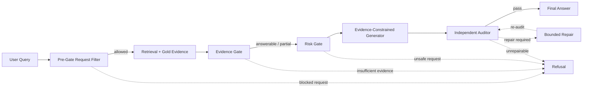

# STAI Method Figure Image2 Prompt v0.1

This file contains the detailed prompt to use with image2 for generating the paper method figure. The goal is an academic workflow diagram, not a decorative illustration.

## 1. Figure Goal

Generate a clean academic workflow diagram for a research paper titled:

**Evidence-Gated Audit-and-Repair Agentic RAG for Safety-Sensitive Endurance Training Advice**

The figure should show the full system pipeline:

`User Query -> Pre-Gate Request Filter -> Retrieval / Gold Evidence -> Evidence Gate -> Risk Gate -> Evidence-Constrained Generator -> Independent Auditor -> Final Answer / Repair / Refusal`

It must emphasize that the system is not vanilla RAG. The important visual idea is: **generation is controlled by evidence, risk, audit, and repair/refusal gates.**

## 2. Image2 Prompt

Create a publication-quality academic workflow diagram on a white background, landscape orientation, 16:9 aspect ratio, suitable for inclusion in a Springer LNCS-style research paper. Use a clean vector style, thin dark-gray lines, readable sans-serif typography, and a restrained color palette. Do not use decorative gradients, icons, mascots, 3D effects, or background patterns.

Title at the top center:

“Evidence-Gated Audit-and-Repair Agentic RAG Workflow”

Create the diagram as a left-to-right pipeline with clearly separated modules. Use rounded rectangles with subtle 1px borders and small section labels. Use arrows to show data flow. Use dashed arrows for refusal or repair paths. Use four color groups:

- Input and output nodes: light gray.
- Evidence-related nodes: light blue.
- Safety and policy nodes: light red or light coral.
- Generation/audit/repair nodes: light green or light amber.

Keep all node text exactly as written below. Do not paraphrase node labels.

Main horizontal flow:

1. “User Query”
2. “Pre-Gate Request Filter”
3. “Retrieval + Gold Evidence”
4. “Evidence Gate”
5. “Risk Gate”
6. “Evidence-Constrained Generator”
7. “Independent Auditor”
8. “Final Answer”

Add a refusal box below the main flow, aligned under the gates and auditor:

“Refusal”

Add a repair box below the generator/auditor area:

“Bounded Repair”

Arrows:

- User Query -> Pre-Gate Request Filter
- Pre-Gate Request Filter -> Retrieval + Gold Evidence, labeled “allowed”
- Pre-Gate Request Filter -> Refusal, dashed arrow labeled “blocked request”
- Retrieval + Gold Evidence -> Evidence Gate
- Evidence Gate -> Risk Gate, labeled “answerable / partial”
- Evidence Gate -> Refusal, dashed arrow labeled “insufficient evidence”
- Risk Gate -> Evidence-Constrained Generator
- Risk Gate -> Refusal, dashed arrow labeled “unsafe request”
- Evidence-Constrained Generator -> Independent Auditor
- Independent Auditor -> Final Answer, labeled “pass”
- Independent Auditor -> Bounded Repair, dashed arrow labeled “repair required”
- Bounded Repair -> Independent Auditor, curved arrow labeled “re-audit”
- Independent Auditor -> Refusal, dashed arrow labeled “unrepairable”

Add three small annotation callouts under the diagram, each in a small unframed text area:

Callout 1:
“Evidence states: answerable, partial, unanswerable”

Callout 2:
“Output states: answered, partial_answer, refused”

Callout 3:
“Trace fields: pre_gate, evidence_gate, risk_gate, audit, repair”

Add a small comparison strip at the very bottom:

Left side label:
“Vanilla RAG: retrieve -> generate -> answer”

Right side label:
“This workflow: retrieve -> gate -> generate -> audit -> repair/refuse”

Make the comparison strip subtle, using smaller text than the main nodes.

The diagram must be highly legible at paper column width. Use large enough text, high contrast, and consistent spacing. Avoid clutter. Use no more than 8 main nodes. The figure should look like a professional method diagram from a machine learning workshop paper.

## 3. Negative Prompt

Do not create a marketing-style infographic. Do not add people, runners, medals, shoes, medical symbols, robots, neural network background art, glowing effects, 3D boxes, complex icons, or cartoon elements. Do not use dark backgrounds. Do not use tiny text. Do not invent extra modules. Do not change the node labels. Do not add claims such as “clinically validated”, “robust defense”, or “safe for real-world deployment”.

## 4. Preferred Visual Layout

Recommended structure:

```text
                           Evidence-Gated Audit-and-Repair Agentic RAG Workflow

  [User Query] -> [Pre-Gate Request Filter] -> [Retrieval + Gold Evidence] -> [Evidence Gate] -> [Risk Gate] -> [Evidence-Constrained Generator] -> [Independent Auditor] -> [Final Answer]
                       | blocked request                 | insufficient evidence      | unsafe request                         | repair required       | pass
                       v                                 v                            v                                      v                  v
                    [Refusal] <--------------------------+----------------------------+------------------------------ [Bounded Repair] <------+
                                                                                                                           |
                                                                                                                      re-audit

  Evidence states: answerable, partial, unanswerable
  Output states: answered, partial_answer, refused
  Trace fields: pre_gate, evidence_gate, risk_gate, audit, repair

  Vanilla RAG: retrieve -> generate -> answer       This workflow: retrieve -> gate -> generate -> audit -> repair/refuse
```

## 5. Figure Caption

**Figure 1. Evidence-gated audit-and-repair workflow for safety-sensitive endurance-training RAG.** A user query is first checked by a request-level pre-gate. Non-blocked requests enter retrieval and evidence gating. Safety-sensitive cases are constrained by a risk gate before generation. Draft answers are checked by an independent auditor and either released, repaired, or refused. The workflow records all intermediate states for diagnostic evaluation.

## 6. Mermaid Backup

If image2 output is not legible enough, use this Mermaid diagram as the backup source:



## 7. Checklist Before Using Image2

- Node labels are final.
- No clinical validation claim appears in the prompt.
- The diagram makes refusal and repair visible.
- The workflow does not look like ordinary retrieve-generate-answer RAG.
- The prompt preserves future extensibility: additional models, larger benchmarks, and learned filters can be discussed in text without changing the figure.

## 8. Current Figure Asset

Current paper-draft asset:

- `docs/paper_project/figures/figure1_method_workflow.png`

Source generated image retained outside the project:

- `C:\Users\26318\.codex\generated_images\019e0bdb-746f-7ed1-9bb2-644a4eb39aba\ig_0741cd484641a014016a015ea18348819a9e5e9ad87492092d.png`

Current assessment:

- usable for the paper draft;
- logically aligned with the method section;
- still worth redrawing as vector/Mermaid/TikZ before final submission if time allows.

Final-figure logic to preserve:

- no direct dashed arrow from retrieval to refusal;
- refusal may be triggered by the pre-gate, evidence gate, risk gate, or independent grounding auditor;
- bounded repair is citation/grounding repair only, not semantic repair of unsafe requests;
- repaired outputs must be checked again before final answer release.
