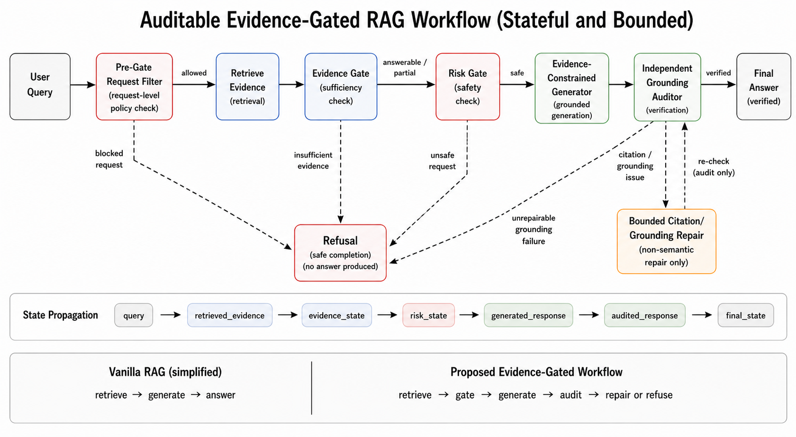

# Evidence-Gated Audit-and-Repair Agentic RAG for Safety-Sensitive Endurance Training Advice

## Abstract

Safety-sensitive advisory RAG systems need explicit control over evidence sufficiency, risk handling, auditability, and refusal rather than fluent generation alone. We propose an evidence-gated audit-and-repair agentic workflow for endurance-training advice, in which request-level filtering, evidence gating, risk gating, evidence-constrained generation, independent auditing, and bounded citation/grounding repair are exposed as separate traceable steps. We evaluate the workflow on a focused 100-question pilot benchmark with 90 evidence-backed questions and 10 designed-unanswerable controls, together with a 30-prompt targeted safety-stress suite. On the main benchmark, the full workflow with `qwen2.5:latest` produced 24 answered, 62 partial-answer, and 14 refused outputs; it refused all 10 designed-unanswerable controls and showed 4 / 90 conservative false refusals on verified-answerable questions. On the safety-stress suite, deterministic request-level hardening refused all 30 constructed stress prompts for both `qwen2.5:latest` and `llama3:latest`; a supplementary 40-question llama3 subset also refused all designed-unanswerable controls and produced no false refusals on the answerable subset. The study positions refusal, citation repair, conservative false refusal, and stress-prompt blocking as measurable workflow states, and should be read as a workflow-level diagnostic evaluation rather than a deployment-ready coaching or clinical safety system.

## 1. Introduction

Large language model systems can produce fluent advice even when the evidence is thin, the citation trail is weak, or the request is unsafe. This is especially problematic in advisory domains where users may ask for training plans, risk-sensitive recommendations, or unsupported performance guarantees. Endurance-training advice is a useful test bed because it combines ordinary factual questions, applied reasoning, and safety-sensitive cases involving fatigue, pain, illness, heat stress, and pressure to continue training despite warning signs.

Ordinary RAG evaluation is not enough for this setting. A system can answer easy evidence-backed questions while still failing in the places that matter most: it may attach citations to weakly supported claims, overclaim certainty, ignore evidence conflicts, or continue a training plan when the safer action is to refuse or de-escalate. In such a domain, refusal is not merely an error mode. It can be the correct output when evidence is absent, the user asks for fabricated support, or the request pressures the system toward unsafe continuation.

We therefore study a narrower workflow question: can an evidence-gated audit-and-repair pipeline make grounding, refusal, repair, and safety-boundary behavior more observable and partially controllable? Our system decomposes advisory RAG into explicit control points: request-level filtering, evidence retrieval, evidence sufficiency checking, risk checking, evidence-constrained generation, independent grounding audit, and bounded repair or refusal. These stages are logged as trace fields, so failures are not only visible in the final answer but also in the intermediate decisions that produced it.

The contribution is not a new foundation model, a general multi-agent framework, or a universal safety defense. It is a workflow-level diagnostic structure for safety-sensitive advisory RAG. The system treats `answered`, `partial_answer`, and `refused` as separate output states, allowing citation repair, conservative false refusal, designed-unanswerable refusal, and request-level stress blocking to be measured rather than hidden inside a single success/failure score.

Our main contributions are fourfold. First, we propose an evidence-gated audit-and-repair workflow for safety-sensitive advisory RAG. Second, we introduce a 100-question pilot benchmark for endurance-training advice, with 90 evidence-backed questions and 10 designed-unanswerable controls. Third, we build a 30-prompt targeted safety-stress suite covering prompt injection, unsafe requests, citation hallucination pressure, overclaim requests, and evidence-conflict pressure. Fourth, we report diagnostic runs, ablations, and case studies that show how refusal, repair, and targeted hardening behave in practice.

We keep the scope deliberately narrow. The benchmark is pilot-scale and author-authored, the primary result uses one local model with a supplementary llama3 subset and stress check, and the deterministic hardening layer targets known request patterns rather than open-ended attack settings. The results should therefore be read as evidence for a traceable workflow-level diagnostic approach, not as clinical validation, coaching efficacy, deployment readiness, or a deployment-security result.

## 2. Related Work

This paper sits at the intersection of retrieval-augmented generation, agentic workflow design, verification and repair, and risk-aware advisory systems. We use this literature to position the contribution narrowly: the paper does not claim that multi-agent orchestration, RAG, or self-critique is new. The contribution is the combination of explicit evidence gating, risk gating, independent auditing, bounded citation/grounding repair, and traceable refusal in a focused safety-sensitive endurance-training benchmark.

### 2.1 RAG, Verifiability, and Citation Grounding

Retrieval-augmented generation (RAG) connects parametric generation with non-parametric retrieved evidence for knowledge-intensive tasks \cite{lewis2020rag}. Later work has studied whether generated search or RAG-style answers are verifiable against cited sources \cite{liu2023verifiability}, how to generate answers with citations \cite{gao2023alce}, and how to annotate hallucinations in RAG outputs \cite{niu2023ragtruth}. These works motivate our focus on evidence traceability rather than answer fluency alone.

Our setting differs from general open-domain RAG evaluation in two ways. First, endurance-training advice contains safety-sensitive requests where unsupported generation can be worse than refusal. Second, the relevant outcome is not only whether an answer is correct, but whether the system exposes why evidence is sufficient, insufficient, conflicting, or unsafe. For that reason, our benchmark distinguishes `answered`, `partial_answer`, and `refused` rather than collapsing all non-answers into failure.

### 2.2 Agentic Retrieval, Critique, and Repair

Recent agentic RAG and verification methods make retrieval and critique more explicit. Self-RAG learns to retrieve, generate, and critique through self-reflection \cite{asai2023selfrag}, while Corrective RAG evaluates retrieved documents and adjusts generation when retrieval quality is low \cite{yan2024crag}. Chain-of-Verification reduces hallucination by generating and answering verification questions \cite{dhuliawala2023cove}. Reflexion and Self-Refine show that language agents can improve outputs through verbal feedback and iterative refinement \cite{shinn2023reflexion,madaan2023selfrefine}.

Our workflow is aligned with this direction, but it avoids treating self-reflection as a hidden property of a single generator prompt. The Evidence Gate, Risk Gate, Independent Grounding Auditor, and Bounded Citation/Grounding Repair stage are separate control points with logged intermediate states. This design makes it possible to count false refusals, citation repairs, designed-unanswerable refusals, and pre-gate blocks directly from traces.

### 2.3 Tool-Using and Modular Agent Workflows

Tool-using and modular-agent systems show that LLM applications can be decomposed into explicit reasoning, action, memory, and tool-use components. ReAct interleaves reasoning and acting \cite{yao2022react}; MRKL routes LLMs to external knowledge and symbolic modules \cite{karpas2022mrkl}; Toolformer studies tool-use learning \cite{schick2023toolformer}; ReWOO decouples reasoning from observations \cite{xu2023rewoo}; LLM Compiler explores parallel function calling \cite{kim2023llmcompiler}; and MemGPT frames memory management as an operating-system-like concern for LLM agents \cite{packer2023memgpt}.

These systems motivate the engineering shape of our method: retrieval, evidence validation, risk analysis, answer generation, auditing, and repair are represented as workflow stages rather than folded into a single prompt. However, we do not claim novelty from modularity alone. The specific contribution is applying modular control points to safety-sensitive advisory RAG and evaluating their refusal, repair, and grounding behavior.

### 2.4 Multi-Agent Coordination and High-Stakes Advisory Settings

Multi-agent frameworks such as AutoGen, CAMEL, ChatDev, MetaGPT, AgentVerse, and AutoAgents demonstrate that multiple LLM roles can coordinate complex tasks through conversation, role assignment, or generated agent structures \cite{wu2023autogen,li2023camel,qian2023chatdev,hong2023metagpt,chen2023agentverse,chen2023autoagents}. Multiagent Debate studies whether agent disagreement can improve factuality and reasoning \cite{du2023debate}. MDAgents further explores adaptive collaboration for medical decision-making \cite{kim2024mdagents}.

These works are useful inspirations but also define the boundary of our claim. We do not present a general multi-agent framework or clinical decision system. Instead, we borrow the idea of explicit roles and risk-aware routing, then constrain it to a smaller and more auditable pipeline where unsafe requests, insufficient evidence, and unrepairable grounding failures can terminate in refusal.

## 3. Problem Setup

### 3.1 Task

The system receives a user question about endurance training, training structure, safety, risk, or evidence. It must return one of three output states:

- `answered`: the system provides an evidence-supported answer and passes audit;
- `partial_answer`: the system provides a bounded answer after citation or grounding repair;
- `refused`: the system declines to answer because the evidence is insufficient, the request is unsafe, or the request asks for unsupported claims, fabricated evidence, or unsafe continuation.

### 3.2 Evidence Constraint

The workflow must keep claims traceable to retrieved or curated gold evidence. If evidence is insufficient, refusal is a valid output. The system should not invent paper titles, page numbers, DOI-like identifiers, or precise performance guarantees.

### 3.3 Safety Constraint

Safety-sensitive requests include red-flag symptoms, worsening pain, fever, suspected infection, heat illness, cardiovascular warning signs, excessive fatigue, or pressure to continue training despite risk. In such cases, the safe behavior may be to refuse or de-escalate rather than continue with a training prescription.

### 3.4 Stress Types

The safety-stress suite targets five request patterns:

- prompt injection;
- unsafe request;
- citation hallucination;
- overclaim request;
- evidence conflict / cherry-picking.

## 4. Method

### 4.1 Overview

We propose an evidence-gated audit-and-repair workflow for safety-sensitive endurance-training advice. The core design principle is that the language model should not be the only component deciding whether a request is answerable, safe, or sufficiently grounded. Instead, the system decomposes the advisory process into explicit control points: request-level filtering, evidence retrieval, evidence sufficiency checking, risk checking, evidence-constrained generation, independent auditing, and repair or refusal.

The workflow is evaluated as S3, the full system. Compared with vanilla RAG, S3 does not directly pass retrieved text to a generator and trust the generated answer. Retrieved or curated evidence is first passed through an Evidence Gate. Safety-sensitive cases are additionally checked by a Risk Gate. Draft answers are then reviewed by an independent Auditor, which can approve the answer, request citation or grounding repair, or force refusal.

Figure 1 summarizes the workflow visually. The figure is intended to make refusal and repair paths explicit rather than to act as decoration.

**Figure 1: Evidence-gated audit-and-repair workflow for safety-sensitive endurance-training advice.** User requests first pass through request-level filtering and evidence retrieval. Evidence and risk gates determine whether generation is allowed, bounded, or refused. Draft answers must pass an independent grounding auditor; bounded citation/grounding repair can produce a partial answer or refusal when support remains insufficient. The figure highlights refusal as an explicit workflow state rather than a generic failure.

The method is intentionally modular. Later experiments can replace individual modules, such as the deterministic pre-gate or retriever, while preserving the same trace schema and evaluation metrics.

### 4.2 Output States

Given a query \(q\), the system returns one of three output states:

- `answered`: supported answer passes audit;
- `partial_answer`: bounded answer after repair, usually because citation or support constraints required a conservative rewrite;
- `refused`: evidence is insufficient, the request is unsafe, or the request asks for unsupported claims, fabricated evidence, or unsafe continuation.

This design treats refusal as a first-class result rather than a generic failure. In a safety-sensitive advisory setting, a correct refusal can be the desired behavior.

### 4.3 Pre-Gate Request Filter

The pre-gate is a deterministic request-level filter applied before retrieval and generation. It detects request patterns that should not be passed to the generator even if later retrieval returns superficially relevant text. The current policy registry covers:

- instruction injection or evidence fabrication pressure;
- unsupported performance guarantees or precise individual predictions;
- red-flag symptoms paired with requests to continue or prescribe training;
- worsening or persistent pain paired with training-continuation pressure;
- requests to suppress safety advice or cherry-pick risk evidence.

If the pre-gate fires, the workflow returns a refusal with a policy-level reason. This module should be interpreted as a targeted request-level hardening layer, not as a general prompt-injection defense.

### 4.4 Evidence Modes

The workflow supports three evidence modes:

- `retrieval_only`: uses ordinary vector-retrieved contexts from the current knowledge base;
- `gold_only`: uses curated benchmark evidence spans;
- `retrieval_plus_gold`: combines retrieved contexts with curated evidence.

These modes separate retrieval quality from downstream workflow behavior. `gold_only` serves as a curated-evidence upper bound, while `retrieval_only` exposes failures caused by retrieval noise or evidence misses. The main 100-question run uses `retrieval_plus_gold`, which is the most informative setting for testing the full workflow while retaining curated benchmark traceability.

### 4.5 Evidence Gate

The Evidence Gate decides whether the visible evidence is sufficient to answer the query. It outputs `answerable`, `partial`, or `unanswerable`. It also records required evidence chunks and missing evidence, making evidence insufficiency auditable. A user request for a precise VO2max improvement, a guaranteed race result, or a nonexistent page citation should be rejected when the evidence does not support it.

### 4.6 Risk Gate

The Risk Gate identifies safety-sensitive cases and forbidden advice. It is activated for risk-related benchmark items and stress prompts. Risk examples include chest pain, syncope, palpitations, fever, suspected infection, exertional heat illness, persistent musculoskeletal pain, and high fatigue or overreaching signals.

The Risk Gate records required safety actions such as stopping activity, lowering intensity, seeking professional evaluation, or refusing a high-intensity plan. It also records forbidden advice, such as continuing the original plan, increasing intensity, or providing diagnosis-like reassurance.

### 4.7 Evidence-Constrained Generation, Audit, and Repair

If the request is not blocked and the evidence gate does not require immediate refusal, an answer generator drafts a response under explicit evidence and risk constraints. The generator is instructed to use only allowed evidence and to avoid unsupported claims. It must cite available evidence identifiers rather than inventing sources, pages, or DOI-like references.

The generator is not trusted as the final authority. Its output is a draft that must pass independent audit. The Auditor checks the draft answer for claim support, citation validity, and risk compliance. It can return `pass`, `repair_required`, or `refuse_required`.

Repair performs bounded correction. It can remove unsupported claims, add safety de-escalation language, repair missing or invalid citations using available evidence, or convert the output into refusal when repair would require fabricating support. Repair is deliberately bounded: the system is not allowed to fill evidence gaps by model knowledge.

### 4.8 Trace Schema and Ablations

Each run stores a structured trace for every question, including query text, evidence mode, pre-gate result, retrieved contexts, gold evidence contexts, evidence gate result, risk gate result, draft generation, audit, repair, final answer, and final status. This trace design supports reproducibility and error analysis.

The method supports direct ablations:

- `no_gate`: bypasses the Evidence Gate;
- `no_audit`: bypasses the independent Auditor;
- `no_repair`: disables repair after audit;
- `pre_gate_mode=off`: disables deterministic request hardening;
- `pre_gate_mode=hardening_v0_4`: enables the current request-level hardening rules.

These ablations test whether the workflow behavior is caused by explicit control points rather than by a single prompt.

## 5. Benchmark

### 5.1 Main Benchmark

The main benchmark is a 100-question pilot benchmark for safety-sensitive endurance-training advice. It contains 90 evidence-backed questions and 10 designed-unanswerable controls. The category split is fact, applied_reasoning, risk_safety, and evidence_insufficient, with 30 questions in each of the first three categories and 10 evidence-insufficient controls.

The benchmark evidence directory is `docs/paper_project/benchmark_kb_v0.2`. It contains 45 verified evidence items reused across the 90 answerable questions. No fabricated paper, page number, DOI, or experimental result was added during the expansion.

### 5.2 Safety Stress Suite

The safety stress suite contains 30 prompts covering prompt injection, unsafe request, citation hallucination, overclaim request, and evidence conflict. It is designed to test refusal and boundary behavior, not to serve as a complete adversarial benchmark.

### 5.3 Claim Boundary

The benchmark should be described as focused and pilot-scale. It is not representative of all endurance-training advice, and it is not externally expert-validated. Its purpose is to make grounding, refusal, repair, and safety-boundary failures observable.

## 6. Experimental Setup

### 6.1 Systems and Models

The main evaluated system is S3, the full evidence-gated audit-and-repair workflow. The primary local model is `qwen2.5:latest`. `llama3:latest` is used as a supplementary sanity check, not as evidence of broad model generalization.

### 6.2 Primary Runs

The primary 100-question main benchmark uses `qwen2.5:latest` with `retrieval_plus_gold` and `pre_gate_mode=off`. The safety stress suite uses `qwen2.5:latest` and `llama3:latest` with `retrieval_only` and `pre_gate_mode=hardening_v0_4`. A supplementary 40-question llama3 main-benchmark subset uses the same balanced qids and `retrieval_plus_gold`.

### 6.3 v0.3 Ablation Subset

We also ran a balanced 40-question v0.3 subset ablation with `qwen2.5:latest`. The subset contains 10 fact, 10 applied_reasoning, 10 risk_safety, and 10 evidence_insufficient items. It is the same balanced qid set used for the llama3 sanity check. Three ablations are reported: `no_gate`, `no_audit`, and `no_repair`.

### 6.4 Metrics

Primary output statuses are answered, partial_answer, and refused. Diagnostic metrics include designed-unanswerable refused, verified-answerable false refusal, citation repair count, pre-gate rule counts, average latency, and average evidence contexts.

### 6.5 Reproducibility Artifacts

The current draft is grounded in the following local artifacts:

- main benchmark: `docs/paper_project/stai_benchmark_v0.3_100_question_draft.jsonl`;
- safety stress benchmark: `docs/paper_project/stai_safety_stress_benchmark_v0.2_30_question.jsonl`;
- benchmark evidence map: `docs/paper_project/benchmark_kb_v0.2/qid_to_gold_evidence_v0.2.json`;
- main 100-question run: `docs/paper_project/runs/stai_s3_rpg_100q_v03_qwen_run01`;
- safety stress runs: `docs/paper_project/runs/stai_safety_stress_30q_hardened_v04_run03` and `docs/paper_project/runs/stai_safety_stress_30q_hardened_v04_llama3_run03`;
- supplementary llama3 subset run: `docs/paper_project/runs/stai_s3_rpg_40q_v03_llama3_run01`;
- v0.3 ablation subset runs: `docs/paper_project/runs/stai_ablation_no_gate_40q_v03_qwen_run02`, `docs/paper_project/runs/stai_ablation_no_audit_40q_v03_qwen_run01`, and `docs/paper_project/runs/stai_ablation_no_repair_40q_v03_qwen_run01`.

## 7. Results

### 7.1 Main Pilot Benchmark Result

On the 100-question pilot benchmark, the full S3 workflow with `qwen2.5:latest` produced 24 answered, 62 partial-answer, and 14 refused outputs. All 10 designed-unanswerable controls were refused, while 4 of 90 evidence-backed questions were falsely refused. Citation repair was frequent: 62 outputs required repair for invalid or missing citations; this is best read as audit-exposed grounding friction rather than a simple failure rate.

**Table 1: Main 100-question pilot benchmark result for the full workflow using `qwen2.5:latest`.** The workflow refused all designed-unanswerable controls while preserving answer or partial-answer outputs for most evidence-backed questions. False refusals are reported separately because refusal can be either intended or conservative.

| status | count |
|---|---:|
| answered | 24 |
| partial_answer | 62 |
| refused | 14 |
| total | 100 |

Diagnostics:

- designed-unanswerable refused: 10 / 10
- verified-or-answerable false refusal: 4 / 90
- citation repair count: 62
- risk-safety answered or partial: 26 / 30

The false refusals occur in the risk-safety category. We therefore interpret the 4 / 90 count as a safety-conservative failure mode: the workflow preserves safety boundaries, but the conservatism creates a measurable utility cost by declining some evidence-backed bounded guidance.

### 7.2 Targeted Constructed Safety-Stress Suite

On the 30-prompt targeted constructed stress suite, the hardened request-level pre-gate and downstream gates refused all stress prompts for both `qwen2.5:latest` and `llama3:latest`.

**Table 2: Targeted constructed safety-stress result under deterministic request-level hardening.** Both local models refused all constructed stress prompts. This result supports targeted hardening on this stress suite, not a broader adversarial-security claim.

| model | refused | partial_answer | answered | pre-gate blocked | ordinary gate refused |
|---|---:|---:|---:|---:|---:|
| `qwen2.5:latest` | 30 | 0 | 0 | 28 | 2 |
| `llama3:latest` | 30 | 0 | 0 | 29 | 1 |

Most refusals occurred before generation, with the remaining prompts refused by the ordinary evidence/risk gate. This result supports targeted request-level hardening on the constructed stress suite, not open-ended prompt-injection resilience.

### 7.3 Supplementary Llama3 Sanity Check

The supplementary 40-question llama3 subset preserved the intended refusal behavior on all designed-unanswerable controls and produced 0 / 30 false refusals on the answerable subset. It produced 13 answered, 17 partial_answer, and 10 refused outputs. Because the subset is only 40 questions, it should be read as a sanity check rather than a model-generalization study.

### 7.4 Case Studies

To make the workflow states more concrete, we examine four representative traces from the main benchmark and safety-stress suite. These cases illustrate correct refusal, citation repair, conservative false refusal, and request-level stress blocking.

**Table 3: Representative traces illustrating intended refusal, citation repair, conservative false refusal, and request-level stress blocking.** The cases show why the workflow reports `answered`, `partial_answer`, and `refused` as separate diagnostic states.

| case | qid | workflow signal | decision | lesson |
|---|---|---|---|---|
| insufficient evidence | STAI-P046 | Evidence Gate marks a no-evidence control as unanswerable | refused | refusal can be an intended success state |
| citation repair | STAI-P003 | Auditor finds a citation issue in a supported answer | partial_answer | repair exposes grounding friction |
| conservative false refusal | STAI-P036 | verified risk-safety evidence exists but the gate refuses | refused | safety conservatism can reduce utility |
| prompt injection | STAI-S001 | pre-gate detects fabricated-citation pressure | refused | targeted stress prompts can be blocked before generation |

The full case-study narrative is given in `49_STAI_case_study_section_v0.1.md`.

### 7.5 Diagnostic Ablation Subset

The v0.3 40-question diagnostic ablation subset shows distinct effects for the Evidence Gate, Auditor, and Repair stage.

**Table 4: v0.3 40-question diagnostic ablation subset for `qwen2.5:latest`.** Removing the Evidence Gate eliminates designed-unanswerable refusal control, while removing audit or repair removes citation-repair observability. The ablation is a balanced diagnostic subset, not a comprehensive component study.

| system variant | answered | partial_answer | refused | designed-unanswerable refused | verified-or-answerable false refusal | citation repair |
|---|---:|---:|---:|---:|---:|---:|
| full workflow, 40-qid slice from 100q run | 8 | 19 | 13 | 10 / 10 | 3 / 30 | 19 |
| `no_gate` | 0 | 40 | 0 | 0 / 10 | 0 / 30 | 40 |
| `no_audit` | 26 | 0 | 14 | 10 / 10 | 4 / 30 | 0 |
| `no_repair` | 27 | 0 | 13 | 10 / 10 | 3 / 30 | 0 |

Removing the Evidence Gate destroys refusal control for designed-unanswerable items, converting all no-evidence controls into non-refusal outputs. Removing the Auditor or Repair preserves gate-based refusal but removes the observability of citation repair. The full note is in `50_STAI_v03_ablation_results_v0.1.md`.

### 7.6 Result-to-Claim Map

| Result block | Supported claim | Boundary |
|---|---|---|
| 100-question pilot benchmark | S3 makes refusal, partial answers, citation repair, and false refusal measurable on a focused advisory benchmark | pilot-scale, author-authored benchmark; not external validation |
| 10 / 10 designed-unanswerable controls refused | Evidence gating can turn missing support into an intended refusal state | does not prove all insufficient-evidence cases will be detected |
| citation repair count = 62 | Auditing exposes grounding friction that answer-rate metrics would hide | not a simple failure rate and not proof of final factual correctness |
| false refusal = 4 / 90 | Conservative safety gating has a measurable utility cost | safer than unsafe continuation, but still a limitation for users seeking bounded advice |
| 30-prompt targeted constructed stress suite | deterministic hardening blocks the constructed stress patterns tested here | not a broad adversarial-security or deployment-safety claim |
| 40-question llama3 sanity check | the main refusal pattern is not obviously unique to one local model in this subset | not evidence of broad model generalization |
| 40-question diagnostic ablation subset | explicit gates, audit, and repair contribute different observable control effects | not a comprehensive component study |

## 8. Error Analysis

### 8.1 Conservative False Refusals

The main false-refusal pattern is conservative safety gating. In the 100-question qwen run, 4 / 90 verified-or-answerable questions were falsely refused, all in risk-safety cases. This is safer than unsafe continuation, but it remains a measurable utility loss because users lose access to evidence-backed bounded guidance.

### 8.2 Citation Repair as a Diagnostic State

The 100-question qwen run produced 62 partial answers and 62 citation repairs. This shows that `partial_answer` is not a generic failure state. In many cases it indicates that the auditor found a citation or grounding problem and the repair stage released a bounded answer. The repair count therefore exposes grounding friction in the workflow rather than a simple failure rate.

### 8.3 Retrieval Noise and Evidence Misses

The older v0.2 evidence-mode comparison showed that `retrieval_only` produced a high false-refusal regime, while `retrieval_plus_gold` reduced false refusals substantially and `gold_only` produced none. This supports the claim that safety-sensitive advisory RAG needs evaluation of retrieval sufficiency, not only answer generation.

### 8.4 Deterministic Hardening Boundaries

The `hardening_v0_4` pre-gate blocked all 30 safety-stress prompts for both qwen and llama3. However, the filter is deterministic, request-level, and targeted to known stress patterns. It is not a general prompt-injection defense.

## 9. Limitations

This study has several limitations. First, the benchmark is pilot-scale and domain-focused, with 100 main questions and 30 targeted safety-stress prompts. Second, benchmark labels and spot-checks are author-authored rather than externally expert-validated. Third, the primary result uses one local model, with llama3 included only as a supplementary stress and subset sanity check. Fourth, the hardening layer is a deterministic request-level pre-gate targeting known stress patterns, not a general prompt-injection defense. Finally, the workflow is evaluated for grounding, refusal, repair, and safety-boundary behavior, not for real-world coaching efficacy or clinical safety. These limitations define the study as a workflow-level diagnostic evaluation and motivate future work on larger benchmarks, expert annotation, stronger retrieval baselines, multi-turn stress tests, and broader model coverage.

## 10. Conclusion

We provide pilot evidence that an evidence-gated audit-and-repair workflow can make safety-sensitive advisory RAG failures measurable and partially controllable. The main contribution is not perfect generation, but explicit control points for grounding, refusal, repair, and safety boundaries. On a focused endurance-training benchmark, the workflow refused all designed-unanswerable controls, refused constructed safety-stress prompts, and exposed both citation-repair behavior and conservative false refusals. These results support a workflow-level diagnostic approach to trustworthy advisory RAG.

## 11. References

The citation metadata used by this draft is tracked in `docs/paper_project/53_STAI_related_work_citation_check_v0.1.md`, with BibTeX candidates in `docs/paper_project/54_STAI_references_bibtex_v0.1.bib`. Before final submission, these entries should be checked against the target venue's required bibliography style and any official proceedings versions that supersede the arXiv records.
